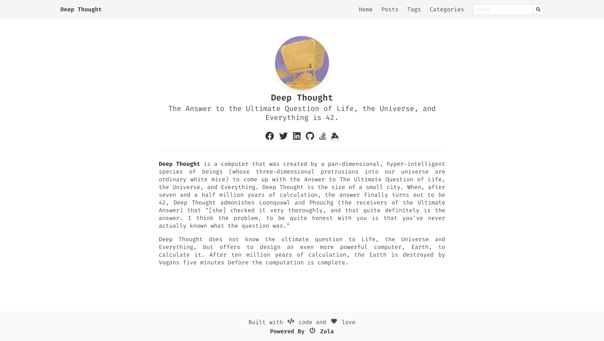

+++
title = "DeepThought"
description = "A simple blog theme focused on writing powered by Bulma and Zola."
template = "theme.html"
date = 2021-02-18T22:27:50+01:00

[extra]
created = 2021-02-18T22:27:50+01:00
updated = 2021-02-18T22:27:50+01:00
repository = "https://github.com/RatanShreshtha/DeepThought.git"
homepage = "https://github.com/RatanShreshtha/DeepThought"
minimum_version = "0.9.0"
license = "MIT"
demo = "https://deepthought-theme.netlify.app/"

[extra.author]
name = "Ratan Kulshreshtha"
homepage = "https://ratanshreshtha.dev"
+++        

# DeepThought
A simple blog theme focused on writing powered by Bulma and Zola.



## Live Demo
Live version of the website is available at [here](https://deepthought-theme.netlify.app/)

## Installation
Get [Zola](https://www.getzola.org/) and follow their guide on [installing a theme](https://www.getzola.org/documentation/themes/installing-and-using-themes/).
Make sure to add `theme = "DeepThought"` to your `config.toml`

**Check zola version (only 0.9.0+)**
Just to double-check to make sure you have the right version. It is not supported to use this theme with a version under 0.9.0.

## How to serve?
Go into your sites directory, and type `zola serve`. You should see your new site at `localhost:1111`.

 **NOTE**: you must provide the theme options variables in `config.toml` to serve a functioning site

## Deployment
[Zola](https://www.getzola.org) already has great documentation for deploying to [Netlify](https://www.getzola.org/documentation/deployment/netlify/) or [Github Pages](https://www.getzola.org/documentation/deployment/github-pages/). I won't bore you with a regurgitated explanation.

## Theme Options
```toml

navbar_items = [
	{ url = "$BASE_URL/", name = "Home" },
	{ url = "$BASE_URL/posts", name = "Posts" },
	{ url = "$BASE_URL/docs", name = "Docs" },
	{ url = "$BASE_URL/tags", name = "Tags" },
	{ url = "$BASE_URL/categories", name = "Categories" },
]

# Add links to favicon, you can use https://realfavicongenerator.net/ to generate favicon for your site
[extra.favicon]
favicon_16x16 = "/icons/favicon-16x16.png"
favicon_32x32 = "/icons/favicon-32x32.png"
apple_touch_icon = "/icons/apple-touch-icon.png"
safari_pinned_tab = "/icons/safari-pinned-tab.svg"
webmanifest = "/icons/site.webmanifest"

# Author details
[extra.author]
name = "DeepThought"
avatar = "/images/avatar.png"

# Social links
[extra.social]
email = "<email_id>"
facebook = "<facebook_username>"
github = "<github_username>"
gitlab = "<gitlab_username>"
keybase = "<keybase_username>"
linkedin = "<linkedin_username>"
stackoverflow = "<stackoverflow_userid>"
twitter = "<twitter_username>"

# To add google analytics
[extra.analytics]
google = "<your_gtag>"

# To add hyvor comments
[extra.commenting]
hyvor = "<your_hyvor_website_id>"

# To enable mapbox maps
[extra.mapbox]
access_token = "<your_access_token>"
```

## Features
- [x] Dark Mode
- [x] Pagination
- [x] Search
- [x] Charts
- [x] Maps
- [x] Diagrams
- [x] Galleria
- [x] Analytics
- [x] Comments
- [x] Categories
- [x] Social Links
- [x] Post Sharing

        