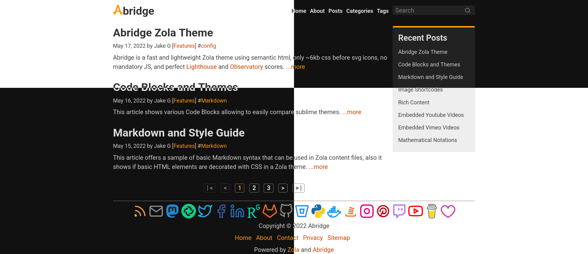

+++
title = "abridge"
description = "A fast and lightweight Zola theme using semantic html, a class-light abridge.css, and No JS."
template = "theme.html"
date = 2022-05-27T10:14:07-07:00

[extra]
created = 2022-05-27T10:14:07-07:00
updated = 2022-05-27T10:14:07-07:00
repository = "https://github.com/Jieiku/abridge.git"
homepage = "https://github.com/jieiku/abridge/"
minimum_version = "0.14.1"
license = "MIT"
demo = "https://abridge.netlify.app/"

[extra.author]
name = "Jake G (jieiku)"
homepage = "https://github.com/jieiku/"
+++        

<div align="center">


# Abridge Zola Theme

Abridge is a fast and lightweight Zola theme using semantic html, a class-light [abridge.css](https://github.com/jieiku/abridge.css), and No JS.



</div>

---

## Demo

[https://abridge.netlify.app/](https://abridge.netlify.app/)

## Requirements

This theme requires version 0.14.1 or later of [Zola](https://www.getzola.org/documentation/getting-started/installation/)

## Quick Start

```bash
git clone https://github.com/jieiku/abridge.git
cd abridge
zola serve
# open http://127.0.0.1:1111/ in the browser
```

## Installation
The Quick Start shows how to run the theme directly as a site.
Next we will use abridge as a theme to a NEW site.

### Step 1: Create a new zola site

```bash
zola init mysite
```

### Step 2: Install abridge

Download this theme to your themes directory:

```bash
cd mysite/themes
git clone https://github.com/jieiku/abridge.git
```

Or install as a submodule:

```bash
cd mysite
git init  # if your project is a git repository already, ignore this command
git submodule add https://github.com/jieiku/abridge.git themes/abridge
```

### Step 3: Configuration

Enable the theme in your `config.toml` in the site directory:

```toml
theme = "abridge"
```

Or copy the `config.toml` from the theme directory to your project's root directory:
(This will give you a base configuration with all config values used)

```bash
cp themes/abridge/config.toml config.toml
```

Uncomment the theme line, and point extra_syntaxes_and_themes at the correct directory:
```bash
sed -i 's/^#theme = "abridge"/theme = "abridge"/' config.toml
sed -i 's/^extra_syntaxes_and_themes = \["highlight_themes"\]/extra_syntaxes_and_themes = \["highlight_themes", "themes\/abridge\/highlight_themes"\]/' config.toml
```

The result should be:
```toml
theme = "abridge"
[markdown]
extra_syntaxes_and_themes = ["highlight_themes", "themes/abridge/highlight_themes"]
```

### Step 4: Add new content

You can copy the content from the theme directory to your project:

```bash
cp -r themes/abridge/content .
```

You can modify or add new posts in the content directory as needed.

### Step 5: Run the project

Just run `zola serve` in the root path of the project:

```bash
zola serve
```

Zola will start the development web server making your site accessible by default at
`http://127.0.0.1:1111`. Saved changes will live reload in the browser.

## Customization

You can customize your configurations, templates and content for yourself. Look
at the `config.toml`, `content` files, and templates files in this
repo for an idea.

### Number of Items per page for pagination

To change the number of items per page edit: `abridge/content/_index.md` and change the value for `paginate_by`

### Page width

You can set the overal page width by editing `themes\abridge\sass\_variables.scss` file, and adjusting these two lines:

```scss
$mw:50% !default;// max-width
$mb:1200px !default;// value at which to switch from fluid layout to using max-width
```

### Colors and Styles

Colors and style are handled by the sass files of [abridge.css](https://github.com/jieiku/abridge.css)

Abridge comes with two "Skins" each with their own auto, dark, and light modes.
Auto mode automatically displays a dark or light version depending on browser/OS settings.

The skin used on [the Demo](https://abridge.netlify.app/) uses primarily orange colors.
It is defined here: `/themes/abridge/sass/abridge.scss` and imports: `/themes/abridge/sass/skins/_abridge-auto.scss`

There is also other variations, that you will see defined in these same directories.

To change colors or fonts all you need to do is edit these files or duplicate them and create your own skin.
Then in the root of your site type `zola build` which will regenerate your site, this is similar to what zola serve does, except it does not facilitate serving the site.

### Global Configuration

There are some configuration options that you can customize in `config.toml`.

#### Configuration options before `extra` options

Set the authors's taxonomies for the site.

```toml
taxonomies = [
  {name = "authors"},
]
```

Use search function for the content.

```toml
build_search_index = true
```

​The search is the only thing that requires javascript in this this theme.

If you set `build_search_index` to false then the javascript file will no longer be loaded.

The default elasticlunr search is currently used, I may eventually switch this out for something else.

#### Configuration options under the `extra`

Most Options in the config.toml are self documenting, meaning between the name of the config value and the notes in the file it is usually obvious what an option is for.

The following options should be under the `[extra]` in `config.toml`

- `language_code` - Set the site language_code.
- `title_separator` - Separator between title and title_addition, eg "|": "Abridge | Fast & Lightweight Zola Theme"
- `title_addition` - a default value for title addition, used at the index.

- `author` - Used for articles to denote the author.
- `author_show = true` - Displays the author name on line with date, tags, categories
- `readtime = true` - Displays the read time on line with date, tags, categories.
- `readtime_string` - The word following the read time, you can set this to "min", "minutes", "min read", etc.
- `recent = true` - This enabled the Recent posts box visible on the top right.
- `recent_items = 9` - The number of items to display in the recent posts box
- `footer_credit = true` - This enables the powered by zola and abridge line in the footer.
- `footer_credit_override` - Can be used to customize the footer credit, useful to add icons to the text, etc.

- `logo = { file="logo.svg", width="42", height="42", alt="Abridge", text="bridge" }` - Defines the graphical logo with optional text to follow the logo.
- `textlogo` - A purely Text based logo, this will be used if logo is commented out, if both are commented out then config.title is used.
- `sitedesc` - This add the site description just below the text based logo.
- `copyright_start_year` - Optionally define a start year for the copyright, otherwise the current year is used.
- `copyright_end_year` - Optionally set the copyright end year, recommend leaving unset, zola build will set this to current year by default
- `headhr` - Display a horizontal rule below header
- `foothr` - Display a horizontal rule above footer
- `menu` - This is an array of links to display at the top right corner of the page
- `menu_footer` - This is an array of links to display in the footer of the page

- `security_header_referrer` - This is mostly used for tracking, the default is set to "strict-origin-when-cross-origin" [info](https://developer.mozilla.org/en-US/docs/Web/HTTP/Headers/Referrer-Policy)
- `security_header_csp` - Content Security policy, to enfore security rules: [observatory](https://observatory.mozilla.org) [csp-google](https://csp-evaluator.withgoogle.com/)

- `banner` - Image to use in seo related cards, this will be the fallback image if the individual articles does not provide one, still a work in progress.
- `js_search_index = "search_index.en.js"` - The search index file to include in the header, comment out to disable.
- `js_search = "search.min.js"` - The search script file to include in the header, comment out to disable.
- `rss_atom_feed = "atom.xml"` - The atom.xml rss file to include in the header.
- `stylesheet = "abridge.css"` - The stylesheet file to include in the header.
- `fontawesome =` - Uncomment to enable fontawesome library, this will include the file in the header.
- `fonts =` - Uncomment to load external fonts, they will be loaded in the header.
- `math` - Set to true to load the Katex library, enabling the use of the [katex shortcode](https://abridge.netlify.app/overview-math/)
- `math_auto_render` - This allows you to define a section of math notation using only $$ $$ symbols instead of using the katex shortcode directly.

- `keywords =` - This is used for SEO.
- `seo =` - This is used for SEO, for the social media related tags, eg: opengraph, facebook, twitter if set to false it disables them all.
- `extra.social` - These are the options for the social icons in the footer, and a couple are also used in SEO related meta tags.

Additionally you should configure which social icons you plan to use. (makes the css file size smaller)

open `themes/abridge/sass/_variables.scss`

To simply turn them all off you can set `$enable-icons: false`
Otherwise to turn on only the ones you need you would set `$enable-icons: true`
Then enable only the icons you need, eg for mail you would set `$icon-mail: true`
You should then disable all the icons that you do not use, as this will decrease the final size of your css file.
The difference in size is NOT a lot, without icons its ~4kb, with all the social icons its ~12kb.
There are also some general purpose icons you can use, they are disabled by default.

The theme requires tags and categories taxonomies to be enabled in your `config.toml`:

```toml
taxonomies = [
    # You can enable/disable RSS
    {name = "categories", rss = true},
    {name = "tags", rss = true},
]
```

### Top and Footer menus
Set a field in `extra` with a key of `menu` and `menu_footer`.
If a link should have a trailing slash at the end of the url set `slash = true`.

```toml
# This is the default menu
menu = [
    {url = "/", name = "Home", slash = true},
    {url = "/about/", name = "About", slash = true},
    {url = "/posts/", name = "Posts", slash = true},
    {url = "/categories/", name = "Categories", slash = true},
    {url = "/tags/", name = "Tags", slash = true},
]
menu_footer = [
    {url = "/", name = "Home", slash = true},
    {url = "/about/", name = "About", slash = true},
    {url = "/contact/", name = "Contact", slash = true},
    {url = "/privacy/", name = "Privacy", slash = true},
    {url = "/sitemap.xml", name = "Sitemap", slash = false},
]
```

### SEO and Header Tags

Most SEO Tags have been added as well as some important head tags for browser compatibility.

you can review them in the head section of `templates/macros/head.html`, all configurable values should be in config.toml under config.extra

SEO is still a work in progress, will be performing more testing and updates as time allows.

### Templates

All pages extend to `base.html`, and you can customize them as need.

## Reporting Issues

We use GitHub Issues as the official bug tracker for **abridge**.
Please search [existing issues](https://github.com/jieiku/abridge/issues).
It’s possible someone has already reported the same problem.
If your problem or idea is not addressed yet, [open a new issue](https://github.com/jieiku/abridge/issues/new).

## Contributing

We'd love your help! Especially with fixes to issues.
The overall idea behind abridge is to be lightweight and fast, and to use zero javascript other than the search.
If javascript is an absolute requirement for a feature to work then it may be added as disabled by default.

## License

**abridge** is distributed under the terms of the
[MIT license](https://github.com/jieiku/abridge/blob/master/LICENSE).

        