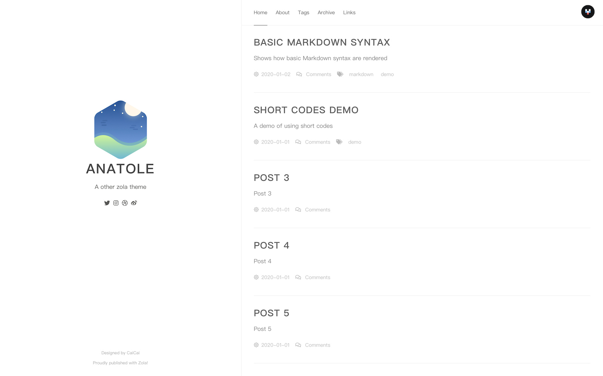

+++
title = "anatole-zola"
description = "A port of farbox-theme-Anatole for zola"
template = "theme.html"
date = 2021-02-18T22:27:50+01:00

[extra]
created = 2021-02-18T22:27:50+01:00
updated = 2021-02-18T22:27:50+01:00
repository = "https://github.com/longfangsong/anatole-zola.git"
homepage = "https://github.com/longfangsong/anatole-zola"
minimum_version = "0.4.0"
license = "MIT"
demo = "https://longfangsong.github.io/blog-next"

[extra.author]
name = "longfangsong"
homepage = "https://github.com/longfangsong"
+++        

# Anatole Theme for Zola

Port [Anatole theme for farbox](https://github.com/hi-caicai/farbox-theme-Anatole) to Zola.




You can view my blog for an example configuation, with customizations.

## Installation

First download this theme to your `themes` directory:

```bash
$ cd themes
$ git clone https://github.com/longfangsong/anatole-zola.git
```
and then enable it in your `config.toml`:

```toml
theme = "anatole-zola"
```

And copy the `content/about`, `content/archive`, `content/_index.md` in the theme folder to your own content folder. And edit the `_index.md` in `about` folder to edit the content of your `about` page.

## Options

### Basic

Add `title`, `description` and `base_url`:

```toml
title = "Anatole"
description = "A other zola theme"
base_url = "https://example.com"
```

### Language

Currently, we have English and Chinese translation, set the `default_language` if necessary:

```toml
# 如果你想要中文
default_language = "zh"
```

It's sad that transations in themes are not working, you can copy these to your `config.toml`:

```toml
[translations.en]
about = "About"
home = "Home"
tags = "Tags"
archive = "Archive"
links = "Links"
next_page = "Next Page"
last_page = "Last Page"

[translations.zh]
home = "首页"
about = "关于"
tags = "标签"
archive = "归档"
links = "友链"
next_page = "下一页"
last_page = "上一页"
```

Feel free to create a pull request if you want to translate the promotes into other languages!

### Sections

Tags and links sections are optional.

- If you want to enable the tags page, add 
  ```toml
  taxonomies = [
    {name = "tags"},
  ]
  
  [extra.show]
  tags = true
  ```
  To your `config.toml`
  
- If you want to enable the links page, add 

  ```toml
  [extra.show]
  links = true
  ```

  and copy `content/links` to your own `content` library. And edit the `_index.md` in it to edit its content.

### Sidebar menu

We support a bunch of social links, they are:

```toml
[extra.social]
github = ""
twitter = ""
facebook = ""
instagram = ""
dribbble = ""
weibo = ""
```

Fill in your username if you want! And the logo won't appear if you leave it empty.


### Comment system

We currently support [valine](https://valine.js.org/quickstart.html):

```toml
[extra.comment.valine]
appid = "Your appid goes here"
appkey = "Your appkey goes here"
notify = false # true/false: mail notify https://github.com/xCss/Valine/wiki/Valine-%E8%AF%84%E8%AE%BA%E7%B3%BB%E7%BB%9F%E4%B8%AD%E7%9A%84%E9%82%AE%E4%BB%B6%E6%8F%90%E9%86%92%E8%AE%BE%E7%BD%AE
verify = false # true/false: verify code
avatar = "mm" # avatar style https://github.com/xCss/Valine/wiki/avatar-setting-for-valine
placeholder = "Say something here"
```

And [disqus](https://disqus.com/admin/create/), note disqus does not work in Mainland China:

```toml
[extra.comment.disqus]
name = "longfangsong"
```

## Customize

There are several points I left in the origin templates for you to customize your site.

### More style

You can create a `blog.scss` or something similiar in the your `sass` folder, add a `templates.html` with following content:

```html


<link rel="stylesheet" href="{{/* get_url(path="blog.css") */}}">

```

### More social links

You can add more social links by adding a `templates.html` with some content added to `more_social_link` block:

```html


<div id="pirate" data-wordart-src="//cdn.wordart.com/json/685czi4rqil5" style="width: 100%;" data-wordart-show-attribution></div>

```

If you want to use some awsome logos, [font awsome icons](https://fontawesome.com/icons?d=gallery) are already available.
        