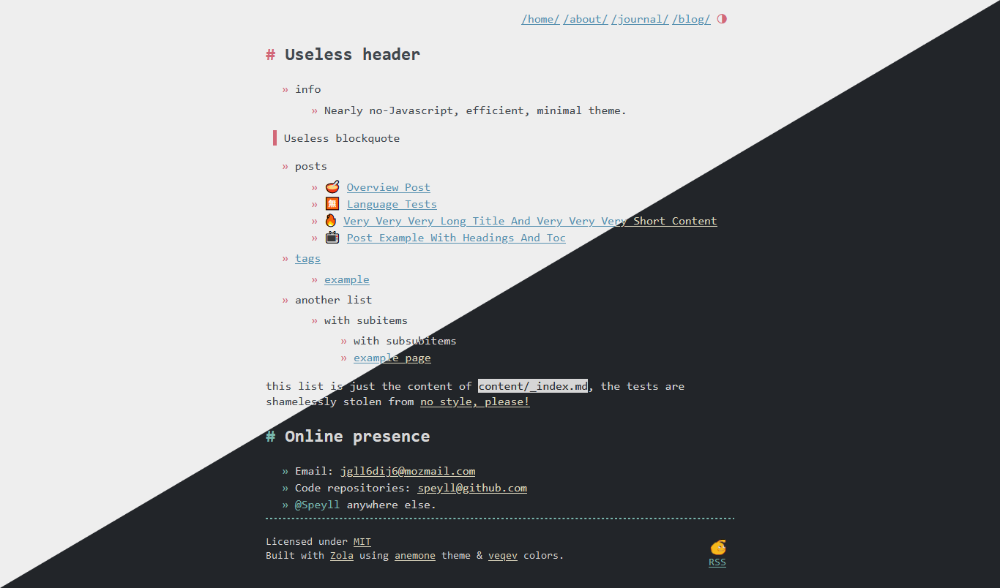

+++
title = "anemone"
description = "A minimalist Zola theme that prioritizes clean CSS and avoids heavy JavaScript. Enjoy a seamless user experience with lightning-fast load times. Let your content take center stage in a clutter-free, elegant design that enhances readability. Responsive and efficient, anemone brings focus to your ideas."
template = "theme.html"
date = 2024-01-09T08:33:22+01:00

[extra]
created = 2024-01-09T08:33:22+01:00
updated = 2024-01-09T08:33:22+01:00
repository = "https://github.com/Speyll/anemone"
homepage = "https://github.com/Speyll/anemone"
minimum_version = "0.4.0"
license = "MIT"
demo = "https://anemone.pages.dev"

[extra.author]
name = "Speyll"
homepage = "https://speyllsite.pages.dev/"
+++        

# anemone

Introducing "anemone," a minimalist [Zola](https://www.getzola.org) theme that prioritizes clean CSS and avoids heavy JavaScript. Enjoy a seamless user experience with lightning-fast load times. Let your content take center stage in a clutter-free, elegant design that enhances readability. Responsive and efficient, anemone brings focus to your ideas.

You can browse the demo website [here](https://anemone.pages.dev/)
I also use it on my own [website.](https://speyllsite.pages.dev/)

Anemone is a versatile Zola theme that comes with both light and dark variants. You can easily switch between the light and dark themes to suit your preferences.



### Installation

To get started with Anemone, follow these simple steps:

1. Download the theme to your `themes` directory:

```bash
cd themes
git clone https://github.com/Speyll/anemone
```

2. Enable Anemone in your `config.toml`:

```toml
theme = "anemone"
```

### Options

Anemone provides various options to customize your website:

#### Default Taxonomies

To use tags, add the following code to a page's metadata:

```toml
[taxonomies]
tags = ["tag1", "tag2"]
```

#### Pages List in Homepage

Enable listing of pages in the homepage by adding the following code to `config.toml`:

```toml
[extra]
list_pages = true
```

#### Multilanguage

The theme has a built-in feature that allows you to use multiple languages. For detailed instructions on how to use this feature, you can refer to the [Zola Multilingual documentation](https://www.getzola.org/documentation/content/multilingual/). This documentation provides additional information on how to make the most out of this multilingual capability.

```toml
[languages.fr]
weight = 2
title = "anemone"
languageName = "Français"
languageCode = "fr"
```
#### Multilanguage-Ready Navigation Bar

Customize the header navigation links with the following code in the `extra` section of `config.toml`:

```toml
[extra]

header_nav = [
  { url = "/", name_en = "/home/", name_fr = "/accueil/" },
  { url = "/about", name_en = "/about/", name_fr = "/concernant/" },
  { url = "/journal", name_en = "/journal/", name_fr = "/journal/" },
  { url = "/blog", name_en = "/blog/", name_fr = "/blog/" }
]
```

#### Default Theme

To configure the default theme, simply utilize the `default_theme` variable and set it to either `light` or `dark`:

```toml
[extra]
default_theme = "light"
```

#### Display Author Name in Blog Posts

Customize the display of the author's name in your blog posts by toggling the `display_author` variable to either `true` or `false`:

```toml
[extra]
display_author = true
```

### Webrings

Add a webring with a shortcode:

```html
{{/* webring(prev="#", webring="#", webringName="Random Webring", next="#") */}}
```

#### Add Table of Contents (TOC) to Pages

In a page's frontmatter, set `extra.toc` to `true`:

```toml
[extra]
toc = true
```

### Extra Data

- Set the `author` in both the main config and in pages' metadata.
- Use the `image` variable in pages to add an image to HTML `<meta>` tags.
- Similarly, set `favicon` in the main config, and it will be used as the site icon.

#### Disable Twitter Card

Twitter metatags are generated by default. To disable them, set `extra.twitter_card` to `false` in `config.toml`:

```toml
[extra]
twitter_card = true
```

### License

The Anemone theme is available as open source under the terms of the [MIT License](LICENSE).

        