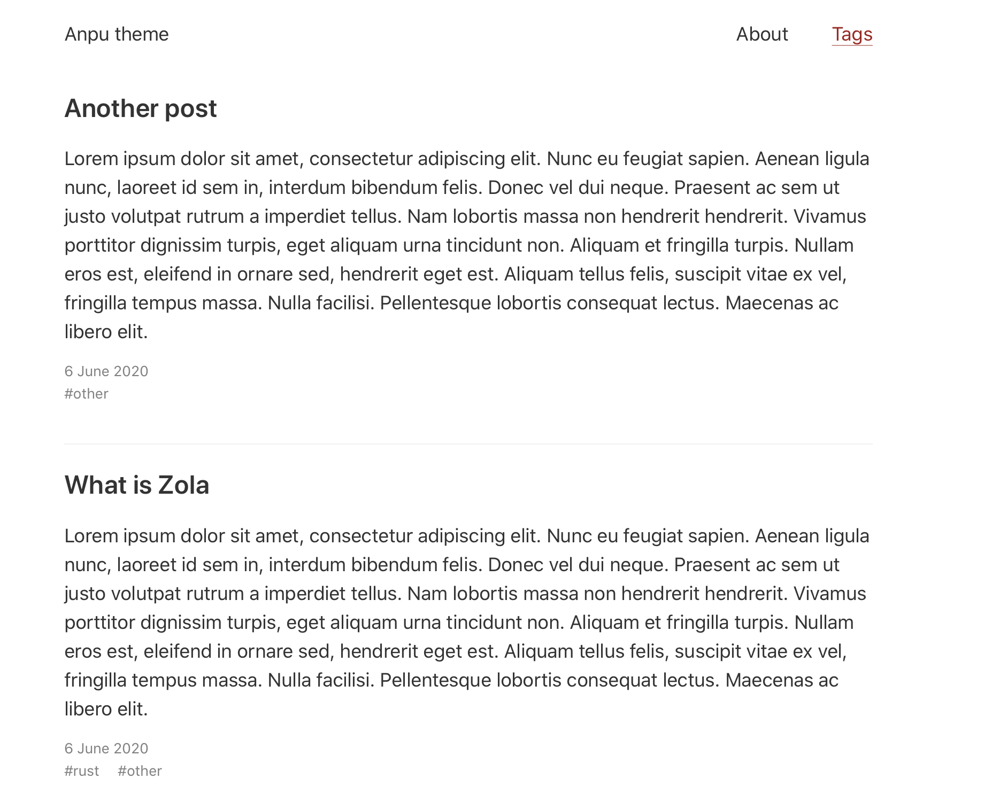

+++
title = "Anpu"
description = "A port of the Hugo Anubis theme"
template = "theme.html"
date = 2021-02-18T22:27:50+01:00

[extra]
created = 2021-02-18T22:27:50+01:00
updated = 2021-02-18T22:27:50+01:00
repository = "https://github.com/zbrox/anpu-zola-theme.git"
homepage = "https://github.com/zbrox/anpu-zola-theme"
minimum_version = "0.11.0"
license = "MIT"
demo = "https://anpu-zola-theme.netlify.app"

[extra.author]
name = "Rostislav Raykov"
homepage = "https://zbrox.com"
+++        

# Anpu theme for Zola

This is a port of the Hugo theme [Anubis](https://github.com/Mitrichius/hugo-theme-anubis/tree/master/layouts) for [Zola](https://getzola.org).



## Usage

In order to use the theme you need to clone this repository in your `themes` folder:

```bash
git clone https://github.com/zbrox/anpu-zola-theme.git themes/anpu
```

Then set your theme setting in `config.toml` to `anpu`:

```toml
theme = "anpu"
```

This theme requires both the `tags` and `categories` taxonomies.

```toml
taxonomies = [
    { name = "categories" },
    { name = "tags" },
]
```

## How To Customize

There are two things you can customize:

- The links to be included in the menu
- The date format of the posts

### Menu links

In your `config.toml` under the `[extra]` section you need to set the `anpu_menu_links` list.

Example:

```toml
[extra]
anpu_menu_links = [
    { url = "$BASE_URL/about/", name = "About" },
]
```

If you include `$BASE_URL` in the url of a link it will be replaced to the base url of your site.

### Date format

In your `config.toml` under the `[extra]` section you need to set the `anpu_date_format` value.

Example:

```toml
[extra]
anpu_date_format = "%e %B %Y"
```

The formatting uses the standart `date` filter in Tera. The date format options you can use are listed in the [chrono crate documentation](https://tera.netlify.app/docs/#date).

        