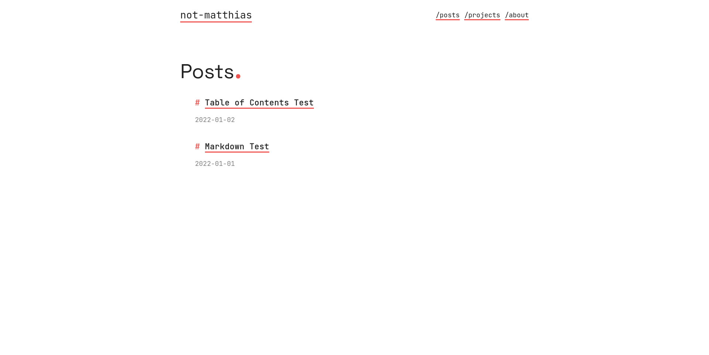

+++
title = "apollo"
description = "Modern and minimalistic blog theme"
template = "theme.html"
date = 2025-01-10T19:55:25+01:00

[taxonomies]
theme-tags = []

[extra]
created = 2025-01-10T19:55:25+01:00
updated = 2025-01-10T19:55:25+01:00
repository = "https://github.com/not-matthias/apollo.git"
homepage = "https://github.com/not-matthias/apollo"
minimum_version = "0.14.0"
license = "MIT"
demo = "https://not-matthias.github.io/apollo"

[extra.author]
name = "not-matthias"
homepage = "https://github.com/not-matthias"
+++        

# apollo

Modern and minimalistic blog theme powered by [Zola](https://getzola.org). See a live preview [here](https://not-matthias.github.io/apollo).

<sub><sup>Named after the greek god of knowledge, wisdom and intellect</sup></sub>

<details open>
  <summary>Dark theme</summary>

  
</details>

<details>
  <summary>Light theme</summary>


</details>

## Features

- [X] Pagination
- [X] Themes (light, dark, auto)
- [X] Projects page
- [X] Analytics using [GoatCounter](https://www.goatcounter.com/) / [Umami](https://umami.is/)
- [x] Social Links
- [x] MathJax Rendering
- [x] Taxonomies
- [x] Meta Tags For Individual Pages
- [x] Custom homepage
- [x] Comments
- [x] Search

## Installation

1. Download the theme
```
git submodule add https://github.com/not-matthias/apollo themes/apollo
```

2. Add the following to the top of your `config.toml`

```toml
theme = "apollo"
taxonomies = [{ name = "tags" }]

[extra]
theme = "auto"
socials = [
  # Configure socials here
]
menu = [
  # Configure menu bar here
]

# See this for more options: https://github.com/not-matthias/apollo/blob/main/config.toml#L14
```

3. Copy the example content

```
cp -r themes/apollo/content/* content/
```

## Configuration

You can find all the configuration options [here](./content/posts/configuration.md)

## References

This theme is based on [archie-zola](https://github.com/XXXMrG/archie-zola/).

        