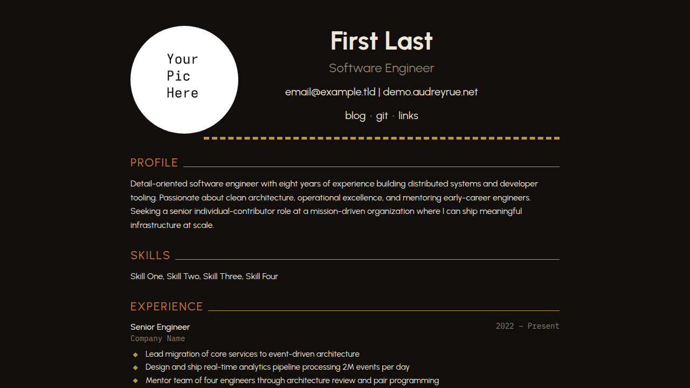

+++
title = "audrey"
description = "A gaudy dark resume theme that looks like a template pulled straight from the internet circa 2012. Allcaps headers, horizontal rules, diamond bullets, and just enough effort to be perfectly mediocre."
template = "theme.html"
date = 2026-09-05T17:43:06-07:00

[taxonomies]
theme-tags = ['dark', 'gaudy', 'resume', 'landing']

[extra]
created = 2026-09-05T17:43:06-07:00
updated = 2026-09-05T17:43:06-07:00
repository = "https://git.colorized.life/demo.audreyrue.net.git"
homepage = "https://git.colorized.life/demo.audreyrue.net/about/"
minimum_version = "0.23.4"
license = "MIT"
demo = "https://demo.audreyrue.net"

[extra.author]
name = "Lany Atwood"
homepage = "https://colorized.life"
+++        

# audrey

A gaudy dark resume theme for Zola that looks like a template pulled straight from the internet circa 2012. Allcaps section headers with extending horizontal rules, diamond bullet points, and thick dashed lines. Perfectly usable, intentionally mediocre.

[Live demo](https://demo.audreyrue.net)



## Features

- Gaudy resume layout with horizontal rules, diamond bullets, and allcaps headers
- Config-driven resume: all content lives in `zola.toml`
- Centered header with professional title, pipe-separated contact, and middot-separated nav
- Section headers with extending horizontal rules (PROFILE ────────)
- Profile, Skills, Experience, and Education sections
- Blog section with paginated listing and directional post navigation
- Links pages with stacked link + description layout
- Dark aesthetic with a 5-color palette (customizable at runtime)
- Urbanist (sans-serif) and IBM Plex Mono fonts
- Responsive design with mobile single-column collapse

## Installation

Requires Zola 0.23.4 or later; this demo is validated with 0.23.4.

From your Zola site's root, add the theme as a Git submodule:

```sh
git submodule add https://git.colorized.life/demo.audreyrue.net.git themes/audrey
```

Alternatively, clone it into the same directory:

```sh
git clone https://git.colorized.life/demo.audreyrue.net.git themes/audrey
```

Set the top-level `theme = "audrey"` in your site's `zola.toml`, as shown below.

Create your own `content/` pages for the links you retain. Theme installation does not copy the demo content or root configuration into your site. Run `zola serve` from your site root to preview; use `zola check` and `zola build` to validate and build it.

## Minimal configuration

Minimal consumer configuration for `zola.toml`:

```toml
base_url = "https://example.com"
title = "My Site"
theme = "audrey"
compile_sass = true
build_search_index = false

[extra]
site_title = "My Site"
copyright_holder = "Your Name"
footer_links = []

[extra.resume]
first_name = "Your"
last_name = "Name"
nav_links = []
```

Use `static/profile.jpg` in your site to replace the bundled portrait. Supply both name fields when configuring a resume name. When `first_name` is absent, the heading uses `extra.site_title`, falling back to `My Site`. The configured resume name takes precedence and retains its existing heading style.

## Full options

### Theme defaults

The following block matches the active `[extra]` defaults in `theme.toml`. These defaults apply to an installed theme; the repository's `zola.toml` separately configures the branded demo. Replace or remove default navigation links when you do not provide the corresponding pages.

```toml
[extra]
site_title = "My Site"
copyright_holder = "Your Name"
footer_links = [{ name = "acknowledgements", path = "/acknowledgements" }]

# Footer links use a simple schema: { name, path }
#   name    — display text
#   path    — local path or absolute URL (e.g. "/about", "https://example.com")

[extra.resume]
first_name = "First"
last_name = "Last"
contact = [
  { text = "email@example.com", url = "mailto:email@example.com" },
  { text = "example.com", url = "https://example.com" },
]
professional_title = "Professional Title"
objective = "Old-school profile statement describing goals. Two sentences maximum."
skills = ["Skill One", "Skill Two", "Skill Three", "Skill Four"]

nav_links = [
  { name = "blog", path = "/blog" },
  { name = "git", path = "/git" },
  { name = "links", path = "/links" },
]
```

`site_title` supplies the fallback resume heading. `copyright_holder` defaults to `Your Name`; if that key is absent at runtime, the footer falls back to `config.title`. Optional `copyright_url` falls back to `config.base_url`. Optional `feed_path` appends `/atom.xml` for the footer feed link; it does not enable feed generation.

Consumer footer and feed customization example:

```toml
feed_filenames = ["atom.xml"]

[extra]
copyright_url = "https://example.com"
feed_path = "/blog"
footer_links = [
  { name = "home", path = "/" },
  { name = "sites", path = "/sites" },
]
```

For a blog feed, set `generate_feeds = true` in the front matter of `content/blog/_index.md`. Set `feed_path = ""` for a root feed, or omit it to hide the footer feed button.

Footer links support `{ name, path }`. `path` accepts local paths or absolute URLs; footer links do not consume `url`. Branded demo source-link excerpt (retain the surrounding demo footer entries):

```toml
[extra]
footer_links = [
  { name = "source", path = "https://git.colorized.life/demo.audreyrue.net/about/" },
]
```

This absolute source URL points directly to the repository and works without a deployment redirect.

### Resume data

Resume fields are under `[extra.resume]`. `professional_title`, `objective`, `skills`, `contact`, `nav_links`, `experience`, and `education` are optional. Contacts use `text` and optional `url`; entries without `url` render as plain text. Contacts are pipe-separated.

Consumer header navigation example:

```toml
[extra.resume]
nav_links = [
  { name = "blog", path = "/blog" },
  { name = "git", url = "https://example.com" },
  { name = "links", path = "/links" },
]
```

Resume navigation uses `name` and either `path` (local or absolute) or `url` (external), with `url` taking precedence. It renders a middot-separated row.

Consumer body customization example:

```toml
[extra.resume]
professional_title = "Software Engineer"
objective = "Profile statement describing goals."
skills = ["Skill One", "Skill Two", "Skill Three"]

[[extra.resume.experience]]
company = "Company Name"
positions = [
  { title = "Senior Engineer", start = "2022", end = "Present", bullets = [
    "Diamond-bulleted accomplishment",
    "Another accomplishment",
  ] },
]

[[extra.resume.education]]
degree = "B.S. Computer Science"
school = "University Name"
year = "2016"
gpa = "3.8"
```

Experience entries contain `company` and `positions`; each position uses `title`, `start`, `end`, and optional `bullets`. Education uses `degree`, `school`, `year`, and optional `gpa`.

### Pages

| Route | Template | Description |
| ----- | -------- | ----------- |
| `/` | `index.html` | Resume landing page |
| `/blog` | `blog.html` | Paginated blog listing |
| `/blog/*` | `post.html` | Individual blog post |
| `/links` | `links.html` | External links (header nav) |
| `/sites` | `links.html` | Cross-site family navigation (footer) |
| `/palette` | `palette.html` | Color palette reference |
| `/acknowledgements` | `page.html` | Font and tool credits |

### Links pages

Consumer page front matter example for `links.html` (inside the page's `+++` delimiters):

```toml
title = "Links"
template = "links.html"

[[extra.links]]
name = "example.com"
url = "https://example.com"
description = "Description text"
```

These page entries consume `name`, `url`, and `description`; they do not consume `path`.

## Customization

### Colors

Consumer customization example: add `[extra.colors]` to your `zola.toml` to override any color:

```toml
[extra.colors]
bg = "#110e0c"
text = "#f0e6d8"
muted = "#8f7f6d"
accent = "#d4793b"
glow = "#b89840"
```

| Key | Default | Role |
| --- | ------- | ---- |
| `bg` | `#110e0c` | Page background (Coral Black) |
| `text` | `#f0e6d8` | Primary text (Parchment Paper) |
| `muted` | `#8f7f6d` | Metadata, descriptions (Safari Beige) |
| `accent` | `#d4793b` | Section headers, link hover (Marquis Orange) |
| `glow` | `#b89840` | Horizontal rules, diamond bullets (Mystic Gold) |

### Palette labels

Optional `extra.palette_names` and `extra.palette_roles` tables override the displayed names and roles on the palette page. Both accept `bg`, `text`, `muted`, `accent`, and `glow`; omitted entries keep the palette names and roles listed above.

Consumer palette customization example:

```toml
[extra.palette_names]
bg = "Night"

[extra.palette_roles]
bg = "Page background"
```

## License

MIT; see [LICENSE](LICENSE).

        