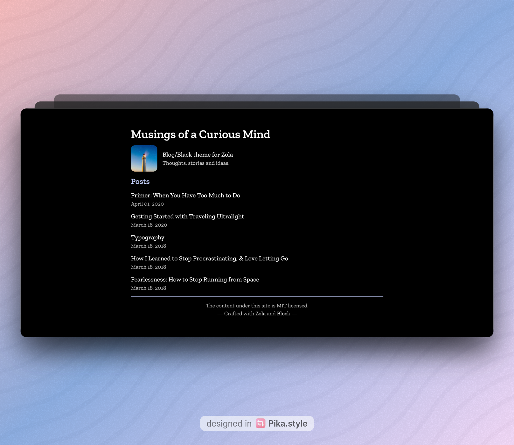

+++
title = "Block"
description = "Blog/Black theme for Zola"
template = "theme.html"
date = 2026-01-28T12:43:48+05:30

[taxonomies]
theme-tags = []

[extra]
created = 2026-01-28T12:43:48+05:30
updated = 2026-01-28T12:43:48+05:30
repository = "https://github.com/ssiyad/block"
homepage = "https://github.com/ssiyad/block"
minimum_version = "0.21.0"
license = "GPLv3"
demo = "https://block-zola.netlify.app/"

[extra.author]
name = "Sabu Siyad"
homepage = "https://ssiyad.com"
+++        

# Block

Pure black, blog focused theme for [Zola](https://www.getzola.org/), powered by
[TailwindCSS](https://tailwindcss.com/).

Demo: https://block-zola.netlify.app/



## Setup

In your zola site directory

- Get theme

    ```bash
    git submodule add https://github.com/ssiyad/block themes/block
    ```

- Build CSS

    ```bash
    cd themes/block
    npm ci
    npm run css:build
    ```

- Build your site

    ```bash
    cd ../..
    zola build
    ```

## Variables

You can use the following variables in your `config.toml`.

```toml
[extra.intro]
heading = "Blog/Black theme for Zola"
subheading = "Thoughts, stories and ideas."
avatar_url = "https://picsum.photos/200"

[extra.footer]
license_text = ""
```

Check [theme.toml](./theme.toml) for more info.

## Blocks

You can override individual blocks by following
[this](https://www.getzola.org/documentation/themes/extending-a-theme/#overriding-a-block).

Example: `templates/base_layout.html`

```html



  <div>
    The content for this site is
    <a
      href="https://creativecommons.org/licenses/by-sa/2.0/"
      target="_blank"
      class="font-medium"
      >CC-BY-SA</a
    >. The
    <a
      href="https://github.com/ssiyad/ssiyad.github.io"
      target="_blank"
      class="font-medium"
      >code for this site</a
    >
    is
    <a
      href="https://www.gnu.org/licenses/gpl-3.0.en.html"
      target="_blank"
      class="font-medium"
      >GPLv3</a
    >.
  </div>

```

## Self Promotion

Like this project? Give it a star! ⭐, and spread the word! 🚀. And if you are
feeling especially charitable, follow [Sabu Siyad](https://ssiyad.com) on
[GitHub](https://github.com/ssiyad). Thanks!


        