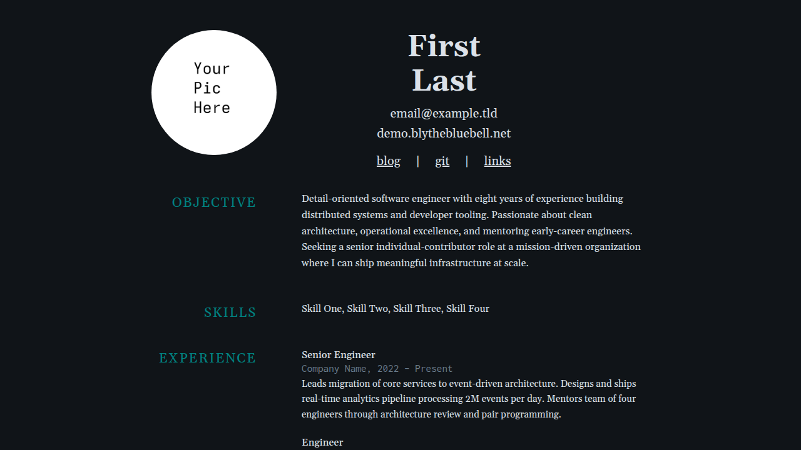

+++
title = "blythe"
description = "A dark minimal resume theme with old-school formatting, Gelasio serif & Inconsolata mono fonts, and responsive design"
template = "theme.html"
date = 2026-09-05T17:43:06-07:00

[taxonomies]
theme-tags = ['dark', 'minimal', 'resume', 'landing']

[extra]
created = 2026-09-05T17:43:06-07:00
updated = 2026-09-05T17:43:06-07:00
repository = "https://git.colorized.life/demo.blythebluebell.net.git"
homepage = "https://git.colorized.life/demo.blythebluebell.net/about/"
minimum_version = "0.23.4"
license = "MIT"
demo = "https://demo.blythebluebell.net"

[extra.author]
name = "Lany Atwood"
homepage = "https://colorized.life"
+++        

# blythe

A dark minimal resume theme for Zola with old-school Microsoft Word formatting, Gelasio serif and Inconsolata mono fonts, and inner pages for blog and links.

[Live demo](https://demo.blythebluebell.net)



## Features

- Old-school resume layout driven by whitespace-as-structure (no accent lines)
- Config-driven resume: all content lives in `zola.toml`
- Centered letterhead header with split first/last name
- Pseudo-two-column body: uppercase section labels left, content right
- Objective, Skills, Experience, and Education sections
- Blog section with paginated listing and directional post navigation
- Links pages with stacked link + description layout
- Dark aesthetic with a 5-color palette (customizable at runtime)
- Gelasio (serif) and Inconsolata (mono) variable fonts
- Responsive design with mobile single-column collapse
- Sass-based theming with `// knob:` tuning comments

## Installation

Requires Zola 0.23.4 or later; this demo is validated with 0.23.4.

From your Zola site's root, add the theme as a Git submodule:

```sh
git submodule add https://git.colorized.life/demo.blythebluebell.net.git themes/blythe
```

Alternatively, clone it into the same directory:

```sh
git clone https://git.colorized.life/demo.blythebluebell.net.git themes/blythe
```

Set the top-level `theme = "blythe"` in your site's `zola.toml`, as shown below.

The repository itself is a standalone demo: run `zola serve` from its root to preview it. For a consumer site, create your own content and replace `static/profile.jpg` with your portrait; the theme includes a demo portrait and fonts. Create pages for navigation destinations you retain, or override the link arrays.

## Minimal configuration

Minimal consumer `zola.toml` (independent of the branded demo):

```toml
base_url = "https://example.com"
title = "My Site"
theme = "blythe"
compile_sass = true
build_search_index = false

[extra]
site_title = "My Site"
copyright_holder = "Your Name"
footer_links = []

[extra.resume]
first_name = "Your"
last_name = "Name"
nav_links = []
```

Create `content/_index.md` with an empty `+++` TOML front matter block to establish your home section. Theme resume defaults supply sample contact, objective, and skills; replace them for your site.

## Full options

The following block exactly reproduces the active `[extra]` defaults in `theme.toml`:

```toml
[extra]
site_title = "My Site"
copyright_holder = "Your Name"
footer_links = [{ name = "acknowledgements", path = "/acknowledgements" }]

# Footer links use a simple schema: { name, path }
#   name    — display text
#   path    — local path or absolute URL (e.g. "https://example.com")

[extra.resume]
first_name = "First"
last_name = "Last"
contact = [
  { text = "email@example.com", url = "mailto:email@example.com" },
  { text = "example.com", url = "https://example.com" },
]
objective = "Old-school profile statement describing goals. Two sentences maximum."
skills = ["Skill One", "Skill Two", "Skill Three", "Skill Four"]

nav_links = [
  { name = "blog", path = "/blog" },
  { name = "git", path = "/git" },
  { name = "links", path = "/links" },
]
```

`site_title` is the homepage heading fallback when `resume.first_name` is absent. A configured first/last name takes priority and keeps the split-name layout. `config.title` controls browser titles. The theme supplies sample names by default.

`copyright_holder` defaults to `Your Name`; without that setting the template falls back to `config.title`. Optional `copyright_url` is omitted from theme defaults and falls back to `config.base_url`.

Footer links accept `{ name, path }`; `path` may be a local path or an absolute URL. Footer links do not consume `url`. Resume navigation accepts `{ name, path }` or `{ name, url }`, with `url` taking priority. Contact entries use `text` and an optional `url`; omitting it renders plain text. Link-page entries use `name`, `url`, and `description`.

Optional `feed_path` adds a footer Atom link by appending `/atom.xml`. For `/blog/atom.xml`, set `feed_path = "/blog"` without a trailing slash, configure top-level `feed_filenames = ["atom.xml"]`, and enable `generate_feeds = true` in the blog section front matter.

### Pages

| Route | Template | Description |
| ----- | -------- | ----------- |
| `/` | `index.html` | Resume landing page |
| `/blog` | `blog.html` | Paginated blog listing |
| `/blog/*` | `post.html` | Individual blog post |
| `/links` | `links.html` | External links (header nav) |
| `/sites` | `links.html` | Cross-site family navigation (footer) |
| `/palette` | `palette.html` | Color palette reference |
| `/acknowledgements` | `page.html` | Font and tool credits |

## Customization

The following snippets are separate consumer customizations; merge tables into your existing configuration rather than repeating TOML table declarations.

### Footer and feed

Consumer customization in `zola.toml` (create the linked pages and blog feed):

```toml
[extra]
copyright_url = "https://example.com"
feed_path = "/blog"
footer_links = [
  { name = "home", path = "/" },
  { name = "sites", path = "/sites" },
]
```

Branded demo configuration excerpt, preserving its source link's position in the footer:

```toml
[extra]
footer_links = [
  { name = "home", path = "/" },
  { name = "source", path = "https://git.colorized.life/demo.blythebluebell.net/about/" },
  { name = "palette", path = "/palette" },
  { name = "acknowledgements", path = "/acknowledgements" },
  { name = "sites", path = "/sites" },
]
```

The source `path` is an absolute repository URL and works without a deployment redirect.

### Resume

Consumer header, navigation, and body customization in `zola.toml`:

```toml
[extra.resume]
first_name = "Your"
last_name = "Name"
contact = [
  { text = "email@example.com", url = "mailto:email@example.com" },
  { text = "example.com", url = "https://example.com" },
]
nav_links = [
  { name = "blog", path = "/blog" },
  { name = "git", url = "https://example.com" },
  { name = "links", path = "/links" },
]
objective = "Profile statement describing goals."
skills = ["Skill One", "Skill Two", "Skill Three"]

[[extra.resume.experience]]
company = "Company Name"
positions = [
  { title = "Senior Engineer", start = "2022", end = "Present", description = "Description paragraph." },
]

[[extra.resume.education]]
degree = "B.S. Computer Science"
school = "University Name"
year = "2016"
```

Body sections render when their corresponding fields are present. Experience positions consume `title`, `start`, `end`, and optional `description`; each job supplies `company`. Education entries consume `degree`, `school`, and `year`.

### Links pages

Consumer page front matter example for `content/links.md`:

```toml
+++
title = "Links"
template = "links.html"

[[extra.links]]
name = "example.com"
url = "https://example.com"
description = "Description text"
+++
```

### Colors and palette labels

Consumer color customization in `zola.toml` (shown values are the existing palette):

```toml
[extra.colors]
bg = "#101418"
text = "#dce1e8"
muted = "#6b7d8d"
accent = "#551a8b"
glow = "#018281"
```

Only specified colors override the Sass defaults.

| Key | Default | Role |
| --- | ------- | ---- |
| `bg` | `#101418` | Page background (Midnight Office) |
| `text` | `#dce1e8` | Primary text (Paper Grey) |
| `muted` | `#6b7d8d` | Metadata, descriptions (Cubicle Grey) |
| `accent` | `#551a8b` | Link hover (American Violet) |
| `glow` | `#018281` | Section headers (Windows 95 Desktop) |

Optional `[extra.palette_names]` and `[extra.palette_roles]` accept the same five keys and change palette-page swatch labels and roles. Omitted values use the theme's built-in labels. Consumer customization example:

```toml
[extra.palette_names]
bg = "Night"

[extra.palette_roles]
bg = "Page background"
```

Sass files also include `// knob:` comments for layout tuning.

## License

MIT; see [LICENSE](LICENSE).

        