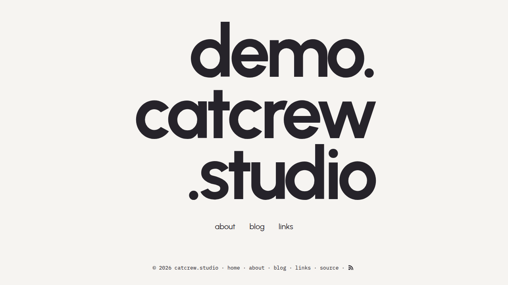

+++
title = "catcrew"
description = "A light and modern lifestyle blog theme for Zola."
template = "theme.html"
date = 2026-09-05T17:43:07-07:00

[taxonomies]
theme-tags = ['light', 'modern', 'blog', 'lifestyle']

[extra]
created = 2026-09-05T17:43:07-07:00
updated = 2026-09-05T17:43:07-07:00
repository = "https://git.colorized.life/demo.catcrew.studio.git"
homepage = "https://git.colorized.life/demo.catcrew.studio/about/"
minimum_version = "0.23.4"
license = "MIT"
demo = "https://demo.catcrew.studio"

[extra.author]
name = "Lany Atwood"
homepage = "https://colorized.life"
+++        

# catcrew

A light and modern lifestyle blog theme for Zola.

[Live demo](https://demo.catcrew.studio)



## Features

- Blog section with paginated listing and directional post navigation
- Minimal links page with a large-type stacked layout
- Light aesthetic with a 6-color palette
- Urbanist (sans-serif) and IBM Plex Mono fonts
- Responsive design with mobile single-column collapse
- Mobile-first image component with full, centered, left, and right layouts

## Installation

Requires Zola 0.23.4 or later; this demo is validated with 0.23.4.

From your Zola site's root, add the theme as a Git submodule:

```sh
git submodule add https://git.colorized.life/demo.catcrew.studio.git themes/catcrew
```

Alternatively, clone it into the same directory:

```sh
git clone https://git.colorized.life/demo.catcrew.studio.git themes/catcrew
```

Set the top-level `theme = "catcrew"` in your site's `zola.toml`, as shown below.

## Minimal configuration

For a homepage-only consumer site, use this minimal `zola.toml`. Empty link
arrays override the default navigation until you add the corresponding pages.
Keep a `content/` directory in your site; no demo content is inherited.

```toml
base_url = "https://example.com"
title = "My Site"
theme = "catcrew"
compile_sass = true

[extra]
nav_links = []
header_links = []
footer_links = []
```

## Full options

These are the complete reusable `[extra]` theme defaults from `theme.toml`.
Override them under `[extra]` in your site's `zola.toml`:

```toml
[extra]
site_title = "My Site"
copyright_holder = "Your Name"

header_links = [
  { name = "home", path = "/" },
  { name = "about", path = "/about" },
  { name = "blog", path = "/blog" },
  { name = "links", path = "/links" },
]

footer_links = [
  { name = "home", path = "/" },
  { name = "about", path = "/about" },
  { name = "blog", path = "/blog" },
  { name = "links", path = "/links" },
]

nav_links = [
  { name = "about", path = "/about" },
  { name = "blog", path = "/blog" },
  { name = "links", path = "/links" },
]
```

`header_links`, `footer_links`, and `nav_links` share the same `{ name, path }`
format. `path` may be a local path or an absolute URL. `header_links` controls
navigation on interior pages, while `nav_links` controls the landing-page
navigation and normally omits `home` because the visitor is already there.
Sites with cross-host webserver routing can override the header and footer
`home` paths independently, such as with `/home`.

`copyright_url` is an optional override; when omitted, the copyright link
uses `config.base_url`. `copyright_holder` defaults to `Your Name` from the
theme. The optional `landing_lines` and `feed_path` settings have no theme
defaults.

## Customization

### Navigation and pages

Create the corresponding content before enabling the default links. The
following routes and templates describe the branded demo:

| Route | Template | Description |
| ----- | -------- | ----------- |
| `/` | `index.html` | Stacked wordmark and config-driven navigation |
| `/about` | `about.html` | Mobile-first editorial About page |
| `/blog` | `blog.html` | Paginated blog listing |
| `/blog/*` | `post.html` | Individual blog post |
| `/links` | `links.html` | External links (header nav) |

The branded demo adds this source entry to `footer_links` under `[extra]`
(merge it with the other entries you want to retain):

```toml
[extra]
footer_links = [
  { name = "source", path = "https://git.colorized.life/demo.catcrew.studio/about/" },
]
```

Because `path` accepts an absolute URL, this source link works directly without
a deployment redirect. Navigation uses `{ name, path }`; links-page items use
`{ name, url }` as documented below.

### Landing title and copyright

Consumer customization example for an optional copyright URL override:

```toml
[extra]
copyright_url = "https://example.com"
```

The landing page displays `site_title` by default. To replace it with a
multi-line wordmark, define the optional `landing_lines` array. Each line
accepts `left`, `center`, or `right` alignment. Consumer customization example:

```toml
[extra]
landing_lines = [
  { text = "example", align = "left" },
  { text = ".com", align = "right" },
]
```

### Feeds

To show the Atom feed links, set `feed_path` to a feed-enabled section. For
example, add `feed_path = "/blog"` under `[extra]`, keep `atom.xml` in the
top-level `feed_filenames`, and set `generate_feeds = true` in that section's
front matter.

### Images

Page-bundled images can be placed with the `image` component. Alt text is
independent from the optional visible caption:

```markdown
{{/* <image url="juniper.jpg" position="left" alt="Juniper sitting by a window" content_path={page.path} /> */}}

{{/* <image url="fig.jpg" position="right" alt="Fig asleep on a blanket" caption="Fig at rest" content_path={page.path} /> */}}
```

Components live in `templates/components/image.html`. Pass `content_path={page.path}`
for page bundles or `content_path={section.path}` in section Markdown. The
component has no implicit page or section context. Root-relative paths and
external URLs do not require `content_path`.

| Parameter | Default | Description |
| --- | --- | --- |
| `url` | Required | Image path or URL |
| `content_path` | `""` | Prefix for relative image and thumbnail paths |
| `url_min` | `""` | Optional thumbnail; links to the full image |
| `alt` | `""` | Alternative text, separate from the caption |
| `caption` | `""` | Optional visible plain-text caption |
| `position` | `"full"` | Layout position |

Local image URLs retain cache busting. HTTP, HTTPS, and protocol-relative URLs
are used directly. Text and HTML attributes are escaped.

Supported positions are `full` (the default), `center`, `left`, and `right`.
Every position uses a centered, contained medium width on mobile; position-based
sizing and text wrapping begin at the desktop breakpoint.

### Links pages

Consumer links-page front matter example for a page using `template = "links.html"`
(inside its `+++` delimiters):

```toml
[[extra.links]]
name = "example.com"
url = "https://example.com"
```

The optional Linktree importer writes this front matter as a complete page:

```sh
python3 themes/catcrew/scripts/extract_linktree_links.py \
  https://linktr.ee/example --output content/links.md
```

Omit `--output` to print the generated page instead of replacing a file.

### Color palette

| Token | Name | Hex | Role |
| --- | --- | --- | --- |
| `text` | Soft Ink | `#26232A` | Foreground |
| `bg` | Bone | `#F6F4F1` | Background |
| `muted` | Whiskey Grey | `#716B67` | Muted accent |
| `glow` | Sky | `#7EC8E8` | Primary accent, link hover background |
| `accent` | Window Blue | `#3C739C` | Secondary accent |
| `tertiary` | Ground Nutmeg | `#9E593D` | Tertiary accent |

## License

MIT; see [LICENSE](LICENSE).

        