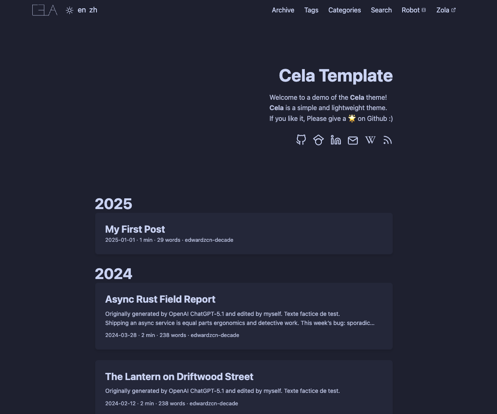

+++
title = "Cela"
description = "A minimalist documentation/blog theme."
template = "theme.html"
date = 2026-04-25T04:31:48+08:00

[taxonomies]
theme-tags = ['blog', 'documentation', 'lightweight', 'minimal', 'responsive', 'search']

[extra]
created = 2026-04-25T04:31:48+08:00
updated = 2026-04-25T04:31:48+08:00
repository = "https://github.com/edwardzcn-decade/cela.git"
homepage = "https://github.com/edwardzcn-decade/cela"
minimum_version = "0.22.1"
license = "MIT"
demo = "https://edwardzcn-decade.github.io/cela/"

[extra.author]
name = "Edward Zhang"
homepage = "https://github.com/edwardzcn-decade"
+++        

# Cela

<p align="center">
  <a href="https://edwardzcn-decade.github.io/cela"></a>
  <a href="https://www.getzola.org"></a>
</p>

*Cela* is a simple, lightweight Zola theme, inspired by [Hugo PaperMod](https://github.com/adityatelange/hugo-PaperMod).

The style sheet is adapted from [Catppuccin](https://github.com/catppuccin/catppuccin).
If you like it, please give it a 🌟 on GitHub. Thanks!



---

## Theme Features

+ [x] Catppuccin color theme
+ [x] Light/Dark mode toggle
+ [x] MathJax support
+ [x] Blog RSS feeds
+ [x] Full-text search
+ [x] Robot tools
+ [x] Home page archive grouping (group by year)
+ [ ] Internationalization (i18n)

### Tags, Categories, and Taxonomies

Cela provides Hexo/Hugo-like `tags` and `categories`, compatible with Zola `taxonomies`. In front matter:

```toml
[taxonomies]
tags = ["Rust", "Zola"]
categories = ["Programming"]
```

or in YAML style:

```yaml
taxonomies:
  tags: ["Rust", "Zola"]
  categories: ["Programming"]
```

Zola `taxonomies` as recommended are more powerful for structuring your contents. See [zola taxonomies](https://www.getzola.org/documentation/content/taxonomies/) for more information.

## Quick Start

If you only need installation of the theme, skip to Theme Installation.

### Zola Installation

Cela is developed and validated against `Zola 0.22.1`.

For syntax highlighting on `Zola 0.22.x`, use the nested
`[markdown.highlighting]` table instead of the older flat
`highlight_code` setting. See the official configuration docs:
https://www.getzola.org/documentation/getting-started/configuration/

```bash
# macOS
brew install zola
# Alpine Linux
apk add zola
# Arch Linux
pacman -S zola
# Docker
docker pull ghcr.io/getzola/zola:v0.22.1
```

### Create a Zola site

Creates your first Zola site.

If `myblog` already exists but only contains hidden files (like `.git`), Zola will alswo populate the site.

```bash
zola init myblog
# or
# populate the current directory
zola init
```

Any choices you make during the initialization can be changed later in the `config.toml` file.


### Theme Installation

#### By Git submodule

```bash
git submodule add https://github.com/edwardzcn-decade/cela themes/cela
git submodule update --init --force --recursive
git submodule sync
```

Then set the `theme` in your `config.toml` file.

```toml
theme = "cela"
```

#### By Download Releases

1. Download the latest release archive from the Cela releases.
2. Unzip to themes/cela in your Zola project.
3. Set `theme` in config.toml.
4. (Optional) Delete unused example content under content/ if you start fresh.

## 👐 Development

> [!NOTE]
>
> If you find this project helpful and would like to support its development, see our [CONTRIBUTING](CONTRIBUTING.md) and [CODE_OF_CONDUCT](CODE_OF_CONDUCT.md) guidelines.

### Static Runtime Model

Cela stays a pure static Zola theme:

- No backend
- No frontend framework runtime
- No Node.js requirement for theme users

Node.js is used only for **theme development** to generate static CSS.

### CSS Layers

The final CSS stack is split into two layers:

1. `static/css/theme-runtime.css`: a thin runtime theme layer for light/dark semantic color variables
2. `styles/tailwind.css` -> `static/css/theme.css`: the generated Tailwind-controlled main stylesheet

The generated CSS file is committed so downstream theme users still only need Zola. Legacy files are no longer part of the runtime load path.

### Local Theme Development

Install the development dependencies:

```bash
npm install
```

Build the generated CSS once:

```bash
npm run build:css
```

Watch CSS changes during theme development:

```bash
npm run watch:css
```

Validate and build the site:

```bash
npm run build:css
zola check --skip-external-links
zola build
```

### Smoke Checklist

See [docs/smoke-checklist.md](docs/smoke-checklist.md) for the baseline routes and interactions to verify after template or CSS changes.

Homepage motion is intentionally scoped to the landing page hero, social icons,
year or section headers, and home post lists. It uses CSS animation plus
`IntersectionObserver`, and degrades cleanly when JavaScript is disabled or
`prefers-reduced-motion` is enabled.

## CSS Class Reference

Mapping between semantic template class names and their Tailwind token equivalents.

| Class | File | Role | Key Tailwind tokens used |
|-------|------|------|--------------------------|
| `.post-single` | `page.html` | Article page container | `max-w-main`, `px-gap` |
| `.search-page` | `search.html` | Search page container | `max-w-main`, `px-gap` |
| `.search-box` | `search.html` | Search input wrapper | — |
| `.post-entry` | `post_card.html` | Post card | `bg-surface`, `border`, `shadow-card` |
| `.post-header` | `page.html`, `search.html` | Page/post header block | — |
| `.post-title` | multiple | Page `<h1>` title | — |
| `.entry-header` | `post_card.html` | Card title area | — |
| `.entry-content` | `post_card.html` | Card summary area | `text-content` |
| `.entry-footer` | `post_card.html` | Card meta area | `text-muted` |
| `.entry-link` | `post_card.html` | Full-card click overlay | — |
| `.breadcrumbs` | `page.html`, `search.html`, `robot.html`, `section_post.html` | `<nav>` breadcrumb trail | `text-muted` |
| `.pagination` | `section_post.html` | Prev/next page nav | — |
| `.pagination .previous` | `section_post.html` | Previous page link | `bg-text`, `text-theme` |
| `.pagination .next` | `section_post.html` | Next page link | `bg-text`, `text-theme` |
| `.footer-credits` | `home_footer.html` | Copyright + powered-by row | `text-muted` |
| `.footer-scheme` | `home_footer.html` | Color scheme selector row | `text-muted` |
| `#scheme-select` | `home_footer.html` | Color scheme `<select>` | `border`, `text-muted` |

> Tailwind token names correspond to keys in `tailwind.config.js` → `theme.extend`.

## TODO

- [ ] **Tailwind Path B migration**: All semantic classes (`.post-single`, `.post-entry`, `.footer`, etc.) in `styles/tailwind.css` currently use raw CSS values. Migrate them to use `@apply` with tokens defined in `tailwind.config.js` (e.g. `@apply bg-surface border-border rounded-theme`). This is the recommended step before considering Path A (utility classes in templates) or Tailwind v4.
- [ ] **Tailwind Path A (future)**: Replace semantic classes in templates with inline Tailwind utility classes. Best done alongside Tailwind v4 migration.
- [ ] Explore Tailwind v4 migration: v4 removes `tailwind.config.js` in favor of `@theme` blocks in CSS, aligns naturally with the CSS variable architecture, and offers significantly faster build times. Tracked for future investigation.

## LICENSE

MIT
exit

        