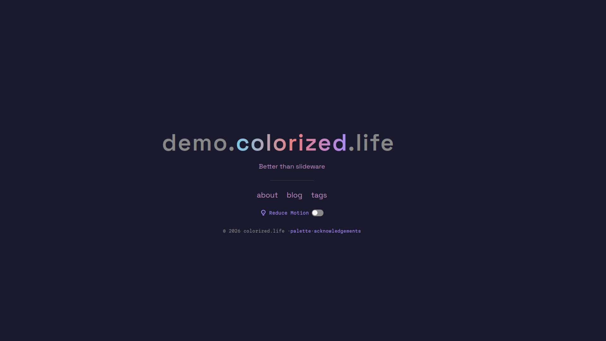

+++
title = "colorized"
description = "An opinionated dark-pastel theme"
template = "theme.html"
date = 2026-04-05T20:39:24-07:00

[taxonomies]
theme-tags = ['dark', 'pastel', 'blog', 'developer']

[extra]
created = 2026-04-05T20:39:24-07:00
updated = 2026-04-05T20:39:24-07:00
repository = "https://git.colorized.life/demo.colorized.life.git"
homepage = "https://git.colorized.life/demo.colorized.life/about/"
minimum_version = "0.22.1"
license = "MIT"
demo = "https://demo.colorized.life"

[extra.author]
name = "Lany Atwood"
homepage = "https://colorized.life"
+++        

# colorized

An opinionated dark-pastel Zola theme with a 6-color accent palette.

[demo.colorized.life](https://demo.colorized.life)



## Features

- Dark pastel aesthetic with a curated 6-color accent palette
- Animated color-cycling landing page with two customizable tiers
- Shimmer gradient text effect (shortcode + CSS class)
- ASCII art shortcode with external file or inline support
- Image embedding shortcodes with floating positions and text wrapping
- Accessible reduce-motion toggle with `prefers-reduced-motion` support
- Responsive design with fluid typography via `clamp()`
- Sass-based theming with easy variable overrides
- Atom feed support
- Taxonomy support (tags)

## Installation

Add the theme as a git submodule:

```sh
git submodule add https://git.colorized.life/demo.colorized.life.git themes/colorized
```

Set the theme in your `zola.toml`:

```toml
theme = "colorized"
compile_sass = true
```

## Configuration

All options live under `[extra]` in your `zola.toml`. Defaults are shown from `theme.toml`:

```toml
[extra]
# Landing page <title> and Tier 1 title text
site_title = "My Site"

# Text below the landing title
landing_subtitle = "A site built with the colorized theme"

# Footer copyright name
copyright_holder = "colorized"

# Navigation links (shown on landing page and site nav)
# Each entry has `name` (display text) and `path` (local path).
# Add `sitemap = true` to include in a custom sitemap (for paths outside the content directory).
# External redirects (e.g. /source/ → a git host) should be handled at the webserver level.
nav_links = [
    { name = "blog", path = "/blog" },
    { name = "tags", path = "/tags" },
    { name = "source", path = "/source/", sitemap = true },
]

# Footer links (same schema as nav_links)
footer_links = [
    { name = "acknowledgements", path = "/acknowledgements" },
]
```

## Landing Title

The landing title supports two tiers:

### Tier 1 (default)

When `landing_chars` is not set, the title renders as a single `<span>` with a slow color-cycling animation that matches the subtitle and nav links.

```toml
[extra]
site_title = "My Site"
```

### Tier 2 (explicit spans)

Set `landing_chars` to control exactly how the title is split and styled. Each entry has a `char` (text content) and `class` (any CSS class).

```toml
[extra]
landing_chars = [
    { char = "demo.colorized", class = "shimmer" },
    { char = ".life", class = "c-muted" },
]
```

#### Centering on a specific span

Set `landing_center` (0-based index) to center a specific span on the page centerline. Spans before it balance to the left, spans after to the right.

```toml
[extra]
landing_center = 1
landing_chars = [
    { char = "demo.", class = "c-muted" },
    { char = "colorized", class = "shimmer" },
    { char = ".life", class = "c-muted" },
]
```

When omitted, the title centers as a whole.

Available classes:

| Class      | Color                                                |
| ---------- | ---------------------------------------------------- |
| `c-accent` | Purple (`#a78bfa`)                                   |
| `c-pink`   | Pink (`#e8a0b4`)                                     |
| `c-green`  | Green (`#7ec8a0`)                                    |
| `c-amber`  | Amber (`#d4a76a`)                                    |
| `c-blue`   | Blue (`#7ec8e8`)                                     |
| `c-red`    | Red (`#e87e7e`)                                      |
| `c-muted`  | Muted gray (`#888888`)                               |
| `shimmer`  | Animated gradient cycling through all palette colors |

Color-class spans (`c-accent`, `c-pink`, etc.) animate with a staggered wave effect. The `shimmer` and `c-muted` classes are excluded from the wave animation.

## Template Blocks

Override any block in your own templates by extending `base.html`:

| Block            | Description                                              |
| ---------------- | -------------------------------------------------------- |
| `html_attrs`     | Attributes on the `<html>` element                       |
| `head_meta`      | Meta tags (charset, viewport, color-scheme, theme-color) |
| `head_styles`    | Stylesheet `<link>` tags                                 |
| `head_scripts`   | Scripts in `<head>`                                      |
| `title`          | Page `<title>`                                           |
| `head`           | Additional `<head>` content                              |
| `nav`            | Entire navigation bar                                    |
| `nav_left`       | Left nav group (site title link)                         |
| `nav_middle`     | Middle nav links                                         |
| `nav_extra`      | Extra nav items                                          |
| `content`        | Main page content                                        |
| `footer`         | Entire footer                                            |
| `footer_content` | Footer text and links                                    |
| `footer_toggle`  | Footer toggle controls (reduce-motion button)            |
| `body_scripts`   | Scripts before `</body>`                                 |

## Customizing Colors

Add `[extra.colors]` to your `zola.toml` to override any color. Only the keys you specify change — the rest keep their defaults:

```toml
[extra.colors]
accent = "#58a6ff"
bg = "#0d1117"
```

Available keys and defaults:

| Key       | Default   | Role                       |
| --------- | --------- | -------------------------- |
| `bg`      | `#1a1a2e` | Page background            |
| `codebg`  | `#11111e` | Code block background      |
| `text`    | `#f5f5f5` | Primary text               |
| `muted`   | `#888888` | Secondary text, borders    |
| `accent`  | `#a78bfa` | Links, accents, highlights |
| `pink`    | `#e8a0b4` | Palette pink               |
| `green`   | `#7ec8a0` | Palette green              |
| `amber`   | `#d4a76a` | Palette amber              |
| `blue`    | `#7ec8e8` | Palette blue               |
| `red`     | `#e87e7e` | Palette red                |
| `surface` | `#2a2a40` | Panels, code headers       |

### Advanced: Sass Variable Override

For deeper customization (fonts, layout, or Sass-level changes), shadow the variables file:

```sh
cp themes/colorized/sass/_variables.scss sass/_variables.scss
```

Note: Zola replaces the entire file, so include all variables when shadowing.

## Shortcodes

### `shimmer`

Renders text with an animated gradient effect cycling through the palette colors.

```markdown
{{/* shimmer(text="hello world") */}}
```

### `ascii`

Displays ASCII art in a `<pre>` block. Accepts either an external file or inline content.

From a file:

```markdown

```

Inline:

<!-- prettier-ignore-start -->
```markdown

⠀⠀⠀⠀⠀⠀⠀⠀⢀⣤⡶⢶⣦⡀
⠀⠀⠀⣴⡿⠟⠷⠆⣠⠋⠀⠀⠀⢸⣿
⠀⠀⠀⣿⡄⠀⠀⠀⠈⠀⠀⠀⠀⣾⡿
⠀⠀⠀⠹⣿⣦⡀⠀⠀⠀⠀⢀⣾⣿
⠀⠀⠀⠀⠈⠻⣿⣷⣦⣀⣠⣾⡿
⠀⠀⠀⠀⠀⠀⠀⠉⠻⢿⡿⠟
⠀⠀⠀⠀⠀⠀⠀⠀⠀⡟⠀⠀⠀⢠⠏⡆⠀⠀⠀⠀⠀⢀⣀⣤⣤⣤⣀⡀
⠀⠀⠀⠀⠀⡟⢦⡀⠇⠀⠀⣀⠞⠀⠀⠘⡀⢀⡠⠚⣉⠤⠂⠀⠀⠀⠈⠙⢦⡀
⠀⠀⠀⠀⠀⡇⠀⠉⠒⠊⠁⠀⠀⠀⠀⠀⠘⢧⠔⣉⠤⠒⠒⠉⠉⠀⠀⠀⠀⠹⣆
⠀⠀⠀⠀⠀⢰⠀⠀⠀⠀⠀⠀⠀⠀⠀⠀⠀⠀⠀⢻⠀⠀⣤⠶⠶⢶⡄⠀⠀⠀⠀⢹⡆
⠀⣀⠤⠒⠒⢺⠒⠀⠀⠀⠀⠀⠀⠀⠀⠤⠊⠀⢸⠀⡿⠀⡀⠀⣀⡟⠀⠀⠀⠀⢸⡇
⠈⠀⠀⣠⠴⠚⢯⡀⠐⠒⠚⠉⠀⢶⠂⠀⣀⠜⠀⢿⡀⠉⠚⠉⠀⠀⠀⠀⣠⠟
⠀⠠⠊⠀⠀⠀⠀⠙⠂⣴⠒⠒⣲⢔⠉⠉⣹⣞⣉⣈⠿⢦⣀⣀⣀⣠⡴⠟⠁
⠀⠀⠀⠀⠀⠀⠀⠀⠀⠀⠉⠉⠉⠀⠉⠉⠉

```
<!-- prettier-ignore-end -->

### `codeline`

Renders a single line of code in a `<pre><code>` block.

```markdown
{{/* codeline(text="npm install") */}}
```

### `image`

Embeds an image in a `<figure>` with optional caption, thumbnail, and floating position.

```markdown
{{/* image(url="photo.jpg", alt="A caption beneath the image") */}}
```

Parameters:

| Parameter  | Required | Description                                                               |
| ---------- | -------- | ------------------------------------------------------------------------- |
| `url`      | yes      | Image path (relative to the page, or absolute / external)                 |
| `alt`      | no       | Alt text, also rendered as a `<figcaption>`                               |
| `url_min`  | no       | Thumbnail path — displayed as the ``, links to the full-size `url`   |
| `position` | no       | `left` or `right` — floats the image to that side so text wraps around it |

Floating example:

```markdown
{{/* image(url="photo.jpg", url_min="photo_sm.jpg", alt="Floating right", position="right") */}}
```

### `hr`

Renders a horizontal rule.

```markdown
{{/* hr() */}}
```

## Reduce Motion

The theme respects `prefers-reduced-motion: reduce` at the OS level. A toggle button is also provided on both the landing page and in the site footer, storing the preference in a cookie. When `cookie_domain` is set in `[extra]` (e.g., `cookie_domain = ".colorized.life"`), the preference is shared across all subdomains.

When reduce-motion is active, all animations (color cycling, shimmer gradient, wave stagger) are disabled and elements display their static fallback colors.

## Custom Sitemap

Zola's built-in `sitemap.xml` only includes pages from the content directory. Nav/footer
links that point to paths outside the content directory (e.g. `/source/`) will be missing.

The theme ships a `templates/sitemap.xml.example` template that extends the default
sitemap with nav/footer links marked `sitemap = true`. To activate it:

1. Copy the example template:

```sh
cp templates/sitemap.xml.example templates/sitemap.xml
```

2. Add `sitemap = true` to any link entries you want included:

```toml
nav_links = [
    { name = "source", path = "/source/", sitemap = true },
]
```

Links already in the content directory do not need this flag — they are automatically
included by Zola.

## License

MIT

        