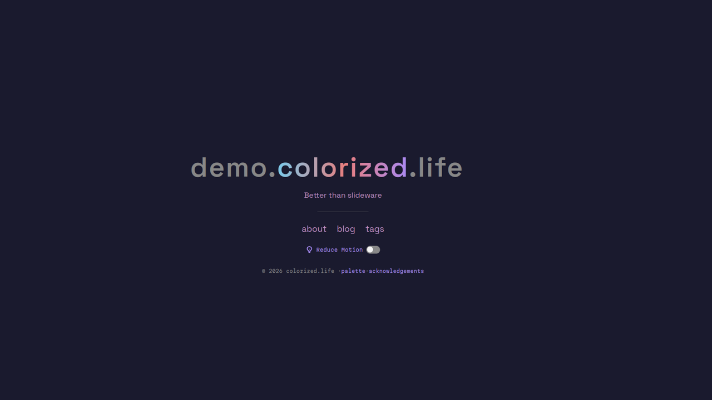

+++
title = "colorized"
description = "An opinionated dark-pastel theme"
template = "theme.html"
date = 2026-09-05T19:22:59-07:00

[taxonomies]
theme-tags = ['dark', 'pastel', 'blog', 'developer']

[extra]
created = 2026-09-05T19:22:59-07:00
updated = 2026-09-05T19:22:59-07:00
repository = "https://git.colorized.life/demo.colorized.life.git"
homepage = "https://git.colorized.life/demo.colorized.life/about/"
minimum_version = "0.23.4"
license = "MIT"
demo = "https://demo.colorized.life"

[extra.author]
name = "Lany Atwood"
homepage = "https://colorized.life"
+++        

# colorized

An opinionated dark-pastel Zola theme with a 6-color accent palette.

[Live demo](https://demo.colorized.life)



## Features

- Dark pastel aesthetic with a curated 6-color accent palette
- Animated color-cycling landing page with two customizable tiers
- Shimmer gradient text effect (component + CSS class)
- ASCII art component with external file or inline support
- Image embedding components with floating positions and text wrapping
- Accessible reduce-motion toggle with `prefers-reduced-motion` support
- Responsive design with fluid typography via `clamp()`
- Sass-based theming with easy variable overrides
- Atom feed support
- Taxonomy support (tags)

## Installation

Requires Zola 0.23.4 or later; this demo is validated with 0.23.4.

From your Zola site's root, add the theme as a Git submodule:

```sh
git submodule add https://git.colorized.life/demo.colorized.life.git themes/colorized
```

Alternatively, clone it into the same directory:

```sh
git clone https://git.colorized.life/demo.colorized.life.git themes/colorized
```

Set the top-level `theme = "colorized"` in your site's `zola.toml`, as shown below.

## Minimal configuration

Minimal consumer configuration in your site's `zola.toml` (top-level settings must precede `[extra]`):

```toml
base_url = "https://example.com"
title = "My Site"
theme = "colorized"
compile_sass = true
taxonomies = [{ name = "tags" }]
```

Create your own content, including `/blog` and `/acknowledgements` if you keep the default links, or customize those links to match your pages. For Atom feeds, enable `generate_feeds = true` and `feed_filenames = ["atom.xml"]` at the top level.

## Full options

The active theme defaults below match `[extra]` in `theme.toml`. Copy overrides into your site's `zola.toml`:

```toml
[extra]
site_title = "My Site"
landing_subtitle = "A site built with the colorized theme"
copyright_holder = "Your Name"
nav_links = [
    { name = "blog", path = "/blog" },
    { name = "tags", path = "/tags" },
]
footer_links = [
    { name = "acknowledgements", path = "/acknowledgements" },
]
```

`site_title` supplies the landing page title and the default landing heading; explicit `landing_chars` overrides the heading. `landing_subtitle` supplies the text beneath it. Optional `copyright_url` falls back to `config.base_url`. Optional `home_url` sets the home navigation destination (for example, `/home/` or an absolute URL); missing or empty values use the site root. The remaining optional keys are `landing_chars`, `landing_center`, `colors`, and `cookie_domain`, described below.

Navigation and footer entries accept `name` (display text), `path` (local path or absolute URL), and optional `sitemap` (include local paths in the sitemap). Templates render `path` directly; there is no `url` link key. Absolute source URLs work without a deployment redirect. Never set `sitemap = true` on external URLs.

## Customization

Consumer customization example for a copyright destination (merge into your existing `[extra]` table):

```toml
[extra]
copyright_url = "https://example.com"
```

Branded demo navigation customization from the demo's `zola.toml`, including its source link:

```toml
[extra]
nav_links = [
    { name = "about", path = "/about" },
    { name = "blog", path = "/blog" },
    { name = "source", path = "https://git.colorized.life/demo.colorized.life/about/" },
    { name = "tags", path = "/tags" },
]
```

### Landing title

The landing title supports two tiers:

#### Tier 1 (default)

When `landing_chars` is not set, the title renders as a single `<span>` with a slow color-cycling animation that matches the subtitle and nav links.

Consumer customization example:

```toml
[extra]
site_title = "My Site"
```

#### Tier 2 (explicit spans)

Set `landing_chars` to control exactly how the title is split and styled. Each entry has a `char` (text content) and `class` (any CSS class).

Consumer customization example:

```toml
[extra]
landing_chars = [
    { char = "example", class = "shimmer" },
    { char = ".com", class = "c-muted" },
]
```

##### Centering on a specific span

Set `landing_center` (0-based index) to center a specific span on the page centerline. Spans before it balance to the left, spans after to the right.

Branded demo configuration example:

```toml
[extra]
landing_center = 1
landing_chars = [
    { char = "demo.", class = "c-muted" },
    { char = "colorized", class = "shimmer" },
    { char = ".life", class = "c-muted" },
]
```

When omitted, the title centers as a whole.

Available classes:

| Class      | Color                                                |
| ---------- | ---------------------------------------------------- |
| `c-accent` | Purple (`#a78bfa`)                                   |
| `c-pink`   | Pink (`#e8a0b4`)                                     |
| `c-green`  | Green (`#7ec8a0`)                                    |
| `c-amber`  | Amber (`#d4a76a`)                                    |
| `c-blue`   | Blue (`#7ec8e8`)                                     |
| `c-red`    | Red (`#e87e7e`)                                      |
| `c-muted`  | Muted gray (`#888888`)                               |
| `shimmer`  | Animated gradient cycling through all palette colors |

Color-class spans (`c-accent`, `c-pink`, etc.) animate with a staggered wave effect. The `shimmer` and `c-muted` classes are excluded from the wave animation.

### Template blocks

Override any block in your own templates by extending `base.html`:

| Block            | Description                                              |
| ---------------- | -------------------------------------------------------- |
| `html_attrs`     | Attributes on the `<html>` element                       |
| `head_meta`      | Meta tags (charset, viewport, color-scheme, theme-color) |
| `head_styles`    | Stylesheet `<link>` tags                                 |
| `head_scripts`   | Scripts in `<head>`                                      |
| `title`          | Page `<title>`                                           |
| `head`           | Additional `<head>` content                              |
| `nav`            | Entire navigation bar                                    |
| `nav_left`       | Left nav group (site title link)                         |
| `nav_middle`     | Middle nav links                                         |
| `nav_extra`      | Extra nav items                                          |
| `content`        | Main page content                                        |
| `footer`         | Entire footer                                            |
| `footer_content` | Footer text and links                                    |
| `footer_toggle`  | Footer toggle controls (reduce-motion button)            |
| `body_scripts`   | Scripts before `</body>`                                 |

### Colors

Add `[extra.colors]` to your `zola.toml` to override any color. Only the keys you specify change — the rest keep their defaults:

Consumer customization example:

```toml
[extra.colors]
accent = "#58a6ff"
bg = "#0d1117"
```

Available keys and defaults:

| Key       | Default   | Role                       |
| --------- | --------- | -------------------------- |
| `bg`      | `#1a1a2e` | Page background            |
| `codebg`  | `#11111e` | Code block background      |
| `text`    | `#f5f5f5` | Primary text               |
| `muted`   | `#888888` | Secondary text, borders    |
| `accent`  | `#a78bfa` | Links, accents, highlights |
| `pink`    | `#e8a0b4` | Palette pink               |
| `green`   | `#7ec8a0` | Palette green              |
| `amber`   | `#d4a76a` | Palette amber              |
| `blue`    | `#7ec8e8` | Palette blue               |
| `red`     | `#e87e7e` | Palette red                |
| `surface` | `#2a2a40` | Panels, code headers       |

#### Advanced: Sass variable override

For deeper customization (fonts, layout, or Sass-level changes), shadow the variables file:

```sh
cp themes/colorized/sass/_variables.scss sass/_variables.scss
```

Note: Zola replaces the entire file, so include all variables when shadowing.

### Components

Components live in `templates/components/` and are available in Markdown without imports. Text and HTML attributes are escaped. Optional text and thumbnail arguments default to empty strings.

#### `shimmer`

Renders text with an animated gradient effect cycling through the palette colors.

```markdown
{{/* <shimmer text="hello world" /> */}}
```

#### `ascii`

Displays ASCII art in a `<pre>` block. Accepts either an external file or inline content.

Inline art trims outer whitespace (matching the former shortcode) and preserves interior indentation and line breaks. File art preserves all whitespace. For file art, pass `src` and the explicit `colocated_path` (both default to `""`). In section content, use `section.colocated_path` instead of `page.colocated_path`.

From a file:

```markdown
{{/* <ascii src="art/logo.txt" colocated_path={page.colocated_path} /> */}}
```

Inline:

<!-- prettier-ignore-start -->
```markdown

⠀⠀⠀⠀⠀⠀⠀⠀⢀⣤⡶⢶⣦⡀
⠀⠀⠀⣴⡿⠟⠷⠆⣠⠋⠀⠀⠀⢸⣿
⠀⠀⠀⣿⡄⠀⠀⠀⠈⠀⠀⠀⠀⣾⡿
⠀⠀⠀⠹⣿⣦⡀⠀⠀⠀⠀⢀⣾⣿
⠀⠀⠀⠀⠈⠻⣿⣷⣦⣀⣠⣾⡿
⠀⠀⠀⠀⠀⠀⠀⠉⠻⢿⡿⠟
⠀⠀⠀⠀⠀⠀⠀⠀⠀⡟⠀⠀⠀⢠⠏⡆⠀⠀⠀⠀⠀⢀⣀⣤⣤⣤⣀⡀
⠀⠀⠀⠀⠀⡟⢦⡀⠇⠀⠀⣀⠞⠀⠀⠘⡀⢀⡠⠚⣉⠤⠂⠀⠀⠀⠈⠙⢦⡀
⠀⠀⠀⠀⠀⡇⠀⠉⠒⠊⠁⠀⠀⠀⠀⠀⠘⢧⠔⣉⠤⠒⠒⠉⠉⠀⠀⠀⠀⠹⣆
⠀⠀⠀⠀⠀⢰⠀⠀⠀⠀⠀⠀⠀⠀⠀⠀⠀⠀⠀⢻⠀⠀⣤⠶⠶⢶⡄⠀⠀⠀⠀⢹⡆
⠀⣀⠤⠒⠒⢺⠒⠀⠀⠀⠀⠀⠀⠀⠀⠤⠊⠀⢸⠀⡿⠀⡀⠀⣀⡟⠀⠀⠀⠀⢸⡇
⠈⠀⠀⣠⠴⠚⢯⡀⠐⠒⠚⠉⠀⢶⠂⠀⣀⠜⠀⢿⡀⠉⠚⠉⠀⠀⠀⠀⣠⠟
⠀⠠⠊⠀⠀⠀⠀⠙⠂⣴⠒⠒⣲⢔⠉⠉⣹⣞⣉⣈⠿⢦⣀⣀⣀⣠⡴⠟⠁
⠀⠀⠀⠀⠀⠀⠀⠀⠀⠀⠉⠉⠉⠀⠉⠉⠉

```
<!-- prettier-ignore-end -->

#### `codeline`

Renders a single line of code in a `<pre><code>` block.

```markdown
{{/* <codeline text="npm install" /> */}}
```

#### `image`

Embeds an image in a `<figure>` with optional caption, thumbnail, and floating position.

```markdown
{{/* <image url="photo.jpg" alt="A caption beneath the image" content_path={page.path} /> */}}
```

Parameters:

| Parameter  | Required | Description                                                               |
| ---------- | -------- | ------------------------------------------------------------------------- |
| `url`      | yes      | Image path (relative to the page, or absolute / external)                 |
| `alt`      | no       | Alt text, also rendered as a `<figcaption>`                               |
| `url_min`  | no       | Thumbnail path — displayed as the ``, links to the full-size `url`   |
| `content_path` | no | Prefix for relative URLs; defaults to `""`. Pass `{page.path}` in page content or `{section.path}` in section content. |
| `position` | no       | Defaults to `""` (no position class); `left` or `right` floats the image to that side so text wraps around it |

Floating example:

```markdown
{{/* <image url="photo.jpg" url_min="photo_sm.jpg" alt="Floating right" position="right" content_path={page.path} /> */}}
```

#### `hr`

Renders a horizontal rule.

```markdown
{{/* <hr /> */}}
```

### Reduce motion

The theme respects `prefers-reduced-motion: reduce` at the OS level. A toggle button is also provided on both the landing page and in the site footer, storing the preference in a cookie. When `cookie_domain` is set in `[extra]` (e.g., `cookie_domain = ".example.com"`), the preference is shared across all subdomains.

When reduce-motion is active, all animations (color cycling, shimmer gradient, wave stagger) are disabled and elements display their static fallback colors.

### Sitemap

The theme automatically extends Zola's sitemap with local nav/footer links marked
`sitemap = true` in your site's `zola.toml`. No template copy is needed:

```toml
[extra]
nav_links = [
    { name = "archive", path = "/archive/", sitemap = true },
]
```

Generated entries are preserved. Added URLs use the runtime base URL, retain explicit
trailing slashes, and are XML-escaped. Duplicate URLs and external/protocol-relative
links are skipped. Missing link lists or flags need no special configuration.

## License

MIT; see [LICENSE](LICENSE).

        