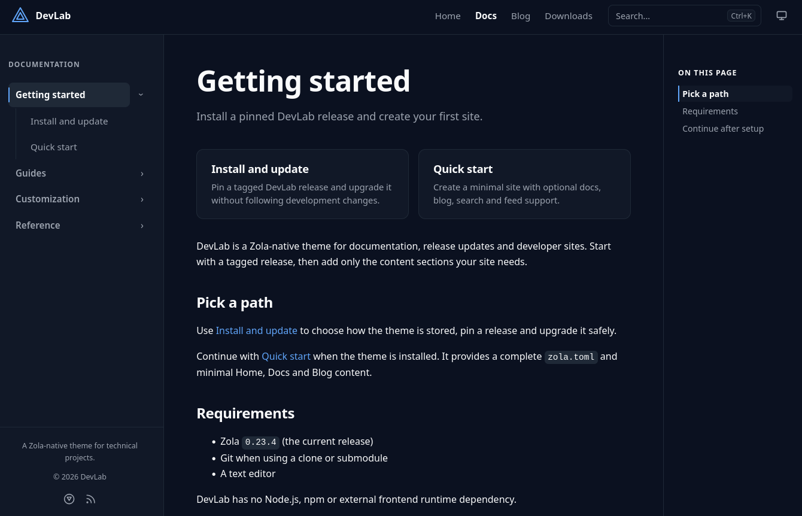

+++
title = "devlab-theme"
description = "A Zola-native theme for documentation, release updates and developer sites."
template = "theme.html"
date = 2026-08-31T13:48:19+05:00

[taxonomies]
theme-tags = ['documentation', 'blog', 'responsive', 'search', 'dark-mode']

[extra]
created = 2026-08-31T13:48:19+05:00
updated = 2026-08-31T13:48:19+05:00
repository = "https://codeberg.org/ripetitor/devlab-theme.git"
homepage = "https://codeberg.org/RiPetitor/devlab-theme"
minimum_version = "0.23.4"
license = "MIT"
demo = "https://ripetitor.codeberg.page/devlab-theme/"

[extra.author]
name = "RiPetitor"
homepage = "https://codeberg.org/RiPetitor"
+++        

[](https://www.getzola.org/)
[](https://codeberg.org/RiPetitor/devlab-theme/tags)
[](LICENSE)

# DevLab Theme

DevLab is a Zola-native theme for documentation, release updates and software projects. One content tree drives the Docs sidebar, mobile navigation, breadcrumbs and previous/next links, while Blog and Downloads provide optional release-facing layouts.



[Live demo](https://ripetitor.codeberg.page/devlab-theme/) · [Documentation](https://ripetitor.codeberg.page/devlab-theme/docs/) · [Updates](https://ripetitor.codeberg.page/devlab-theme/blog/)

The live Demo follows the development branch. Install a tagged release when the site must remain reproducible.

## Features

- Recursive Docs navigation with remembered groups, breadcrumbs, nested page TOC and server-rendered previous/next links
- Paginated Blog/Updates with published, updated and release metadata
- Generic pages and sections, a wide landing page and an optional Downloads layout
- Search, one responsive mobile drawer, skip navigation, Copy feedback and reduced-motion support
- Light, dark and system color modes with update-safe CSS tokens
- Namespaced Tera 2 content components, synchronized tabs, structured configuration and template hooks without Node.js or a frontend build step

## Install

For a standalone theme checkout, clone the latest stable release into an existing Zola site:

```sh
git clone --branch v0.6.0 --depth 1 https://codeberg.org/RiPetitor/devlab-theme themes/devlab-theme
```

Pinning the release tag keeps site builds reproducible. Change `v0.6.0` only when you intentionally upgrade the theme.

If the site itself is stored in Git, use a submodule or a vendored copy instead of committing an embedded repository. See [Install and update](https://ripetitor.codeberg.page/devlab-theme/docs/getting-started/installation/) for every installation method and the tagged upgrade workflow.

Enable it in `zola.toml`:

```toml
base_url = "https://example.com"
title = "My project"
theme = "devlab-theme"

compile_sass = true
build_search_index = true

[search]
index_format = "elasticlunr_javascript"
include_title = true
include_description = true
include_content = true

[extra.devlab.appearance]
default_mode = "system"
show_toggle = true
```

DevLab search consumes Zola's `elasticlunr_javascript` index. An explicitly configured incompatible format hides the search control and does not load its scripts; omitting `index_format` remains compatible while Zola's default produces the supported format.

Create `content/_index.md`:

```md
+++
title = "My project"
description = "Documentation and release updates."
+++

Project overview.
```

Then run:

```sh
zola serve
```

Docs, Blog, Downloads and richer homepage sections are opt-in. Continue with [Getting started](https://ripetitor.codeberg.page/devlab-theme/docs/getting-started/), the [Configuration reference](https://ripetitor.codeberg.page/devlab-theme/docs/reference/configuration/) and [Customization](https://ripetitor.codeberg.page/devlab-theme/docs/customization/).

## Tera 2 components

DevLab tracks the current Zola release and requires Zola `0.23.4`. It uses global, namespaced Tera 2 components in Markdown. No import is required:

```jinja

The body supports **Markdown**.

```

This release does not support Zola 0.22 or the removed shortcode syntax. Sites upgrading from `v0.3.1` must migrate authored shortcode calls and any Tera 1 template overrides; see the [v0.4.0 migration notes](https://ripetitor.codeberg.page/devlab-theme/blog/devlab-theme-v0-4-0/) and [component reference](https://ripetitor.codeberg.page/devlab-theme/docs/reference/components/).

## Compatibility

- Zola `0.23.4` (the theme tracks the current Zola release)
- No Node.js, npm or external frontend runtime required

## Development

This repository contains both the reusable theme and its Demo/Docs site. The Blog is the human-readable release history.

```sh
zola check
zola build
```

## License

[MIT](LICENSE)

        