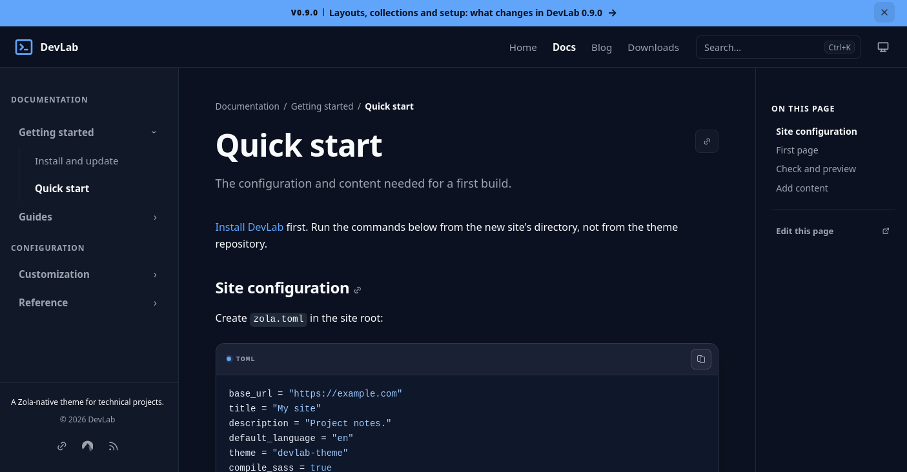

+++
title = "devlab-theme"
description = "A composable Zola theme for product sites, blogs, documentation and books."
template = "theme.html"
date = 2026-10-04T10:22:04+02:00

[taxonomies]
theme-tags = ['documentation', 'blog', 'book', 'product', 'responsive', 'search', 'dark-mode']

[extra]
created = 2026-10-04T10:22:04+02:00
updated = 2026-10-04T10:22:04+02:00
repository = "https://codeberg.org/ripetitor/devlab-theme.git"
homepage = "https://codeberg.org/RiPetitor/devlab-theme"
minimum_version = "0.23.6"
license = "MIT"
demo = "https://ripetitor.codeberg.page/devlab-theme/"

[extra.author]
name = "RiPetitor"
homepage = "https://codeberg.org/RiPetitor"
+++        

[](https://nogithub.codeberg.page)
[](https://www.getzola.org/)
[](content/blog/devlab-theme-v0-9-0.md)
[](LICENSE)

# DevLab Theme

A Zola theme with layouts for pages, blogs, documentation and books. Content is
written in Markdown; configuration lives in `zola.toml`. Builds require Zola
**0.23.6 or newer**.

The [v0.9.0 release notes](content/blog/devlab-theme-v0-9-0.md) describe layouts,
collections, navigation, community cards and template extensions.



[Live demo](https://ripetitor.codeberg.page/devlab-theme/) · [Documentation](https://ripetitor.codeberg.page/devlab-theme/docs/) · [Updates](https://ripetitor.codeberg.page/devlab-theme/blog/)

## Setup

[Install the theme](content/docs/getting-started/installation.md), then create
`zola.toml` and `content/_index.md` with the
[quick start](content/docs/getting-started/quick-start.md).
Keep content, styles and template overrides in the site repository.

## Documentation

| Topic | Reference |
| --- | --- |
| Landing blocks | [Landing pages](content/docs/reference/landing.md) |
| Independent documentation trees | [Collections](content/docs/reference/collections.md) |
| Books and chapter order | [Reader](content/docs/reference/reader.md) |
| Site and theme settings | [Configuration](content/docs/reference/configuration/_index.md) |
| Callouts, cards, tabs and other content blocks | [Components](content/docs/reference/components/_index.md) |
| Translations and sharing metadata | [Languages](content/docs/reference/languages.md) |
| Template slots and CSS tokens | [Extensions](content/docs/reference/extensions.md) |

## Development

```sh
python3 tests/test_theme.py
zola check --skip-external-links
zola build
```

## License

[MIT](LICENSE). Library licenses and exact upstream versions are listed in
[Third-party notices](THIRD_PARTY_NOTICES.md) and the
[search module provenance](static/vendor/lunr-languages/README.md).

        