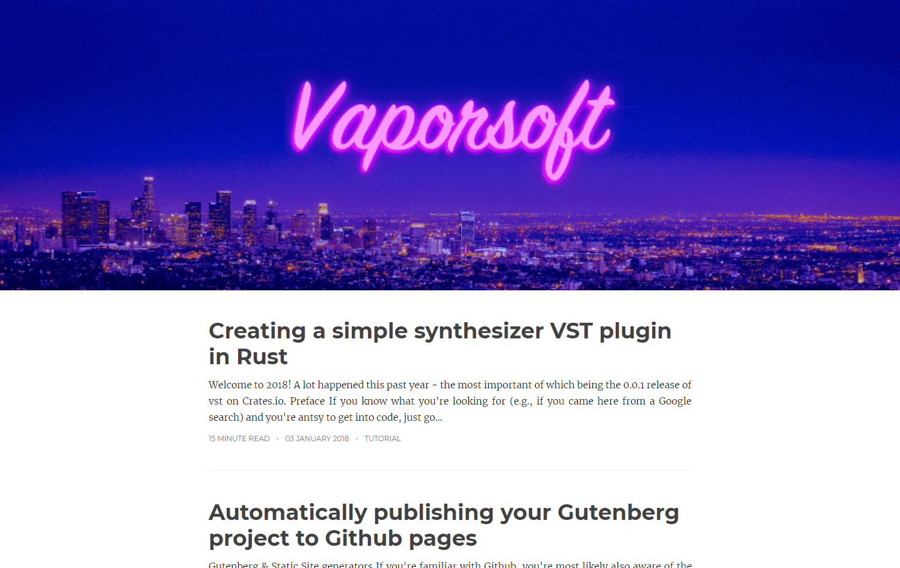

+++
title = "feather"
description = "A fuzzy blog theme"
template = "theme.html"
date = 2024-01-25T10:41:35+02:00

[extra]
created = 2024-01-25T10:41:35+02:00
updated = 2024-01-25T10:41:35+02:00
repository = "https://github.com/piedoom/feather.git"
homepage = "https://github.com/piedoom/feather"
minimum_version = "0.11.0"
license = "MIT"
demo = "http://feather.doomy.org/"

[extra.author]
name = "doomy"
homepage = "https://doomy.org"
+++        

# feather
A lightweight blog theme for [Zola](https://www.getzola.org/) (and to my knowledge the first of now
many themes created specifically for Zola).

# [Live demo 🔗](https://feather.doomy.org/)

[](https://feather.doomy.org/)

# Developing & Contributing
Because feather comes with example content, you can run the theme just like any Zola
blog with `zola serve`.

# Usage
Using feather is easy.  Install [Zola](https://www.getzola.org/) and follow 
[the guide for creating a site and using a theme](https://www.getzola.org/documentation/themes/installing-and-using-themes/).  Then,
add `theme = "feather"` to your `config.toml` file.

If you intend to publish your site to GitHub Pages, please check out [this
tutorial](https://www.getzola.org/documentation/deployment/github-pages/).

You can specify `tags` taxonomies .

## Options
Zola allows themes to [define `[extra]` variables](https://www.getzola.org/documentation/getting-started/configuration/)
in the config. Here's a full list of theme variables with example values and comments.

```
title = "My site" # Otherwise, this will read "Home" in the nav

[extra]
feather_analytics = "<script></script>" # basically just a place to put extra scripts
feather_disqus_domain = "mysite-com" # disqus embeds, if you want that
```

        