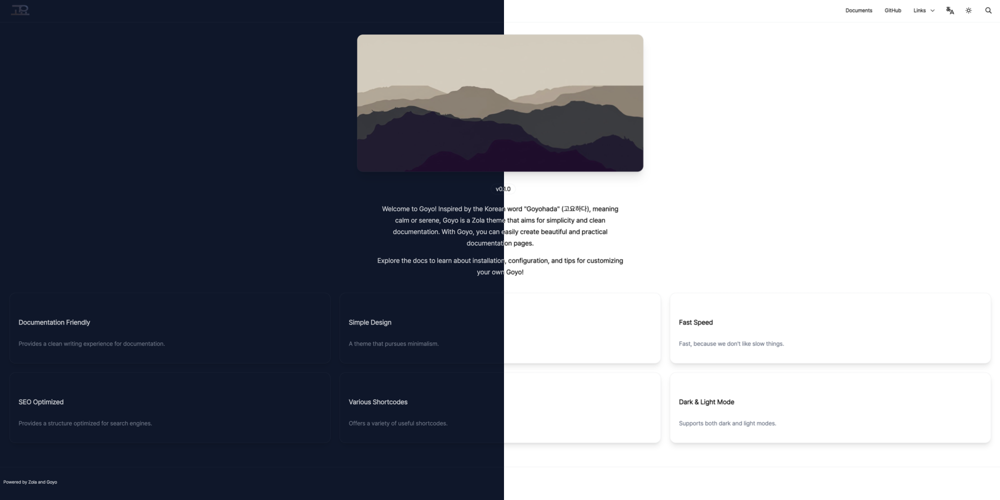

+++
title = "Goyo"
description = "A simplicity and clean documentation theme"
template = "theme.html"
date = 2025-11-08T09:05:00+09:00

[taxonomies]
theme-tags = ['documentation', 'Multilingual', 'Responsive', 'minimal']

[extra]
created = 2025-11-08T09:05:00+09:00
updated = 2025-11-08T09:05:00+09:00
repository = "https://github.com/hahwul/goyo"
homepage = "https://github.com/hahwul/goyo"
minimum_version = "0.17.0"
license = "MIT"
demo = "https://goyo.hahwul.com"

[extra.author]
name = "hahwul"
homepage = "https://www.hahwul.com"
+++        



<div align="center">
  <p>Goyo is a <a href="https://www.getzola.org/">Zola</a> theme that aims for simplicity and clean documentation.</p>
</div>

<p align="center">
  <a href="https://goyo.hahwul.com"></a>
  <a href="https://github.com/hahwul/goyo/blob/main/CONTRIBUTING.md"></a>
  <a href="https://www.getzola.org/"></a>
  <a href="https://tailwindcss.com"></a>
  <a href="https://daisyui.com"></a>
</p>

## Features

- Dark & Light Themes with Brightness Settings
- Beautiful Landing Page
- Responsive Design
- SEO-Friendly
- Multi-Language Support
- Auto-Generated Sidebar & Custom Nav
- Built-in resources (FontAwesome, Mermaid.js)
- Comments (Giscus, Utterances)
- Various shortcodes (Mermaid, Asciinema, Katex, Alert, Badge, etc.)
- Customization

## Installation

Make your zola app

```bash
zola init yoursite
cd yoursite
```

Add the theme as a git submodule:

```bash
git init  # if your project is a git repository already, ignore this command
git submodule add https://github.com/hahwul/goyo themes/goyo
```

Or clone the theme into your themes directory:

```bash
git clone https://github.com/hahwul/goyo themes/goyo
```

Then set `goyo` as your theme in `config.toml`.

```toml
title = "Your Docs"
theme = "goyo"
```

## Configuration

Add extra field in config.toml

```toml
[extra]
# Logo Configuration
logo_text = "Goyo"  # Text to display if no logo image
logo_image_path = "images/goyo.png"  # Path to logo image
logo_image_padding = "5px"  # Padding for logo image (optional)

# Footer Configuration
footer_html = "Powered by <a href='https://www.getzola.org'>Zola</a> and <a href='https://github.com/hahwul/goyo'>Goyo</a>"  # Footer HTML content

# Thumbnail Configuration
default_thumbnail = "images/default_thumbnail.jpg"  # Default thumbnail image path

# Twitter Configuration
twitter_site = "@hahwul"  # Site Twitter handle
twitter_creator = "@hahwul"  # Creator Twitter handle

# Color Configuration
default_colorset = "dark"  # Default color scheme (dark/light)
brightness = "normal"  # Options: "darker", "normal", "lighter"

# Google Tag Configuration
gtag = ""  # Google Analytics tracking ID

# Sidebar Configuration
sidebar_expand_depth = 1  # Sidebar expansion depth (max 5)

# Language display names for the language selector
# If not defined, the language code will be displayed
lang_aliases = { en = "English", ko = "한국어" }

# Navigation Configuration
nav = [
  { name = "Documents", url = "/introduction", type = "url", icon = "fa-solid fa-book" },
  { name = "GitHub", url = "https://github.com/hahwul/goyo", type = "url", icon = "fa-brands fa-github" },
  { name = "Links", type = "dropdown", icon = "fa-solid fa-link", members = [
    { name = "Creator Blog", url = "https://www.hahwul.com", type = "url", icon = "fa-solid fa-fire-flame-curved" }
  ] }
]

# Navigation Configuration (i18n / optional)
# `nav_{lang}`: Language-specific navigation menu (e.g., `nav_ko` for Korean).
# If defined, it will be used instead of the default `nav` for that language.
nav_ko = [
    { name = "문서", url = "/ko/introduction", type = "url", icon = "fa-solid fa-book" },
    { name = "GitHub", url = "https://github.com/hahwul/goyo", type = "url", icon = "fa-brands fa-github" },
    { name = "링크", type = "dropdown", icon = "fa-solid fa-link", members = [
        { name = "제작자 블로그", url = "https://www.hahwul.com", type = "url", icon = "fa-solid fa-fire-flame-curved" },
    ] },
]

# Language Aliases Configuration
# Custom display names for languages in the language selector
# If not defined, language codes will be displayed
lang_aliases = { en = "English", ko = "한국어" }

# Theme Toggle Configuration
disable_theme_toggle = false  # Hide theme toggle button (true to disable)

# Sidebar Visibility Configuration
disable_root_sidebar_hide = false  # Prevent hiding sidebar on root page

# Edit URL Configuration
edit_url = ""  # Base URL for editing pages (e.g., "https://github.com/user/repo/edit/main")

# Comments Configuration
[extra.comments]
enabled = false  # Enable comments
system = ""  # Comment system (e.g., "giscus")
repo = ""  # Repository for comments (e.g., "hahwul/goyo")
repo_id = ""  # Repository ID (e.g., "R_kgDOXXXXXXX")
category = ""  # Comment category (e.g., "General")
category_id = ""  # Category ID (e.g., "DIC_kwDOXXXXXXXXXX")
```

More information? [Configuration - Goyo Documents](https://goyo.hahwul.com/get_started/configuration/) and [Creating Landing - Goyo Documents](https://goyo.hahwul.com/get_started/creating-landing/)

## Run

```bash
zola serve

# and open http://localhost:1111 in your browser.
```

        