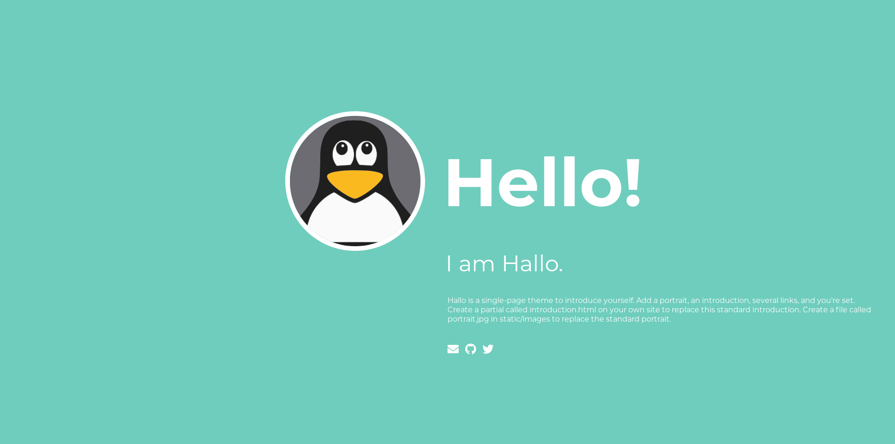

+++
title = "hallo"
description = "A single-page theme to introduce yourself."
template = "theme.html"
date = 2021-02-18T22:27:50+01:00

[extra]
created = 2021-02-18T22:27:50+01:00
updated = 2021-02-18T22:27:50+01:00
repository = "https://github.com/flyingP0tat0/zola-hallo.git"
homepage = "https://github.com/janbaudisch/zola-hallo"
minimum_version = "0.4.0"
license = "MIT"
demo = "https://zola-hallo.janbaudisch.dev"

[extra.author]
name = "Jan Baudisch"
homepage = "https://janbaudisch.dev"
+++        

[![Build Status][build-img]][build-url]
[![Demo][demo-img]][demo-url]

# Hallo

> A single-page theme to introduce yourself.
>
> [Zola][zola] port of [hallo-hugo][hallo-hugo].



## Original

This is a port of the original [hallo-hugo][hallo-hugo] theme for Hugo ([License][upstream-license]).

## Installation

The easiest way to install this theme is to either clone it ...

```
git clone https://github.com/janbaudisch/zola-hallo.git themes/hallo
```

... or to use it as a submodule.

```
git submodule add https://github.com/janbaudisch/zola-hallo.git themes/hallo
```

Either way, you will have to enable the theme in your `config.toml`.

```toml
theme = "hallo"
```

### Introduction

The introduction text is included from `templates/partials/introduction.html`.

You will need to create this file and fill it with content.


## Options

See [`config.toml`][config] for an example configuration.

### Author

The given name will be used for the 'I am ...' text.

Default: `Hallo`

```toml
[extra.author]
name = "Hallo"
```

### Greeting

The string will be used as a greeting.

Default: `Hello!`

```toml
[extra]
greeting = "Hello!"
```

### `iam`

This variable defines the `I am` text, which you may want to swap out for another language.

Default: `I am`

```toml
[extra]
iam = "I am"
```

### Links

Links show up below the introduction. They are styled with [Font Awesome][fontawesome], you may optionally choose the iconset (default is [brands][fontawesome-brands]).

```toml
[extra]
links = [
    { title = "E-Mail", url = "mailto:mail@example.org", iconset = "fas", icon = "envelope" },
    { title = "GitHub", url = "https://github.com", icon = "github" },
    { title = "Twitter", url = "https://twitter.com", icon = "twitter" }
]
```

### Theme

Change the colors used.

```toml
[extra.theme]
background = "#6FCDBD"
foreground = "#FFF" # text and portrait border
hover = "#333" # link hover
```

[build-img]: https://builds.sr.ht/~janbaudisch/zola-hallo.svg
[build-url]: https://builds.sr.ht/~janbaudisch/zola-hallo
[demo-img]: https://img.shields.io/badge/demo-live-green.svg
[demo-url]: https://zola-hallo.janbaudisch.dev
[zola]: https://www.getzola.org
[hallo-hugo]: https://github.com/EmielH/hallo-hugo
[fontawesome]: https://fontawesome.com
[fontawesome-brands]: https://fontawesome.com/icons?d=gallery&s=brands&m=free
[upstream-license]: https://github.com/janbaudisch/zola-hallo/blob/master/upstream/LICENSE
[config]: https://github.com/janbaudisch/zola-hallo/blob/master/config.toml

        