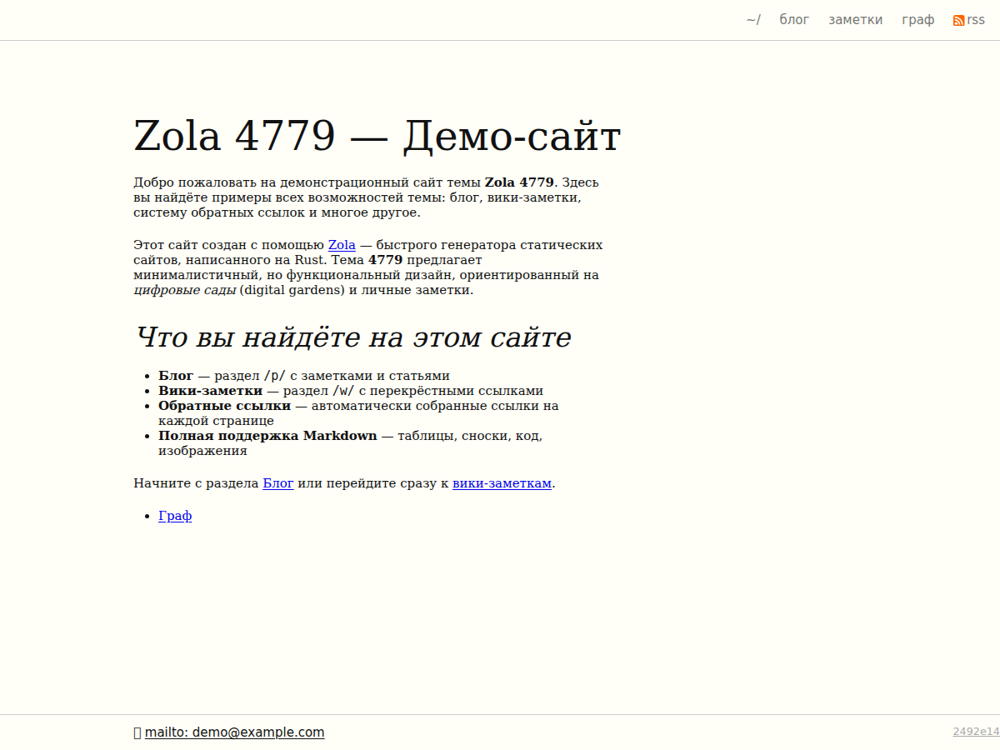

+++
title = "harmless"
description = "Digital garden theme — blog, wiki, backlinks, and D3.js link graph"
template = "theme.html"
date = 2026-06-07T12:08:11+07:00

[taxonomies]
theme-tags = []

[extra]
created = 2026-06-07T12:08:11+07:00
updated = 2026-06-07T12:08:11+07:00
repository = "https://github.com/e4779/zola-harmless.git"
homepage = "https://github.com/e4779/zola-harmless"
minimum_version = "0.22.1"
license = "MIT"
demo = "https://4779.ru"

[extra.author]
name = "Nick"
homepage = "https://4779.ru"
+++        

# harmless

[](https://getzola.org)
[](LICENSE)

**Digital garden theme for Zola — blog, wiki, backlinks, and D3.js link graph.**

Designed for personal knowledge spaces where ideas grow over time. Combines a
chronological blog, a wiki of interconnected notes, automatic backlinks, and an
interactive force-directed graph of your entire site.



---

## Quick start

```bash
cd your-site/themes
git clone https://github.com/e4779/zola-harmless.git harmless
```

Add `theme = "harmless"` to your site's `config.toml`:

```toml
theme = "harmless"
```

---

## Features

| Feature                  | Description                                                      |
|--------------------------|------------------------------------------------------------------|
| **Blog + Wiki sections** | `/p/` for chronological posts, `/w/` for evergreen wiki notes    |
| **Automatic backlinks**  | Every page shows which other pages link to it                    |
| **D3.js link graph**     | Interactive force-directed graph at `/graph/`                    |
| **Tufte CSS design**     | Content at 55 % width, margin notes at 35 %, serif typography    |
| **Footnotes as margin notes** | Footnotes render in the right margin, not at page bottom    |
| **Draw.io diagram embedding** | Embed editable draw.io diagrams with `{{/*/* drawio() */*/}}`   |
| **Dark mode**            | Automatic, based on system `prefers-color-scheme`                |
| **CSS `@scope` isolation** | Component-scoped styles without class name collisions          |
| **RSS/Atom feed**        | Built-in feed at `/p/atom.xml`                                   |
| **Responsive design**    | Adapts gracefully from desktop to mobile                         |
| **Marginnote shortcode** | Tufte-style margin notes with `{{/*/* marginnote() */*/}}`           |

---

## Configuration

Add a `[extra]` section to your site's `config.toml`:

```toml
[extra]

[extra.author]
name = "Your Name"
email = "you@example.com"

[extra.layout]
tufte_css = true     # Enable Tufte CSS (content at 55 %, margin notes at 35 %)

[extra.graph]
enabled = true       # Enable D3.js graph at /graph/
```

### Reference

| Variable                 | Type    | Default  | Description                               |
|--------------------------|---------|----------|-------------------------------------------|
| `extra.author.name`      | string  | —        | Author name, shown in footer              |
| `extra.author.email`     | string  | —        | Author email, shown as mailto link        |
| `extra.layout.tufte_css` | bool    | `true`   | Enable Tufte-inspired typography & layout |
| `extra.graph.enabled`    | bool    | `true`   | Enable the D3.js link graph page          |

---

## Content structure

Organise your content like this:

```
content/
├── _index.md              # Homepage
├── p/                     # Blog posts (chronological)
│   ├── _index.md          # Blog index section
│   ├── 2024-01-15-hello-world.md
│   └── 2024-02-20-some-post.md
├── w/                     # Wiki notes (evergreen, cross-linked)
│   ├── _index.md          # Wiki index section
│   └── some-note.md
└── graph.md               # Graph page (template: graph.html)
```

### Blog posts (`content/p/`)

Use date-prefixed filenames to control publication order:

```md
+++
title = "My Post"
date = 2024-01-15
+++

Content here.
```

### Wiki notes (`content/w/`)

Wiki notes don't need date prefixes in filenames, though a `date` in frontmatter
is used for display:

```md
+++
title = "A Wiki Note"
date = 2024-01-10
updated = 2024-06-01
+++

Content with [[internal links]] or plain markdown links.
```

### Graph page (`content/graph.md`)

```md
+++
title = "Graph"
date = 2024-01-01
template = "graph.html"
+++

Description of the graph page.
```

---

## Shortcodes

### `marginnote(body)`

Renders a Tufte-style margin note (appears in the right margin on desktop).

```md
{{/*/* marginnote(body="This is a margin note.") */*/}}
```

### `drawio(url, page)`

Embeds an interactive [draw.io](https://draw.io) diagram using the mxgraph
viewer.

```md
{{/*/* drawio(url="/img/diagram.drawio", page=0) */*/}}
```

| Parameter | Default | Description                |
|-----------|---------|----------------------------|
| `url`     | —       | Path to the `.drawio` file |
| `page`    | `0`     | Page index in the diagram  |

### Backlinks

Backlinks are **automatic** — no shortcode needed. Just link between your pages
using normal markdown links, and the build pipeline generates a `backlinks.json`
map that renders incoming links on every page.

---

## Build pipeline

The theme uses a **double-build** process to generate backlinks and a sitemap:

```
┌─────────┐    ┌──────────────┐    ┌─────────┐    ┌──────────────┐
│  Zola   │ →  │ backlinks.js │ →  │  Zola   │ →  │ sitemap.js   │
│ build 1 │    │ (reads HTML, │    │ build 2 │    │ (generates   │
│         │    │  writes JSON)│    │         │    │  sitemap.xml)│
└─────────┘    └──────────────┘    └─────────┘    └──────────────┘
```

1. **Zola build** — generates the static site
2. **backlinks.js** — scans all `.html` files, extracts internal links, and
   writes `backlinks.json` into both `static/` and `public/`
3. **Zola build (again)** — rebuilds with `backlinks.json` available at compile
   time so every page can render its backlinks
4. **sitemap.js** — generates `sitemap.xml` from the final output

This is handled automatically by the `Makefile`:

```bash
make build
```

---

## Development

```bash
make deps        # Install Zola (0.22.1) and npm dependencies
make dev         # Build + start dev server at http://127.0.0.1:1111
make test        # Run Playwright integration tests
make clean       # Remove build artifacts
```

### Requirements

- **Zola** ≥ 0.22.1 (installed automatically by `make deps`)
- **Node.js** ≥ 18 (for backlinks & sitemap scripts)

---

## License

MIT

        