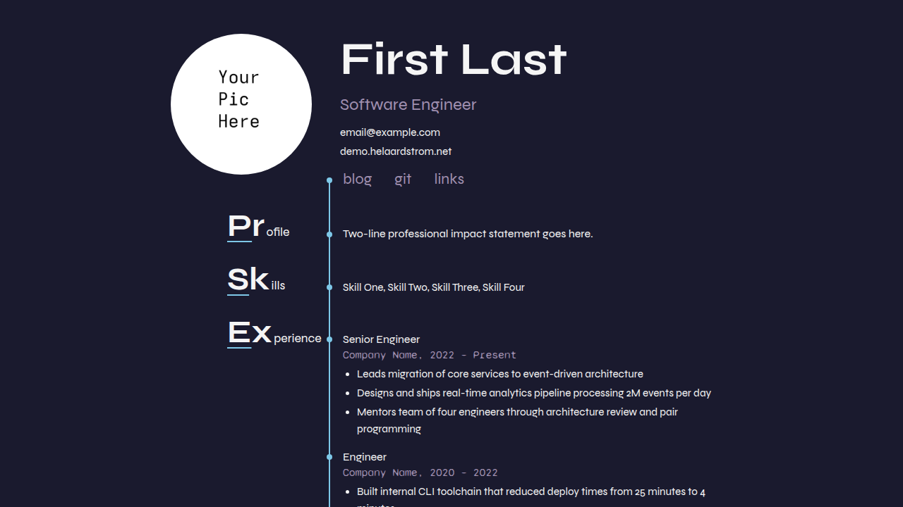

+++
title = "hela"
description = "An expressive resume theme for Zola — each step of one's life adds stones to the stream as it carves gently through the earth"
template = "theme.html"
date = 2026-09-05T17:43:07-07:00

[taxonomies]
theme-tags = ['dark', 'expressive', 'resume', 'stream', 'landing']

[extra]
created = 2026-09-05T17:43:07-07:00
updated = 2026-09-05T17:43:07-07:00
repository = "https://git.colorized.life/demo.helaardstrom.net.git"
homepage = "https://git.colorized.life/demo.helaardstrom.net/about/"
minimum_version = "0.23.4"
license = "MIT"
demo = "https://demo.helaardstrom.net"

[extra.author]
name = "Lany Atwood"
homepage = "https://colorized.life"
+++        

# hela

An expressive resume theme for Zola — each step of one's life adds stones to the stream as it carves gently through the earth.

[Live demo](https://demo.helaardstrom.net)



## Features

- Dark aesthetic with a 5-color palette
- Config-driven resume: all content lives in `zola.toml`
- Stream layout with a continuous vertical line studded by stone markers
- Breaking Bad-style section headers with glow-underlined cap letters
- Circular profile photo with horizontal header layout
- Experience section with multi-position company grouping and per-position stones
- Education section with per-degree stones
- Blog section with paginated listing and directional post navigation
- Links pages with stacked link + description layout
- Responsive design with mobile stream accent
- Sass-based theming with extensive tuning knobs
- View Transitions API with cross-page navigation

## Installation

Requires Zola 0.23.4 or later; this demo is validated with 0.23.4.

From your Zola site's root, add the theme as a Git submodule:

```sh
git submodule add https://git.colorized.life/demo.helaardstrom.net.git themes/hela
```

Alternatively, clone it into the same directory:

```sh
git clone https://git.colorized.life/demo.helaardstrom.net.git themes/hela
```

Set the top-level `theme = "hela"` in your site's `zola.toml`, as shown below.

The theme repository is also a standalone demo: run `zola check`, `zola build`, or `zola serve` from its root without adding a `theme` setting.

## Minimal configuration

Minimal consumer configuration (`zola.toml`):

```toml
base_url = "https://example.com"
title = "My Site"
theme = "hela"
compile_sass = true
build_search_index = false

[extra]
site_title = "My Site"
copyright_holder = "Your Name"
footer_links = []

[extra.resume]
name = "Your Name"
nav_links = []
```

Add your portrait as `static/profile.jpg`. Empty navigation arrays avoid linking to pages you have not created. Theme defaults include sample resume data; override those fields with your own content. Optional routes below require content in your site; theme installation alone does not create those pages. For a blog, create `content/blog/_index.md` using the front matter shown under Feed below, then add dated Markdown posts. Use `template = "links.html"` for links pages, `"palette.html"` for the palette, and `"page.html"` for ordinary pages.

## Full options

### Theme defaults

The following block exactly matches the active `[extra]` defaults in `theme.toml`. Commented examples in that file are optional customizations, not defaults.

```toml
[extra]
site_title = "My Site"
copyright_holder = "Your Name"
footer_links = [{ name = "acknowledgements", path = "/acknowledgements" }]


[extra.resume]
name = "First Last"
contact = [
  { text = "email@example.com", url = "mailto:email@example.com" },
  { text = "example.com", url = "https://example.com" },
]
summary = "Two-line professional impact statement goes here."
skills = ["Skill One", "Skill Two", "Skill Three", "Skill Four"]

nav_links = [
  { name = "blog", path = "/blog" },
  { name = "git", url = "https://example.com" },
  { name = "links", path = "/links" },
]

```

| Key | Theme default / fallback | Description |
| --- | --- | --- |
| `site_title` | `"My Site"` | Homepage heading when `resume.name` is absent; final template fallback is `"My Site"` |
| `copyright_holder` | `"Your Name"`; `config.title` if absent | Footer copyright link text |
| `copyright_url` | Unset; `config.base_url` | Optional footer copyright URL override |
| `footer_links` | Acknowledgements link above | `{ name, path }`; `path` accepts a local path or an absolute URL, not a `url` key |
| `feed_path` | Unset; no feed button | Feed directory without a trailing slash; the footer appends `/atom.xml` |
| `resume` | Sample data above | Header, navigation, summary, skills, experience, and education |
| `colors` | Unset; built-in palette | Optional color overrides described under Customization |
| `palette_names`, `palette_roles` | Unset; built-in labels | Optional labels for the five palette keys |

### Footer customizations

Consumer customization example, separate from the theme defaults:

```toml
[extra]
copyright_url = "https://example.com"
footer_links = [
  { name = "acknowledgements", path = "/acknowledgements" },
  { name = "sites", path = "/sites" },
]
```

Branded demo configuration excerpt (the source link stays second in the footer):

```toml
[extra]
footer_links = [
  { name = "home", path = "/" },
  { name = "source", path = "https://git.colorized.life/demo.helaardstrom.net/about/" },
  { name = "palette", path = "/palette" },
  { name = "acknowledgements", path = "/acknowledgements" },
  { name = "sites", path = "/sites" },
]
```

The footer renders `path` directly, including absolute URLs. The demo source link reaches the repository without a deployment redirect.

### Feed

Consumer customization for `zola.toml` (keep top-level keys before `[extra]`):

```toml
feed_filenames = ["atom.xml"]

[extra]
feed_path = "/blog"
```

Consumer section front matter for `content/blog/_index.md`:

```toml
+++
title = "Blog"
template = "blog.html"
page_template = "post.html"
sort_by = "date"
paginate_by = 4
generate_feeds = true
+++
```

`feed_path` only adds the footer button; section feed generation creates `/blog/atom.xml`. Omit `feed_path` when no feed exists.

### Pages

| Route | Template | Description |
| ----- | -------- | ----------- |
| `/` | `index.html` | Resume landing page |
| `/blog` | `blog.html` | Paginated blog listing |
| `/blog/*` | `post.html` | Individual blog post |
| `/links` | `links.html` | External links (header nav) |
| `/sites` | `links.html` | Cross-site family navigation (footer) |
| `/palette` | `palette.html` | Color palette reference |
| `/acknowledgements` | `page.html` | Font and tool credits |

### Resume data

Resume content is driven from `[extra.resume]` in your `zola.toml`. The following snippets are consumer customization examples; merge them into the existing table rather than repeating TOML table headers. Fields absent from the effective configuration are skipped, except the name heading, which falls back to `site_title`. Theme defaults supply the sample values above.

#### Header

```toml
[extra.resume]
name = "First Last"
professional_title = "Software Engineer"
contact = [
  { text = "email@example.com", url = "mailto:email@example.com" },
  { text = "example.com", url = "https://example.com" },
]
summary = "Two-line professional impact statement goes here."
skills = ["Skill One", "Skill Two", "Skill Three", "Skill Four"]
```

| Key | Description |
| --- | ----------- |
| `name` | Display name, rendered as an `<h1>` at 700 weight |
| `professional_title` | Subtitle displayed under the name in muted color (optional) |
| `contact` | Array of `{ text, url }` entries, stacked vertically |
| `summary` | Short impact statement rendered in the Profile stream section |
| `skills` | Array of strings, comma-separated in the Skills stream section |

Contact items without a `url` render as plain text. Items with a `url` render as links.

#### Navigation links

```toml
[extra.resume]
nav_links = [
  { name = "blog", path = "/blog" },
  { name = "git", url = "https://example.com" },
  { name = "links", path = "/links" },
]
```

Navigation links support `path` (local or absolute) and `url` (external); `url` takes precedence when supplied. Rendered as the first stream section, capped by a stone at the top of the stream line.

#### Experience

```toml
[[extra.resume.experience]]
company = "Company Name"
positions = [
  { title = "Senior Engineer", start = "2022", end = "Present", items = [
    "Accomplishment one",
    "Accomplishment two",
  ] },
]
```

Each `[[extra.resume.experience]]` entry represents a company. Multiple positions within the same company are listed under `positions`.

| Key | Description |
| --- | ----------- |
| `company` | Company name (Syne Mono, muted color) |
| `positions` | Array of position objects |
| `title` | Position title (Syne) |
| `start` | Start date |
| `end` | End date |
| `items` | Array of bullet point strings (optional) |

#### Education

```toml
[[extra.resume.education]]
school = "State University"
date = "2016"
degree = "B.S. Computer Science"
```

| Key | Description |
| --- | ----------- |
| `school` | School name (Syne Mono, muted) |
| `date` | Year or date range (Syne Mono, muted) |
| `degree` | Degree name (Syne) |

### Links pages

Consumer links-page front matter uses `[extra]` with `url`, `name`, and `description`:

```toml
[[extra.links]]
name = "example.com"
url = "https://example.com"
description = "Description text"
```

## Customization

### CSS tuning knobs

The resume stylesheet (`sass/_resume.scss`) exposes tunable values marked with `// knob:` comments. All values can be adjusted directly in the file.

#### Desktop

| Variable / Selector | Default | Description |
| -------------------- | ------- | ----------- |
| `$stream-x` | `14rem` | Horizontal position of stream line (label column width) |
| `$label-pad-left` | `5rem` | Left padding on section headers |
| `$stream-line-w` | `2px` | Stream line thickness |
| `$stream-gap` | `1.25rem` | Gap between stream line and content |
| `$stone-size` | `8px` | Stone diameter |
| `$stream-overhang` | `1rem` | How far stream line extends past last section |
| `$label-big-size` | `2.8rem` | BB header big letters font-size |
| `$label-rest-size` | `1.1rem` | BB header rest text font-size |
| `$nav-offset-y` | `-1.2rem` | Shifts nav content vertically |
| `.resume-header` `gap` | `2.5rem` | Space between photo and text stack |
| `.resume-photo` `width/height` | `200px` | Profile picture size (keep square) |
| `.resume-name` `font-size` | `4rem` | Name size (largest text on page) |
| `.resume-title` `font-size` | `1.5rem` | Professional title size |
| `.resume-contact` `gap` | `0.15rem` | Vertical spacing between contact lines |

Per-section content vertical offsets (`$content-y-*`) and per-stone vertical offsets (`$stone-y-*`) are also available for fine alignment.

#### Mobile (`max-width: 600px`)

| Variable | Default | Description |
| -------- | ------- | ----------- |
| `$mobile-stream-x` | `-1rem` | Stream line position (into container padding) |
| `$mobile-photo-size` | `140px` | Mobile photo size |
| `$mobile-name-size` | `2.8rem` | Mobile name size |
| `$mobile-label-size` | `1.875rem` | Mobile BB header font-size |
| `$mobile-section-gap` | `2rem` | Space between sections |
| `$mobile-stream-trim-top` | `1rem` | Trims the start of the stream line downward |

### Colors

Add `[extra.colors]` to your `zola.toml` to override any color. Only the keys you specify change. Consumer customization example:

```toml
[extra.colors]
bg = "#1a1a2e"
accent = "#e8a0b4"
```

| Key | Default | Role |
| --- | ------- | ---- |
| `bg` | `#1a1a2e` | Page background |
| `text` | `#f5f5f5` | Primary text |
| `muted` | `#a090b0` | Metadata text, nav links |
| `accent` | `#e8a0b4` | Link hover color |
| `glow` | `#7ec8e8` | Vertical separator color |

### Palette labels

The palette page displays five fixed swatches. Consumer customization example for names and roles:

```toml
[extra.palette_names]
bg = "Space Indigo"
text = "White Smoke"
muted = "Amethyst Smoke"
accent = "Prism Pink"
glow = "Seagull"

[extra.palette_roles]
bg = "Background"
text = "Foreground"
muted = "Muted text"
accent = "Accent"
glow = "Accent"
```

### Sass variables (`sass/_variables.scss`)

Built-in Sass defaults:

```scss
$font-body: "Syne", sans-serif !default;
$font-mono: "Syne Mono", monospace !default;
$container-max: 860px !default;
```

## License

MIT; see [LICENSE](LICENSE).

        