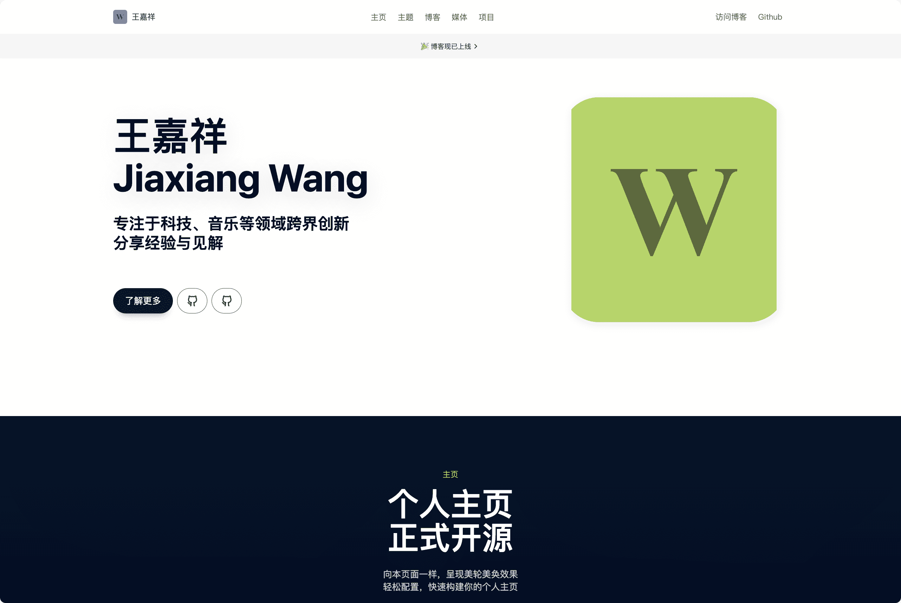

+++
title = "homepage-creators"
description = "A fast and beautiful personal homepage for creators, used by https://jiaxiang.wang, a port of HeoWeb."
template = "theme.html"
date = 2024-12-25T17:08:52+08:00

[taxonomies]
theme-tags = []

[extra]
created = 2024-12-25T17:08:52+08:00
updated = 2024-12-25T17:08:52+08:00
repository = "https://github.com/iWangJiaxiang/Homepage-Creators.git"
homepage = "https://github.com/iWangJiaxiang/homepage-for-creators"
minimum_version = "0.19.2"
license = "AGPL"
demo = "https://jiaxiang.wang/"

[extra.author]
name = "Jiaxiang Wang"
homepage = "https://blog.jiaxiang.wang"
+++        

<div align="center">

<h1>Homepage Creators</h1>

<p align="center">

主题预览](#-预览) | [快速上手](#-快速上手) | [加入讨论

[中文](./README.md) | [English](./README.en.md)

</p>
</div>

[](https://jiaxiang.wang)

## 🔥 预览

| 站点名称 | 站点地址 |
|:------:|:-----------------------|
| 王嘉祥 个人主页 | https://www.jiaxiang.wang |


## ℹ️ 简介

[Homepage Creators](https://github.com/iWangJiaxiang/Homepage-Creators) 是一款适用于 [Zola](https://github.com/getzola/zola) 的个人主页主题，风格接近 Apple，美观大气。

> 注意：本主题移植于的开源 [HeoWeb](https://github.com/zhheo/HeoWeb) 纯静态主题，感谢 [张洪 Heo](https://blog.zhheo.com/) 的无私分享。

本主题使用简单，只需修改`config.toml`文件即可动态调整内容。无需像上游仓库一样修改 HTML 内容，极大降低用户的心智负担。

### 🔌 功能

> 已完成所有功能移植

- [x] 基本功能
  - [x] 移动端自适应
  - [x] 动画滚动
  - [x] AVIF / WebP自适应
  - [x] 动态更新底部年份
  - [x] 访问量统计
- [x] 内容板块
  - [x] 导航菜单
  - [x] 首屏板块
  - [x] 作者板块
  - [x] 事件板块
  - [x] 产品板块（独立）
  - [x] 产品板块（清单）
- [x] 日常运营
  - [x] 置顶通知
- [x] 合规
  - [x] ICP备案

## 📝 快速上手

1. 参考[官方说明](https://www.getzola.org/documentation/getting-started/installation/)安装 Zola 命令行工具
1. 将本仓库克隆到本地

    ```bash
    git clone --depth=1 https://github.com/iWangJiaxiang/Homepage-Creators
    ```

1. 进入本地仓库

    ```bash
    cd zola-theme-jiaxiang
    ```

1. 运行预览命令，然后在浏览器打开提示的预览地址

    ```bash
    zola serve
    ```

    此时您应该成功访问到博客网站啦

1. 参考官方资料进一步并定制您的主页
   - [zola 命令说明](https://www.getzola.org/documentation/getting-started/cli-usage/)
   - [理解项目结构](https://www.getzola.org/documentation/getting-started/directory-structure/)
   - [自定义](https://www.getzola.org/documentation/getting-started/configuration/)

1. 根据需要修改`config.toml`配置文件内容，您需要对 TOML 格式有基本的了解。

1. 根据需要将自己的图片素材放到`static/img`文件夹

## 💬 讨论

如果你对主题有什么建议或者意见，欢迎提 PR & Issue。

## 🔐 许可

[Homepage Creators](https://github.com/iWangJiaxiang/Homepage-Creators) 使用 [AGPL](./LICENSE) 协议开源，请遵守开源协议。


        