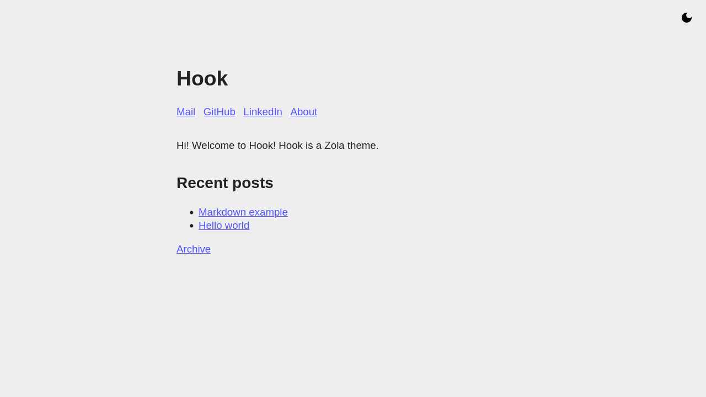

+++
title = "Hook"
description = "Clean and simple personal site/blog theme"
template = "theme.html"
date = 2024-01-09T08:33:22+01:00

[extra]
created = 2024-01-09T08:33:22+01:00
updated = 2024-01-09T08:33:22+01:00
repository = "https://github.com/InputUsername/zola-hook.git"
homepage = "https://github.com/InputUsername/zola-hook"
minimum_version = "0.15.2"
license = "MIT"
demo = "https://inputusername.github.io/zola-hook/"

[extra.author]
name = "Koen Bolhuis"
homepage = "https://koen.bolhu.is"
+++        

# Hook

A clean and simple personal site/blog theme for [Zola](https://getzola.org).

[Demo](https://inputusername.github.io/zola-hook/)

## Setup

Clone this repo into your `themes` folder:
```sh
cd themes
git clone https://github.com/InputUsername/zola-hook.git hook
```

Then, enable it in your `config.toml`:
```toml
theme = "hook"
```

## Features

The following templates are built-in:
- `index.html` - the homepage;
- `page.html` - pages and posts (extends `index.html`);
- `section.html` - archive of pages in a section, mostly for a blog (extends `page.html`);
- `404.html` - 404 page (extends `page.html`).

Templates have the following Tera blocks:
- `title` - to override the default `<title>` (`config.title`);
- `description` - to override the `<meta name="description">`'s content (`config.description`);
- `extra_head` - to override styles and anything else in `<head>`;
- `header` - to change the header (best to put this in a `<header>`);
- `content` - to change the content (best to put this in a `<main>`).

You can set a section or page description using `description` in your front matter.
By default, the `description` in `config.toml` is used.

You can define links to include in the header on the homepage in `config.toml`:
```toml
[extra]

links = [
    { title = "Link display text", href = "http://example.com" },
    # ...
]
```

Pages in the root section can define `extra.in_header = true` to be included in the header links on the homepage.

The content in the root `_index.md` is included in the homepage if present.

Below that is a list of the 20 most recent posts. For this, the `blog/_index.md` section is expected to exist
(will error if it doesn't exist). There is also a link to an archive of all blog posts by year.

Hook supports light/dark mode based on the user's preference. There is also a manual toggle button
(requires JavaScript).

## Screenshots

### Homepage



### Blog post


### Blog archive


### Dark mode


## License

MIT license, see [`LICENSE`](https://github.com/InputUsername/zola-hook/blob/main/LICENSE).

        