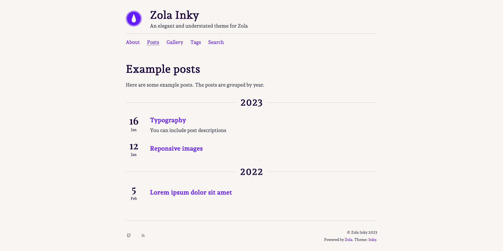

+++
title = "Inky"
description = "An elegant and understated theme for Zola"
template = "theme.html"
date = 2024-01-09T08:33:22+01:00

[extra]
created = 2024-01-09T08:33:22+01:00
updated = 2024-01-09T08:33:22+01:00
repository = "https://github.com/jimmyff/zola-inky.git"
homepage = "https://github.com/jimmyff/zola-inky"
minimum_version = "0.17.0"
license = "MIT"
demo = "https://jimmyff.github.io/zola-inky/"

[extra.author]
name = "jimmyff"
homepage = "https://www.jimmyff.co.uk"
+++        


# Zola-Inky

> An elegant and understated theme for Zola

Zola Inky ([view demo](https://jimmyff.github.io/zola-inky)) is a theme by [jimmyff](https://github.com/jimmyff) and [mr-karan](https://github.com/mr-karan) for the [Zola](https://www.getzola.org/) static site generator. This theme was originally based on the [hugo-ink](https://github.com/knadh/hugo-ink) theme, ported by mr-karan. It was then packaged and developed further by jimmyff. The theme is available on [Github](https://github.com/jimmyff/zola-inky) under the MIT license, for more information on how to use it please see the [readme](https://github.com/jimmyff/zola-inky/blob/main/README.md) and check the [changelog](https://github.com/jimmyff/zola-inky/blob/main/CHANGELOG.md) for a list of the latest changes.

[](https://jimmyff.github.io/zola-inky)

## Changelog

For latest changes please see the [changelog](CHANGELOG.md).

## Features

- Responsive design
- Responsive images
- Gallery template
- Taxonomy support
- Search
- Customisable via template hooks

## Getting started

1. Add this theme to your `themes/` folder (recommended method: git submodule).
2. Copy of the the theme's config.toml file and put in your projects root directory. Update it as required and don't forget to add `theme = 'zola-inky'` at the top of the file.
3. Copy this contents of the `content/` directory the root of your project and change the files as your necessary.

## Customising the theme

- __To change the settings__ copy `config.toml` in to your project and update as required (make sure you add the theme variable at the top of the file, see the getting started heading above).
- __To change the themes colours__ copy `sass/variables.scss` in to your project under the same folder and update as required.
- __To inject content in to templates__ copy `templates/macros/hooks.html` and update as required.

## Using the responsive image shortcode

Using the responsive images will make sure your images are generated at various sizes and served up to viewers at the size that best suits their device via the image srcset attribute. You can use this feature in your markdown like so:

```md
{{/* image(src="yourimage.jpg", alt="This is my image") */}}
```

## Feature requests & support

I'm afraid I'm unable to accept feature requests or provide user support for this theme. The [Zola documentation](https://www.getzola.org/documentation/getting-started/overview/) and [Tera documentation](https://tera.netlify.app/docs/) are great resources and there is a [Zola discussion forum](https://zola.discourse.group/). If you've found a bug in the themse please open a github issue.

## Contributing

Contributions are very welcome! If you are planning to add a feature to the theme then feel free to open an issue to discuss your approach and we will be able to say if it's it will likely be accepted. Please keep the following in mind:

- Only widely generic features will be accepted, anything too specific should be kept to your own templates.
- Be careful about destroying indentation as Tera syntax doesn't seem to be widely supported by IDEs.
- Keep it lean. Adding bloat will likely result in your PR being rejected.
- Consider backward compatibility, ideally people blindly-upgrading won't see any unexpected changes to their sites.

New theme maintainers are welcome but should provide pull-request or two first!

        