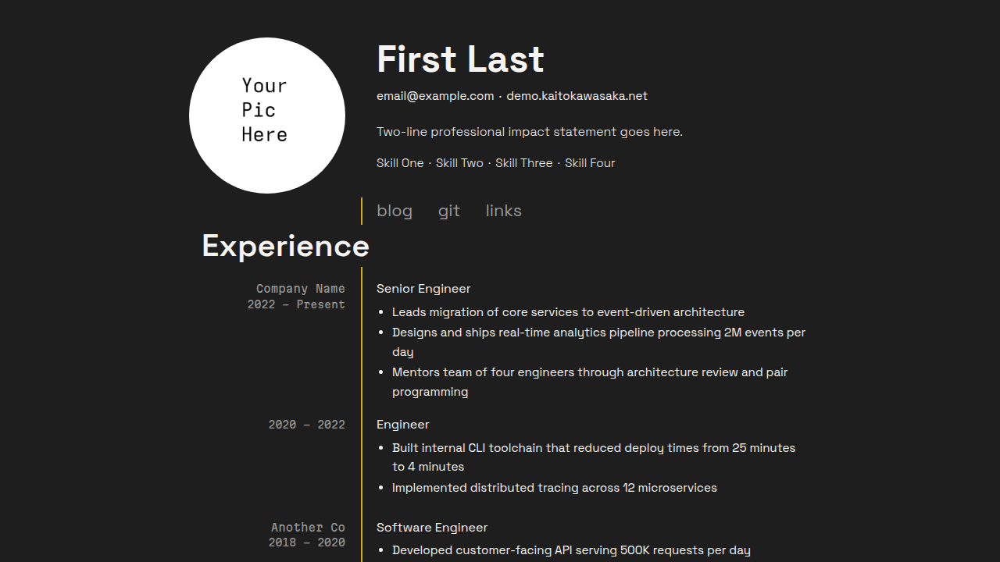

+++
title = "kaito"
description = "A modern and sleek resume landing page for a personal website"
template = "theme.html"
date = 2026-09-05T17:43:08-07:00

[taxonomies]
theme-tags = ['dark', 'minimal', 'resume', 'landing']

[extra]
created = 2026-09-05T17:43:08-07:00
updated = 2026-09-05T17:43:08-07:00
repository = "https://git.colorized.life/demo.kaitokawasaka.net.git"
homepage = "https://git.colorized.life/demo.kaitokawasaka.net/about/"
minimum_version = "0.23.4"
license = "MIT"
demo = "https://demo.kaitokawasaka.net"

[extra.author]
name = "Lany Atwood"
homepage = "https://colorized.life"
+++        

# kaito

A modern dark resume theme for Zola that doubles as a personal website landing page, with inner pages for blog and links.

[Live demo](https://demo.kaitokawasaka.net)



## Features

- Dark aesthetic with a tight 5-color palette
- Config-driven resume: all content lives in `zola.toml`
- Two-column body layout with a vertical separator that jumps over section headers
- Circular profile picture with configurable header layout
- Middot-separated contact and skills lines
- Experience section with multi-position company grouping
- Education section with terminal bubble accent
- Blog section with paginated listing and directional post navigation
- Links pages with stacked link + description layout
- Responsive design with mobile separator accent
- Sass-based theming with easy variable overrides
- View Transitions API with cross-page navigation

## Installation

Requires Zola 0.23.4 or later; this demo is validated with 0.23.4.

From your Zola site's root, add the theme as a Git submodule:

```sh
git submodule add https://git.colorized.life/demo.kaitokawasaka.net.git themes/kaito
```

Alternatively, clone it into the same directory:

```sh
git clone https://git.colorized.life/demo.kaitokawasaka.net.git themes/kaito
```

Set the top-level `theme = "kaito"` in your site's `zola.toml`, as shown below.

## Minimal configuration

Minimal consumer configuration for your site's `zola.toml`:

```toml
base_url = "https://example.com"
title = "My Site"
theme = "kaito"
compile_sass = true
build_search_index = false

[extra]
site_title = "My Site"
copyright_holder = "Your Name"
footer_links = []

[extra.resume]
name = "Your Name"
nav_links = []
```

The homepage always renders a profile image. Add your portrait at `static/profile.jpg`. Create your own content under
`content/`; the demo's content is not installed as your site's content.
Empty navigation arrays avoid links to pages you have not created yet.
Run `zola serve` to preview and `zola build` for production output.

## Full options

These are the active theme defaults from `theme.toml`:

```toml
[extra]
site_title = "My Site"
copyright_holder = "Your Name"
footer_links = [{ name = "acknowledgements", path = "/acknowledgements" }]

# Footer links use a simple schema: { name, path }
#   name    — display text
#   path    — local path or absolute URL (e.g. "/about", "https://example.com")

[extra.resume]
name = "First Last"
contact = [
  { text = "email@example.com", url = "mailto:email@example.com" },
  { text = "example.com", url = "https://example.com" },
]
summary = "Two-line professional impact statement goes here."
skills = ["Skill One", "Skill Two", "Skill Three", "Skill Four"]

nav_links = [
  { name = "blog", path = "/blog" },
  { name = "git", url = "https://example.com" },
  { name = "links", path = "/links" },
]

# Nav links use { name, path } for local or { name, url } for external links.
```

| Key | Theme default / fallback | Description |
| --- | --- | --- |
| `site_title` | `My Site` | Homepage heading when `resume.name` is absent; final template fallback is `My Site` |
| `copyright_holder` | `Your Name`; template fallback `config.title` | Footer copyright text |
| `copyright_url` | Unset; falls back to `config.base_url` | Optional copyright destination |
| `footer_links` | Acknowledgements link above | Entries use `name` and `path`; `path` accepts local paths and absolute URLs |
| `feed_path` | Unset; no feed button | Section path without a trailing slash; the footer appends `/atom.xml` |

Consumer customization example (merge into your existing configuration):

```toml
feed_filenames = ["atom.xml"]

[extra]
copyright_url = "https://example.com"
feed_path = "/blog"
footer_links = [
  { name = "acknowledgements", path = "/acknowledgements" },
  { name = "sites", path = "/sites" },
]
```

Create the linked pages yourself. For the feed, set `generate_feeds = true`
in your blog section's frontmatter; `feed_path` only displays the link and
does not generate a feed.

Branded demo configuration excerpt (the source entry retains its existing footer position):

```toml
[extra]
footer_links = [
  { name = "home", path = "/" },
  { name = "source", path = "https://git.colorized.life/demo.kaitokawasaka.net/about/" },
  { name = "palette", path = "/palette" },
  { name = "acknowledgements", path = "/acknowledgements" },
  { name = "sites", path = "/sites" },
]
```

Footer `path` accepts an absolute URL, so the source link works without a
deployment redirect. Footer entries do not support `url`.

### Pages

| Route | Template | Description |
| ----- | -------- | ----------- |
| `/` | `index.html` | Resume landing page |
| `/blog` | `blog.html` | Paginated blog listing |
| `/blog/*` | `post.html` | Individual blog post |
| `/links` | `links.html` | External links (header nav) |
| `/sites` | `links.html` | Cross-site family navigation (footer) |
| `/palette` | `palette.html` | Color palette reference |
| `/acknowledgements` | `page.html` | Font and tool credits |

### Resume data

All resume content is driven from `[extra.resume]` in your `zola.toml`. Sections are optional; omit a section to skip it. Installed theme defaults may supply values: override arrays with `[]` to clear them. If `name` is absent, the homepage uses `site_title`.

#### Header

Consumer customization example:

```toml
[extra.resume]
name = "First Last"
contact = [
  { text = "email@example.com", url = "mailto:email@example.com" },
  { text = "example.com", url = "https://example.com" },
]
summary = "Two-line professional impact statement goes here."
skills = ["Skill One", "Skill Two", "Skill Three", "Skill Four"]
```

| Key | Description |
| --- | ----------- |
| `name` | Display name, rendered as an `<h1>` at 700 weight; overrides `site_title` |
| `contact` | Array of `{ text, url }` entries, separated by middots |
| `summary` | Short impact statement (two lines max, content guideline) |
| `skills` | Array of strings, separated by middots |

Contact items without a `url` render as plain text. Items with a `url` render as links.

#### Navigation links

Theme-default navigation excerpt:

```toml
[extra.resume]
nav_links = [
  { name = "blog", path = "/blog" },
  { name = "git", url = "https://example.com" },
  { name = "links", path = "/links" },
]
```

Resume navigation supports `path` (local or absolute) and `url` (external); `url` takes precedence when present. Rendered as a horizontal row with the vertical separator starting at this line.

#### Experience

Consumer customization example:

```toml
[[extra.resume.experience]]
company = "Company Name"
positions = [
  { title = "Senior Engineer", start = "2022", end = "Present", items = [
    "Accomplishment one",
    "Accomplishment two",
  ] },
]
```

Each `[[extra.resume.experience]]` entry represents a company. Multiple positions within the same company are listed under `positions`.

| Key | Description |
| --- | ----------- |
| `company` | Company name (Martian Mono, muted color) |
| `positions` | Array of position objects |
| `title` | Position title (Space Grotesk) |
| `start` | Start date |
| `end` | End date |
| `items` | Array of bullet point strings (optional) |

#### Education

Consumer customization example:

```toml
[[extra.resume.education]]
school = "State University"
date = "2016"
degree = "B.S. Computer Science"
```

| Key | Description |
| --- | ----------- |
| `school` | School name (Martian Mono, muted) |
| `date` | Year or date range (Martian Mono, muted) |
| `degree` | Degree name (Space Grotesk) |

#### Links pages

Consumer page-frontmatter example; links pages use `[[extra.links]]` with `name`, `url`, and `description`:

```toml
[[extra.links]]
name = "example.com"
url = "https://example.com"
description = "Description text"
```

## Customization

### CSS tuning knobs

The resume stylesheet (`sass/_resume.scss`) exposes tunable values marked with `// knob:` comments. All values can be adjusted directly in the file.

#### Desktop

| Selector | Property | Default | Description |
| -------- | -------- | ------- | ----------- |
| `.resume-header` | `gap` | `2.5rem` | Space between photo and text stack |
| `.resume-photo` | `width` / `height` | `200px` | Profile picture size (keep square) |
| `.resume-name` | `font-size` | `3rem` | Name size (largest text on page) |
| `.resume-contact` | `gap` | `0.4rem` | Middot spacing (contact line) |
| `.resume-skills` | `gap` | `0.4rem` | Middot spacing (skills line) |
| `.resume-nav` | `gap` | `2rem` | Space between nav links |
| `.resume-nav` | `top` | `1rem` | How far nav floats into separator bridge |
| `.resume-section-title` | `font-size` | `2.5rem` | Section header size |
| `.resume-entry` | `margin-bottom` | `1.5rem` | Space between companies |

#### Mobile (`max-width: 600px`)

| Selector | Property | Default | Description |
| -------- | -------- | ------- | ----------- |
| `.resume-photo` | `width` / `height` | `140px` | Mobile photo size |
| `.resume-name` | `font-size` | `2.25rem` | Mobile name size (75% of desktop) |
| `.resume-section-title` | `font-size` | `1.875rem` | Mobile section header (75% of desktop) |

### Colors

Add `[extra.colors]` to your `zola.toml` to override any color. Only the keys you specify change. Consumer customization example:

```toml
[extra.colors]
bg = "#1e1e1e"
accent = "#025fa1"
```

| Key | Default | Role |
| --- | ------- | ---- |
| `bg` | `#1e1e1e` | Page background |
| `text` | `#f6f4f1` | Primary text |
| `muted` | `#999999` | Metadata text, nav links |
| `accent` | `#025fa1` | Link hover color |
| `glow` | `#d4a824` | Vertical separator color |

### Palette labels

The palette page displays five fixed swatches. Names and roles can be overridden with `extra.palette_names` and `extra.palette_roles`; both accept the five color keys. Consumer customization example:

```toml
[extra.palette_names]
bg = "Blackout"
text = "Bone White"
muted = "Super Grey"
accent = "Brigadier Blue"
glow = "Burnt Gold"
```

### Sass variables (`sass/_variables.scss`)

Theme stylesheet defaults:

```scss
$font-body: "Space Grotesk", sans-serif !default;
$font-mono: "Martian Mono", monospace !default;
$container-max: 860px !default;
```

## License

MIT; see [LICENSE](LICENSE).

        