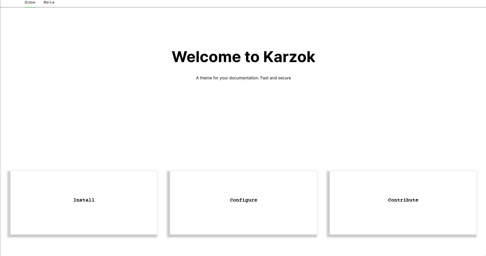

+++
title = "karzok"
description = "The theme for launching fast documentation sites"
template = "theme.html"
date = 2024-01-25T10:41:35+02:00

[extra]
created = 2024-01-25T10:41:35+02:00
updated = 2024-01-25T10:41:35+02:00
repository = "https://github.com/kogeletey/karzok.git"
homepage = "https://github.com/kogeletey/karzok"
minimum_version = "0.15.0"
license = "MIT"
demo = "https://karzok.re128.org"

[extra.author]
name = "Konrad Geletey"
homepage = ""
+++        

<p align="center">
  <a href="https://ci.codeberg.org/kogeletey/karzok" target="_blank"></a>
  <a href="https://codeberg.org/kogeletey/karzok/blob/develop/LICENSE"></a>
  <a href="https://github.com/kogeletey/karzok/releases"></a>
</p>
<p align="center">
    <a href="https://karzok.re128.org"> Documentation </a>
</p>

# Karzok

- classless and frameworkless
- Jinja-like templates
- javascript is optional, needed only for search,math,alerts and dark mode
- no roundings and other strange design trends



## Get Started

- [find out more](https://karzok.re128.org/install/)

### Requirements

- [Node.js](https://nodejs.org/)

### 1. Create a new zola site

```sh
zola init zola_site
```

### 2. Download this theme to you themes directory:

```sh
git clone https://codeberg.org/kogeletey/karzok zola_site/themes
```

or install as submodule:

```sh
cd zola_site
git init # if your project is a git repository already, ignore this command
git submodule add https://codeberg.org/kogeletey/karzok zola_site/themes
```

### 3. Configuration. Open in favorite editor `config.toml`

```toml
base_url = "https://karzok.example.net" # set-up for production
theme = "karzok"
```

See more in [configuration](https://karzok.re128.org/configure/)

### 4. Added new content

```zsh
    cp ./themes/content/_index.md content/_index.md
```

how you can give freedom to your creativity

### 5. Run the project

i. development enviroment

1. Install node dependencies needed to work

```zsh
pnpm ci
pnpm run build
```

2. Just run `zola serve` in the root path of the project

```zsh
zola serve
```

Open in favorite browser [http://127.0.0.1:1111](http://127.0.0.1:1111). Saved
changes live reolad.

ii. production enviroment

- with conainers

1. Write file for container

```Dockerfile
FROM ghcr.io/kogeletey/karzok:latest AS build-stage
# or your path to image
ADD . /www
WORKDIR /www
RUN sh /www/build.sh 

FROM nginx:stable-alpine

COPY --from=build-stage /www/public /usr/share/nginx/html

EXPOSE 80
```

2.  Run the your container
```zsh
docker build -t <your_name_image> . &&\
docker run -d -p 8080:8080 <your_name_image> 
```
- using gitlab-ci and gitlab-pages

```yml
image: ghcr.io/kogeletey/karzok:latest # or change use your registry

pages: 
  script:
    - sh /www/build.sh   
    - mv /www/public public
  artifacts:
    paths:
      - public/
```

Open in favorite browser [https://localhost:8080](http://localhost:8080)

## License

This program is Free Software: You can use, study share and improve it at your
will. Specifically you can redistribute and/or modify it under the terms of the
[MIT](https://mit-license.org/)

## Contribute

Make sure to read the [Code of Conduct](https://karzok.re128.org/reference/code_of_conduct/)

### Find bugs and come up with features

On the [codeberg issues](https://codeberg.org/kogeletey/karzok/issues) or
[github issues](https://github.com/kogeletey/karzok/issues)

        