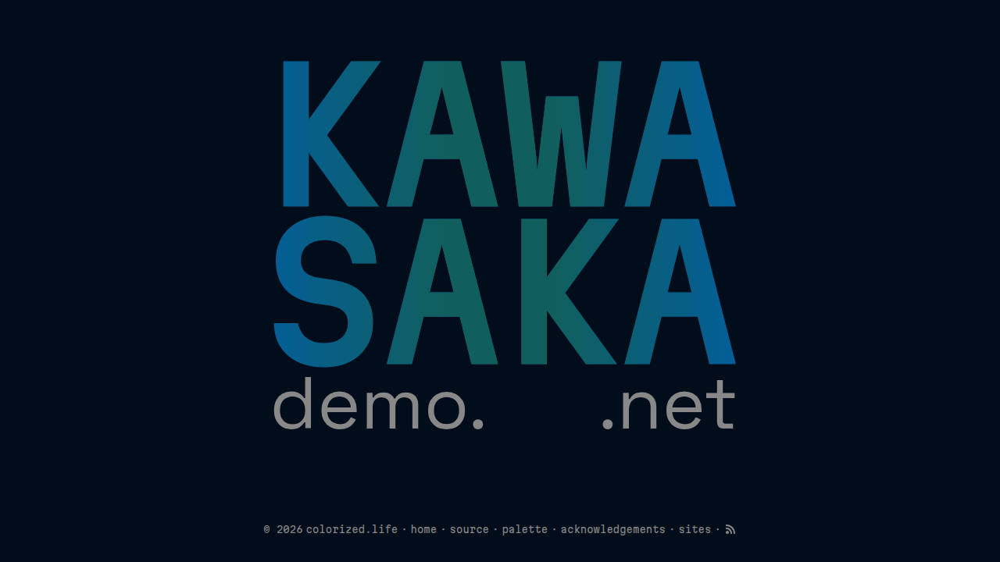

+++
title = "kawasaka"
description = "A minimal dark theme for creative writing"
template = "theme.html"
date = 2026-09-05T17:43:08-07:00

[taxonomies]
theme-tags = ['dark', 'minimal', 'creative', 'poetry']

[extra]
created = 2026-09-05T17:43:08-07:00
updated = 2026-09-05T17:43:08-07:00
repository = "https://git.colorized.life/demo.kawasaka.net.git"
homepage = "https://git.colorized.life/demo.kawasaka.net/about/"
minimum_version = "0.23.4"
license = "MIT"
demo = "https://demo.kawasaka.net"

[extra.author]
name = "Lany Atwood"
homepage = "https://colorized.life"
+++        

# kawasaka

A minimal dark Zola theme for creative writing, with a config-driven landing page and two poem layout variants.

[Live demo](https://demo.kawasaka.net)



## Features

- Dark oceanic aesthetic with a tight 5-color palette
- Config-driven landing page with per-line font, color, and link control
- Multi-span landing lines (multiple elements on a single row)
- Puddle hover effect with animated gradient fill
- Two poem page layouts: centered (default) and side-nav (alternative)
- RSS/Atom feed support with configurable feed icon in footer
- Responsive design with fluid typography via `clamp()`
- Sass-based theming with easy variable overrides
- Accessible `prefers-reduced-motion` support
- View Transitions API with cross-page navigation

## Installation

Requires Zola 0.23.4 or later; this demo is validated with 0.23.4.

From your Zola site's root, add the theme as a Git submodule:

```sh
git submodule add https://git.colorized.life/demo.kawasaka.net.git themes/kawasaka
```

Alternatively, clone it into the same directory:

```sh
git clone https://git.colorized.life/demo.kawasaka.net.git themes/kawasaka
```

Set the top-level `theme = "kawasaka"` in your site's `zola.toml`, as shown below.

## Minimal configuration

Minimal consumer configuration in your site's `zola.toml`:

```toml
base_url = "https://example.com"
title = "My Site"
theme = "kawasaka"
compile_sass = true
```

Create your own `content/` directory and pages, then run `zola serve` from your
site root. With no `landing_lines` override, the homepage displays `site_title`
as a link to `/`. The installed theme supplies `My Site`; if that key is absent,
the template falls back to the top-level `title`.

## Full options

The active `[extra]` defaults in `theme.toml` are exactly:

```toml
[extra]
site_title = "My Site"
copyright_holder = "Your Name"
```

All other options are optional consumer overrides in your site's `zola.toml`:

| Key | Theme default / behavior when omitted | Description |
| --- | --- | --- |
| `site_title` | `"My Site"`; template fallback is `config.title` | Homepage title when `landing_lines` is absent |
| `copyright_holder` | `"Your Name"`; template fallback is `config.title` | Copyright link text |
| `copyright_url` | `config.base_url` | Optional copyright link URL |
| `footer_links` | No links | List of objects with `name` and `path` |
| `feed_path` | No feed icon | Section path; footer appends `/atom.xml` |
| `landing_lines` | Simple title link | Optional custom landing rows, described below |
| `colors` | Built-in palette below | Optional color overrides |
| `palette_names` | Built-in names below | Optional palette swatch labels |
| `palette_roles` | Built-in roles below | Optional palette swatch descriptions |

## Customization

### Footer and feeds

Consumer customization example (provide pages at the chosen local paths):

```toml
[extra]
site_title = "My Site"
copyright_holder = "Your Name"
copyright_url = "https://example.com"
feed_path = "/depths"
footer_links = [
  { name = "home", path = "/" },
  { name = "website", path = "https://example.com" },
  { name = "contact", path = "mailto:email@example.com" },
]
```

Footer links use `name` for display text and `path` directly as the `href`.
`path` accepts local paths, absolute URLs, and `mailto:` links; `url` is not a
supported footer-link key. Landing rows instead use `href`, as described below.

Branded demo configuration excerpt from `zola.toml` (the full footer also has
other links):

```toml
[extra]
footer_links = [
  { name = "source", path = "https://git.colorized.life/demo.kawasaka.net/about/" },
]
```

This absolute source URL points directly to the repository and works without a
deployment redirect.

For feeds, the section referenced by `feed_path` must have `generate_feeds = true`
in its `_index.md` front matter. Consumer section configuration example:

```toml
generate_feeds = true
```

Consumer top-level `zola.toml` feed configuration (place before `[extra]`):

```toml
feed_filenames = ["atom.xml"]
```

### Landing page

The landing page is built from `[[extra.landing_lines]]` entries in `zola.toml`. Each entry renders as a single visual row in the title card.

#### Single-span lines

Each entry produces one `<a>` (if `href` is set) or `<span>`. Branded demo
customization example:

```toml
[[extra.landing_lines]]
text = "KAWA"
href = "/depths"
font = "Martian Mono"
color = "var(--muted)"
class = "landing-puddle"
```

| Key     | Required | Description                                         |
| ------- | -------- | --------------------------------------------------- |
| `text`  | yes      | Display text                                        |
| `href`  | no       | Makes the line a link                               |
| `font`  | no       | CSS font-family (rendered as inline style)          |
| `color` | no       | Sets `--line-color` CSS custom property              |
| `class` | no       | CSS class(es) added to the element                  |

#### Multi-span lines

Set `spans` instead of `text` to place multiple elements on one row. The `font` and `color` fields are set on the wrapper and inherited by all spans. Each span only supports `text`, `href`, and `class`.

Branded demo customization example:

```toml
[[extra.landing_lines]]
class = "landing-line-multi"
font = "Space Grotesk"
color = "var(--muted)"
spans = [
  { text = "demo.", class = "landing-line-sm landing-line-left" },
  { text = ".net", class = "landing-line-sm landing-line-right" },
]
```

The `landing-line-multi` class uses `display: flex; justify-content: space-between` to push spans to opposite edges.

#### Available landing classes

| Class                | Effect                                                    |
| -------------------- | --------------------------------------------------------- |
| `landing-puddle`     | Animated gradient fill on hover (horizontal wipe)         |
| `landing-line-sm`    | Smaller text (0.42em), lighter weight                     |
| `landing-line-left`  | Left-aligned with optical nudge (`$landing-nudge-left`)   |
| `landing-line-right` | Right-aligned with optical nudge (`$landing-nudge-right`) |
| `landing-line-multi` | Flex row with `space-between` for multi-span lines        |

#### Landing title defaults

The `.landing-title` container defaults to Martian Mono at `clamp(4rem, 18vw, 14rem)`. Individual lines can override the font via the `font` config field.

### Poem layouts

Two poem templates are available. Consumer section front-matter example for
`_index.md` (choose one `page_template` value):

```toml
page_template = "poem.html"      # centered layout (default)
# page_template = "poem_alt.html"  # alternative: side-nav layout
```

#### Centered layout (`poem.html`)

Title, body, and navigation are stacked vertically in a centered column. Navigation uses a 3-column grid below the poem body: ascend (left), depths (center), descend (right).

#### Side-nav layout (`poem_alt.html`)

Navigation links are vertically stacked in the left margin, absolutely positioned so they don't affect content centering. The poem body has a hard left anchor that stays fixed regardless of line length — longer lines drift rightward rather than shifting the layout.

On viewports narrower than `40rem`, the layout degrades gracefully: navigation collapses to a horizontal 3-column grid below the body, matching the centered layout's pattern.

### CSS tuning knobs

Several Sass variables are exposed as manual tweaking points for optical alignment. All use `!default` and can be overridden by shadowing the relevant file.

#### Landing optical nudges (`sass/_base.scss`)

Current Sass defaults:

```scss
$landing-nudge-left: 10px !default;   // translateX for .landing-line-left spans
$landing-nudge-right: 0px !default;   // translateX for .landing-line-right spans
```

These compensate for font side-bearing differences between Martian Mono (title text) and Space Grotesk (subdomain/TLD text) when using multi-span lines.

#### Poem nav centering (`sass/_poem.scss`)

Current Sass default:

```scss
$poem-nav-center-nudge: -4px !default;  // translateX for the center nav link
```

Compensates for proportional font rendering in the centered poem layout's "depths" link.

### Colors

Add `[extra.colors]` to your `zola.toml` to override any color. Only the keys you specify change. Consumer customization example:

```toml
[extra.colors]
bg = "#010D1A"
accent = "#025fa1"
```

| Key      | Default   | Role                          |
| -------- | --------- | ----------------------------- |
| `bg`     | `#010d1a` | Page background               |
| `text`   | `#f5f5f5` | Primary text                  |
| `muted`  | `#888888` | Secondary text, nav links     |
| `accent` | `#025fa1` | Links, hover states           |
| `glow`   | `#115f5c` | Puddle hover gradient overlay |

### Palette labels

The palette page displays five fixed swatches. Names and roles can be overridden independently. Consumer customization example
using the built-in defaults:

```toml
[extra.palette_names]
bg = "Blue Charcoal"
text = "White Smoke"
muted = "Argent"
accent = "Brigadier Blue"
glow = "Hadal"

[extra.palette_roles]
bg = "Background"
text = "Foreground"
muted = "Muted text"
accent = "Accent"
glow = "Accent"
```

Only the keys you specify change — omitted keys keep their defaults.

### Sass variables (`sass/_variables.scss`)

Current Sass defaults for deeper customization (fonts, layout):

```scss
$font-body: "Space Grotesk", sans-serif !default;
$font-mono: "Martian Mono", monospace !default;
$container-max: 860px !default;
```

## License

MIT; see [LICENSE](LICENSE).

        