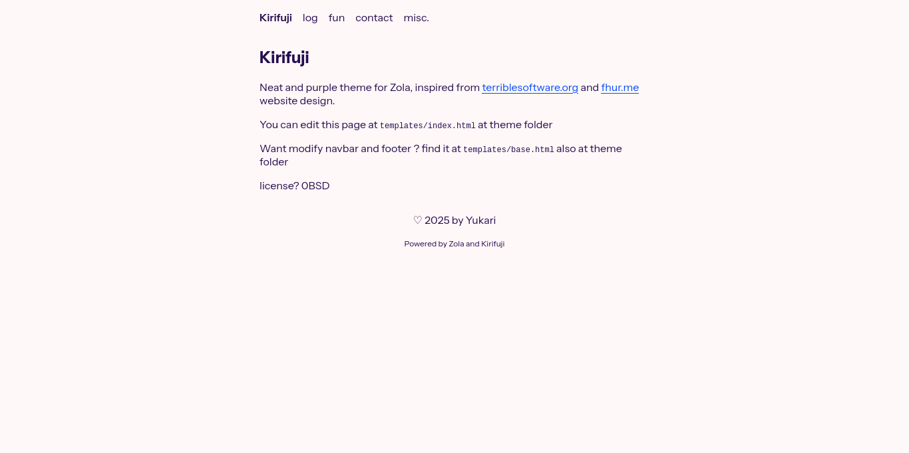

+++
title = "kirifuji"
description = "simple and neat theme for blogging."
template = "theme.html"
date = 2025-11-07T19:18:47+07:00

[taxonomies]
theme-tags = ['neat', 'purple', 'blog']

[extra]
created = 2025-11-07T19:18:47+07:00
updated = 2025-11-07T19:18:47+07:00
repository = "https://codeberg.org/yukari/kirifuji-zola.git"
homepage = "https://github.com/yukari/kirifuji-zola"
minimum_version = "0.4.0"
license = "0BSD"
demo = ""

[extra.author]
name = "Yukari Kirifuji"
homepage = ""
+++        

## Kirifuji



Neat, responsive and purple theme for Zola, inspired by [terriblesoftware.org](https://terriblesoftware.org) and [fhur.me](https://fhur.me) website design.

To install this theme:

```
git clone https://codeberg.org/yukari/kirifuji-zola themes/kirifuji
```

or, this option to keep update with latest change:

```
git init # if you not have initiate git
git submodule add https://codeberg.org/yukari/kirifuji-zola.git themes/kirifuji
```

Then change `config.toml`:

```toml
theme = "kirifuji"

[extra]
# to hide "Powered by Zola and Kirifuji" footer texts
# hideThemeName = true

# navigation menu setup
navigationMenu = [
    { name = "log", path = "/log"},
    { name = "fun", path = "/fun"},
    { name = "contact", path = "/contact"},
    { name = "misc.", path = "/misc"}
]
```


### License

- [0BSD](LICENSE)
- Alan Sans fonts: [OFL-1.1](static/AlanSans-LICENSE.txt)
        