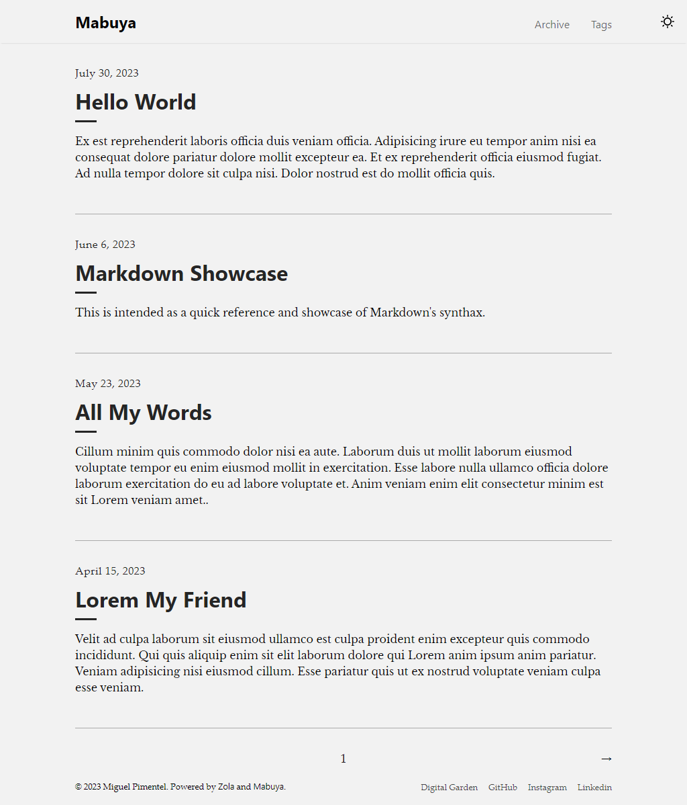

+++
title = "Mabuya"
description = "🦎 A minimal Zola theme for building light and SEO-ready blogs."
template = "theme.html"
date = 2024-07-01T05:58:26Z

[extra]
created = 2024-07-01T05:58:26Z
updated = 2024-07-01T05:58:26Z
repository = "https://github.com/semanticdata/mabuya.git"
homepage = "https://github.com/semanticdata/mabuya"
minimum_version = "0.18.0"
license = "MIT"
demo = "https://mabuya.vercel.app/"

[extra.author]
name = "Miguel Pimentel"
homepage = "https://miguelpimentel.do/"
+++        

<div align="center">
<h1>🦎 Mabuya</h1>
  
  
  
  
  
</div>
<br />

<div align="center">

[Mabuya](https://mabuya.vercel.app/) is a minimal [Zola](https://www.getzola.org) theme for building light and SEO-ready blogs.  
Put your work front and center with Mabuya as the base of your project.

<a href="https://mabuya.vercel.app/">
</a>
</div>

<br />
<div align="center">

</div>

## ⓘ Background

While searching for themes, I came across [Zola Tale](https://github.com/aaranxu/tale-zola). Sadly, the project's last update was on Dec, 2021. Shortly after, I decided to fork the project and add my own touches to it.

The name **Mabuya** comes from the [Mabuya hispaniolae](https://en.wikipedia.org/wiki/Mabuya_hispaniolae?useskin=vector), a possibly extinct[^1] species of skink endemic to the Dominican Republic, my home country.

## ✨ Features and Improvements

While working on the theme, I have added new functionality and made many quality of life improvements. Here's a short list:

- Refactored stylesheets.
- Added Dark theme and color theme toggle.
- Added new footer navigation.
- Created a custom GitHub Action to deploy Zola sites faster than any other GitHub Actions using Docker.
- Refined page transitions from desktop to mobile and viceversa.
- Centralized custom variables–made it easier to customize the site's colors.
- Addressed PR [#7](https://github.com/aaranxu/tale-zola/pull/7) fixing the pagination problem present in the original Zola theme.
- Addressed Issue [#4](https://github.com/aaranxu/tale-zola/issues/4) fixing custom text not being used correctly.
- Addressed (temporarily) Issue [#1](https://github.com/aaranxu/tale-zola/issues/1) by removing the erroneous pinned marker.
- Optimized for speed and accessibility. Subtle color changes to make the text more readable, etc.
- Many other small improvements...

## 🚀 Quick Start

Before using the theme, you need to install [Zola](https://www.getzola.org/documentation/getting-started/installation/) ≥ v0.18.0.

### 1. Clone the repo

```sh
git clone git@github.com:semanticdata/mabuya.git
```

### 2. Change directory into clone

```sh
cd mabuya
```

### 3. Serve the site locally

```sh
zola serve
```

For more detailed instructions, visit the [Documentation](https://www.getzola.org/documentation/themes/installing-and-using-themes/) page about installing and using themes.

## 🎨 Customization

You can change the configuration, templates and content yourself. Refer to the [config.toml](config.toml), and [templates](templates) for ideas. In most cases you only need to modify the contents of [config.toml](config.toml) to customize the appearance of your blog. Make sure to visit the Zola [Documentation](https://www.getzola.org/documentation/getting-started/overview/).

Adding custom CSS is as easy as adding your styles to [sass/_custom.scss](sass/_custom.scss). This is made possible because SCSS files are backwards compatible with CSS. This means you can type normal CSS code into a SCSS file and it will be valid.

## 🔄 Workflows

### 🔨 Build only

```yml
steps:
  - name: Checkout
    uses: actions/checkout@v4
  - name: Install Zola
    uses: taiki-e/install-action@zola
  - name: Build Zola
    run: zola check --drafts
    env:
      BUILD_ONLY: true
      GITHUB_TOKEN: ${{/* secrets.GITHUB_TOKEN */}}
```

### 📢 Deployment

```yml
steps:
  - name: Checkout
    uses: actions/checkout@v4
  - name: Install Zola
    uses: taiki-e/install-action@zola
  - name: Build site
    run: zola build
    env:
      GITHUB_TOKEN: ${{/* secrets.GITHUB_TOKEN */}}
  - name: Upload site artifact
    uses: actions/upload-pages-artifact@v3
    with:
      path: public
  - name: Deploy to GitHub Pages
    id: deployment
    uses: actions/deploy-pages@v4
```

## 🚩 Reporting Issues

We use GitHub Issues as the official bug tracker for **Mabuya**. Please search [existing issues](https://github.com/semanticdata/mabuya/issues). It’s possible someone has already reported the same problem. If your problem or idea is not addressed yet, [open a new issue](https://github.com/semanticdata/mabuya/issues/new).

## 🤝 Contributing

We'd love your help! Please see [CONTRIBUTING](./CONTRIBUTING.md) and our [Code of Conduct](.github/CODE_OF_CONDUCT.md) before contributing.

## 💜 Acknowledgements

Mabuya is a *fork* of [Tale](https://github.com/aaranxu/tale-zola), which itself is a *port* of the Jekyll theme [Tale](https://github.com/chesterhow/tale) which is now archived.

The icons used throughout the site are kindly provided by [UXWing](https://uxwing.com/license/). Read their [license](https://uxwing.com/license/).

## ©️ License

Source code in this repository is available under the [MIT License](LICENSE).

[^1]: *Mabuya hispaniolae*'s conservation status is *Critically endangered, possibly extinct*.  

        