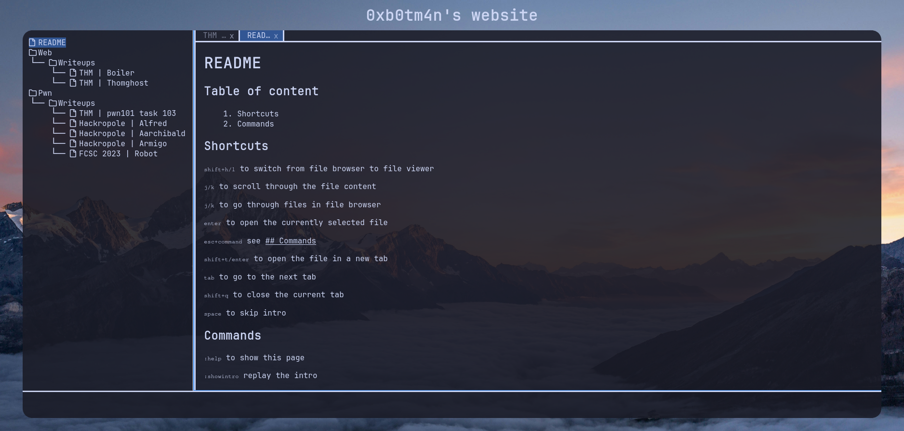

+++
title = "neovim"
description = "A only keyboard theme with tabs and file browser"
template = "theme.html"
date = 2024-09-26T00:35:09+02:00

[taxonomies]
theme-tags = []

[extra]
created = 2024-09-26T00:35:09+02:00
updated = 2024-09-26T00:35:09+02:00
repository = "https://github.com/Super-Botman/neovim-theme.git"
homepage = "https://github.com/super-botman/zola-theme"
minimum_version = "0.4"
license = "MIT"
demo = "https://super-botman.github.io"

[extra.author]
name = "0xb0tm4n"
homepage = "https://super-botman.github.io"
+++        

# Neovim like theme 

Neovim theme is a neovim like theme for zola.



exemple: [https://super-botman.github.io](https://super-botman.github.io)

## Instalation
```bash
cd themes
git clone https://github.com/Super-Botman/neovim-theme.git
```

then enable it in your config

```toml
theme = "neovim-theme"
```

## Config

You can setup the blog name with config file in extra

```toml
[extra]
blog_name = "name"
```

## Customisation

### JS

You can add some custom javascript function with this parameter:

```toml
[extra]
custom_script = "<path>.js" 
```
then you just add a file `static/js/custom_script.js` and define your custom functions like this:

```javascript
// add special commands
function custom_commands(command, args){
   ...
}

// add special init routine
function custom_init(){
    ...
}
```

### CSS

And for css 

```toml
[extra]
custom_css = "<path>.css"
```

        