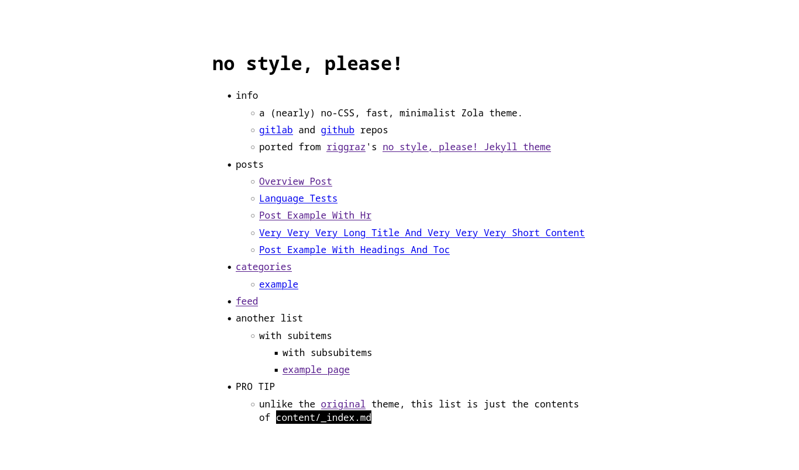

+++
title = "no style, please!"
description = "A (nearly) no-CSS, fast, minimalist Zola theme"
template = "theme.html"
date = 2024-01-25T10:41:35+02:00

[extra]
created = 2024-01-25T10:41:35+02:00
updated = 2024-01-25T10:41:35+02:00
repository = "https://gitlab.com/4bcx/no-style-please.git"
homepage = "https://gitlab.com/atgumx/no-style-please"
minimum_version = "0.4.0"
license = "MIT"
demo = "https://atgumx.gitlab.io/no-style-please"

[extra.author]
name = "Ahmed Alaa"
homepage = "https://gumx.cc"
+++        

# no style, please!

A (nearly) no-CSS, fast, minimalist [Zola](https://www.getzola.org/) theme.
Ported from from [riggraz](https://riggraz.dev/)'s [no style, please! Jekyll theme](https://riggraz.dev/no-style-please/), and you can find the demo [here](https://atgumx.gitlab.io/no-style-please/)



## Installation

First download this theme to your `themes` directory:

```bash
cd themes
git clone https://gitlab.com/4bcx/no-style-please.git
```

and then enable it in your `config.toml`:

```toml
theme = "no-style-please"
```

## Options

### Default taxonomies

Special templates for `tags`, `categories`, and `contexts` taxonomies are provided. However, generic templates exist for custom taxonomies.

To use taxonomies, in a page metadata add

```toml
[taxonomies]
tags = [ 'tag1', 'tag2' ]
categories = [ 'category A', 'B class' ]
genre = [ 'rock', 'alternative' ]   # custom taxonomy
```

### Pages list in homepage

To enable listing of pages in homepage add the following in `config.toml`

```toml
[extra]
list_pages = true
```

If you do not want the date of the post added next to the title in the list, add the following as well:

```toml
no_list_date = true
```

### Header and footer nav links

Also in the `extra` section in `config.toml`

```toml
[extra]

header_nav = [
    { name = "~home", url = "/" },
    { name = "#tags", url = "/tags" },
    { name = "+categories", url = "/categories" },
    { name = "@contexts", url = "/contexts" },
    { name = "example", url = "http://example.com", new_tab=true },
]
footer_nav = [
    { name = "< previous", url = "#" },
    { name = "webring", url = "#" },
    { name = "next >", url = "#" },
]
```

### Add TOC to pages

In a page frontmatter, set `extra.add_toc` to `true`

```toml
[extra]
add_toc = true
```

### Extra data

- `author` can be set in both main config and in pages metadata
- `image` variable can be used in pages to add an image to HTML `<meta>` tags
- Same for `logo` in main config, except this one is also used as the site icon

### Horizontal rule shortcode `hr()`

Adds the option to insert text in the thematic break

```html
{{/* hr(data_content="footnotes") */}}
```

is rendered


### Invertable image `iimg()`

Images are not inverted in darkmode by default. To add an invertable image use the following

```html
{{/* iimg(src="logo.png", alt="alt text") */}}
```

In light mode


In dark mode


### Disable Twitter card

Twitter metatags are generated by default, to disable them set `extra.twitter_card` to `false` in in your `config.toml`

```toml
[extra]
twitter_card = true
```

## TODO

- [ ] Add RTL support
- [ ] Write proper test pages

## License

The theme is available as open source under the terms of the [MIT License](https://opensource.org/licenses/MIT).

        