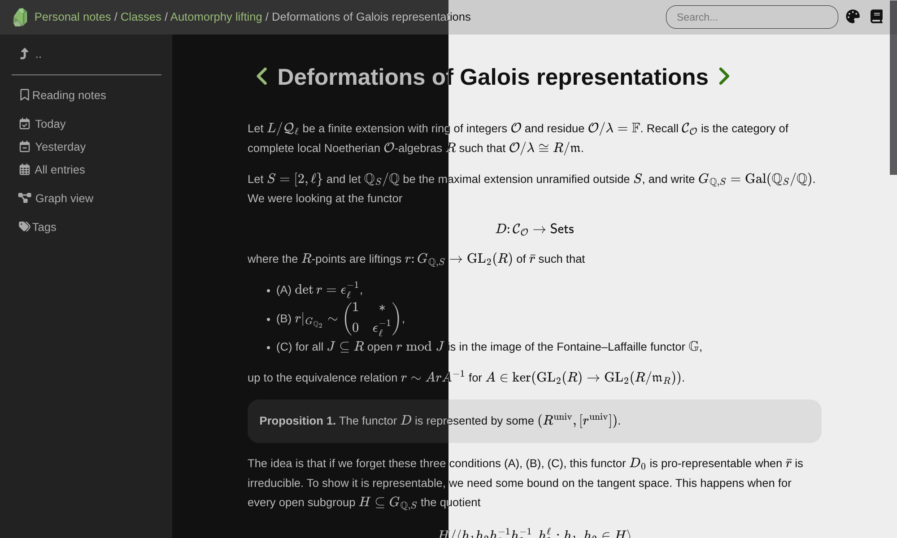

+++
title = "Olivine"
description = "A Zola theme for a personal knowledge base"
template = "theme.html"
date = 2025-12-22T10:21:49-08:00

[taxonomies]
theme-tags = []

[extra]
created = 2025-12-22T10:21:49-08:00
updated = 2025-12-22T10:21:49-08:00
repository = "https://github.com/dongryul-kim/olivine.git"
homepage = "https://github.com/dongryul-kim/olivine"
minimum_version = "0.20.0"
license = "MIT"
demo = "https://dongryul-kim.github.io/olivine/"

[extra.author]
name = "Dongryul Kim"
homepage = "https://web.stanford.edu/~dkim04/"
+++        


# Olivine

A simple [Zola](https://github.com/getzola/zola) theme for a personal knowledge
base. Inspired by [Obsidian](https://obsidian.md).



## Features

* Journaling
* Tags
* Knowledge graph
* Searching
* Light/dark mode
* Keyboard shortcuts
* Backlinks

## Installation

The easiest way to install Olivine is to use the [quickstart
repository](https://github.com/dongryul-kim/olivine-quickstart).

```
git clone --depth 1 --recurse-submodules git@github.com:dongryul-kim/olivine-quickstart.git <your-folder-name>
```

### Manual installation

You can also use the standard method for installing a Zola theme.
Please follow the Zola documentation on [installing and using
themes](https://www.getzola.org/documentation/themes/installing-and-using-themes/).

There is also an additional step that is specific to Olivine. Create a file a
named `content/olivine-internal-graph.md` with contents:
```
+++
title = "Graph"
template = "internal/graph.html"
+++
```
a file named `content/olivine-internal-sitemap.md` with contents:
```
+++
title = "Sitemap"
template = "internal/sitemap.html"
+++
```
and a file named `content/journal/_index.md` with contents:
```
+++
title = "Journal"
template = "internal/journal.html"
extra.siblings = true
+++
```

## Acknowledgments

Special thanks to
* [year-calendar](https://github.com/year-calendar/js-year-calendar) for the
  calendar widget,
* [cytoscape](https://github.com/cytoscape/cytoscape.js) for the graph widget,
* [tikzjax](https://github.com/maker-jr/tikzjax) for rendering TikZ diagrams.


        