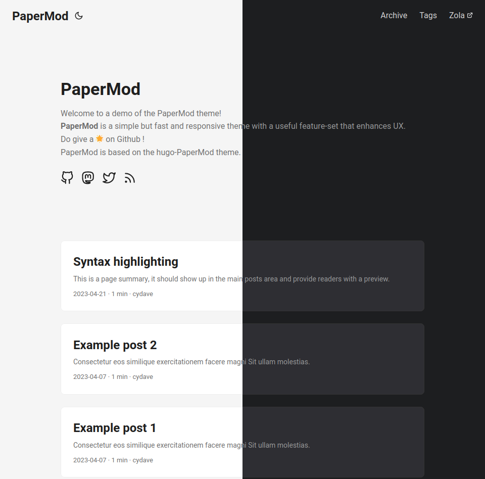

+++
title = "PaperMod"
description = "A fast, clean, responsive theme ported to Zola."
template = "theme.html"
date = 2025-09-16T22:16:54-04:00

[taxonomies]
theme-tags = []

[extra]
created = 2025-09-16T22:16:54-04:00
updated = 2025-09-16T22:16:54-04:00
repository = "https://github.com/dawnandrew100/zola-theme-papermod-2"
homepage = "https://github.com/cydave/zola-theme-papermod"
minimum_version = "0.4.0"
license = "MIT"
demo = "https://cydave.github.io/zola-theme-papermod/"

[extra.author]
name = "cydave"
homepage = "https://github.com/cydave"
+++        

# Zola PaperMod

This repository is the unofficial successor to [cydave's papermod](https://github.com/cydave/zola-theme-papermod)!

This theme is the backbone of my site [Seq.rs](https://github.com/dawnandrew100/seq.rs)
and will primarily be updated to meet my needs for that site.

With that being said, if others have additions they'd like to see, you're more
than welcome to open a pull request on this fork!



A work in progress port of the [hugo-PaperMod](https://github.com/adityatelange/hugo-PaperMod)
theme by [@adityatelange](https://github.com/adityatelange) to [Zola](https://www.getzola.org/)

Due to config changes introduced with Zola 0.19, only Zola 0.19.1 and later are
currently supported.

Demo @ https://dawnandrew100.github.io/zola-theme-papermod-2/

## Features

+ [x] Blog post archive
+ [x] Blog post RSS feeds
+ [x] Tags
+ [x] Tag-based RSS feeds
+ [x] Optional: Custom taxonomies
+ [x] Light / Dark theme switching (with configurable default preference)
+ [x] Syntax highlighting for code snippets (Zola's built-in syntax highlighting)
+ [x] Custom navigation
+ [x] Hide pages from home page by adding `extra = {exclude_from_home = true}` to front matter or adding markdown file to `content/static/` folder
+ [x] Code copy buttons
+ [x] Search page
+ [ ] SEO Metadata
+ [ ] Language switcher (multi-language support)

## Installation

1. Download the Theme

```sh
git submodule add https://github.com/dawnandrew100/zola-theme-papermod-2 themes/papermod_2
```

2. Add `theme = "papermod_2"` to your zola `config.toml`
3. Copy over the example content to get started

```sh
cp -r themes/papermod_2/content content
```

## Switching from papermod to papermod_2

1. Remove papermod submodule

```sh
git submodule deinit -f path/to/papermod
git rm -f path/to/papermod
rm -rf .git/modules/path/to/papermod # Or manually remove
```

2. Download papermod_2

```sh
git submodule add https://github.com/dawnandrew100/zola-theme-papermod-2 themes/papermod_2
git submodule update --init --recursive
```

## Options

Papermod customizations exist under a designated `extra.papermod` section.
Refer to [config.toml](config.toml) for available options.

## Contributing

If you would like to help out with porting hugo-Papermod to Zola, feel free to pick
up a feature and start working on it. All help, no matter how small the
contribution is highly appreciated.

        