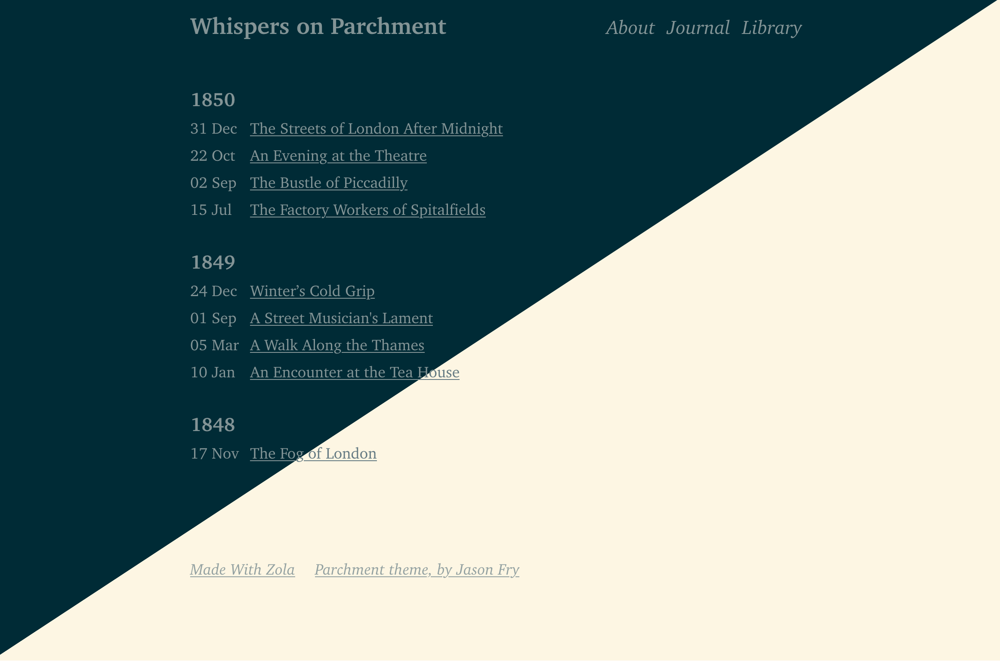

+++
title = "parchment"
description = "Parchemnt theme, by jasonfry.co.uk"
template = "theme.html"
date = 2025-05-03T22:07:01+01:00

[taxonomies]
theme-tags = []

[extra]
created = 2025-05-03T22:07:01+01:00
updated = 2025-05-03T22:07:01+01:00
repository = "https://github.com/jsonfry/parchment"
homepage = "https://github.com/json/parchment"
minimum_version = "0.19.0"
license = "MIT"
demo = "https://whispers-on-parchment.jasonfry.co.uk"

[extra.author]
name = "Jason Fry"
homepage = "https://jasonfry.co.uk"
+++        

# Parchment Zola Theme

A website theme for the static site generator [Zola](https://getzola.org).

Written to produce clean, semantic, simple-to-read HTML and CSS. The aim is for a novice to press `F12` and be able to understand what is going on. No div-soup, No javascript, no third party frameworks.

Used at [jasonfry.co.uk](https://jasonfry.co.uk).

Demo available at [whispers-on-parchment.jasonfry.co.uk](https://whispers-on-parchment.jasonfry.co.uk)



## Installation

First download this theme to your `themes` directory:

```bash
cd themes
git clone https://github.com/jsonfry/parchment.git
```
and then enable it in your `config.toml`:

```toml
theme = "parchment"
```

## Zola Features

No support for taxonomy.

## Customization

### Base Template

- Adding in your own things to `<head>` (e.g. favicons), your own CSS.
- Adding some content to the footer
- Adding something to the end of the body, like analytics. Create a file like the following in `templates/index.html`.

If you don't want to include the default CSS, then remove the line `{{/* super() */}}`

```html



    {{/* super() */}}
    <link rel="apple-touch-icon" sizes="180x180" href="/apple-touch-icon.png" />
    <link rel="icon" type="image/png" sizes="32x32" href="/favicon-32x32.png" />
    <link rel="icon" type="image/png" sizes="16x16" href="/favicon-16x16.png" />
    <link rel="manifest" href="/site.webmanifest" />

    <style>
        body {
            font-family: "Comic Sans MS", "Comic Sans", cursive;
        }
    <style>



    <p>Created by a human</p>
    
    <p>
        <a
        href="/rss.xml"
        title="subscribe - rss feed"
        >rss</a
        >
    </p>
    



    <script
      src="https://tinylytics.app/embed/your-code.js"
      defer
    ></script>

```

### Colors

The color scheme is based on [Solarized](https://ethanschoonover.com/solarized/) and has both a dark and light theme included, that will follow the browser / OS setting. The colors are set with CSS variables, which you can override by setting your own CSS in `head` block.

```css
    :root {
        --background: white;
        --background-highlights: white;
        --primary: black;
        --secondary: blue;
    }

    @media (prefers-color-scheme: dark) {
        :root {
            --background: black;
            --background-highlights: black;
            --primary: white;
            --secondary: cyan;
        }
    }
```

### TOML config options

The following optional things are available to set in the `config.toml` file.

```toml
[extra]
 head_title = "My Custom <head> Title"
 [[extra.footer_menu]]
    [[extra.footer_menu.links]]
      text = "Parchment theme, by Jason Fry"
      href = "https://jasonfry.co.uk"
    [[extra.footer_menu.links]]
      text = "Made With Zola"
      href = "https://getzola.org"
```

### After Post Nav

There is a block to add things after the nav that appears at the bottom of posts.

`templates/page.html`
```html



    <p>Reply via email - my first name @ my website address</p>

```
### Everything looks too small/big

Everything is set with CSS REMs, so just change the HTML element's font size using CSS:

```css
html { font-size: 32px; }
```
        