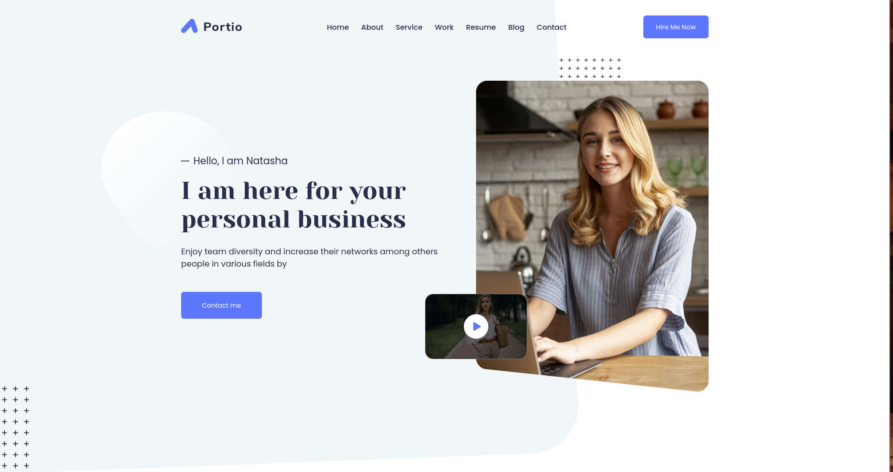

+++
title = "Portio-Zola"
description = "Portio-Zola is a minimal, well-formatted and extremely flexible theme"
template = "theme.html"
date = 2026-01-09T10:11:15+01:00

[taxonomies]
theme-tags = []

[extra]
created = 2026-01-09T10:11:15+01:00
updated = 2026-01-09T10:11:15+01:00
repository = "https://github.com/quentin-rodriguez/portio-zola.git"
homepage = "https://github.com/quentin-rodriguez/portio-zola.git"
minimum_version = "0.21.0"
license = "MIT"
demo = "https://quentin-rodriguez.github.io/portio-zola"

[extra.author]
name = "quentin-rodriguez"
homepage = "https://github.com/quentin-rodriguez"
+++        

# Portio-Zola

<div align="center">

[](LICENSE)
[](https://quentin-rodriguez.github.io/portio-zola)

</div>



## 📝 About

Portio-Zola is a minimal, well-formatted theme that is extremely flexible and can be changed in whole or in part as required.

This theme is based on [Portio-Hugo](https://github.com/StaticMania/portio-hugo.git), with all the features mentioned below.

## 💻 Installation

1. Install [Zola](https://www.getzola.org/documentation/getting-started/installation/)

2. Initialize a new project and go to the folder 

```sh
zola init <PROJECT_NAME>
cd <PROJECT_NAME>
```


3. Add the **Portio-Zola** theme to the project with either a `submodule` or a `clone`

```sh
# Submodule
git submodule add https://github.com/quentin-rodriguez/portio-zola.git themes/portio-zola

# Clone
git clone https://github.com/quentin-rodriguez/portio-zola.git themes/portio-zola
```

4. Copy the theme's `config.toml` file into your project

```sh
cp themes/portio-zola/config.toml .
```

5. Copy the theme `content` folder directly into the project

```sh
cp -r themes/portio-zola/content/ content/
```

## 📥 Deployment

Here is a list provided by [Zola](https://www.getzola.org/) to help you deploy your own site on different platforms.

- [Sourcehut Pages](https://www.getzola.org/documentation/deployment/sourcehut/)
- [Netlify](https://www.getzola.org/documentation/deployment/netlify/)
- [GitHub Pages](https://www.getzola.org/documentation/deployment/github-pages/)
- [GitLab Pages](https://www.getzola.org/documentation/deployment/gitlab-pages/)
- [Codeberg Pages](https://www.getzola.org/documentation/deployment/codeberg-pages/)
- [Edgio](https://www.getzola.org/documentation/deployment/edgio/)
- [Vercel](https://www.getzola.org/documentation/deployment/vercel/)
- [Zeabur](https://www.getzola.org/documentation/deployment/zeabur/)
- [Cloudflare Pages](https://www.getzola.org/documentation/deployment/cloudflare-pages/)
- [Fly.io](https://www.getzola.org/documentation/deployment/flyio/)
- [AWS S3 Bucket](https://www.getzola.org/documentation/deployment/aws-s3/)
- [Docker image](https://www.getzola.org/documentation/deployment/docker-image/)

        