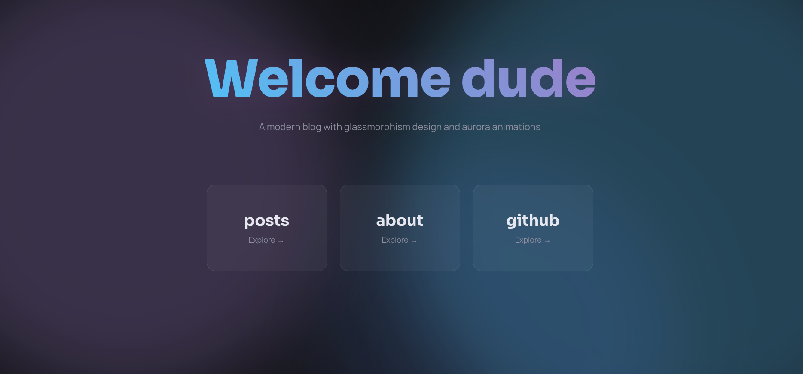

+++
title = "Prism"
description = "A modern Zola theme featuring glassmorphism design and aurora-inspired animations."
template = "theme.html"
date = 2026-02-07T20:23:55+05:00

[taxonomies]
theme-tags = []

[extra]
created = 2026-02-07T20:23:55+05:00
updated = 2026-02-07T20:23:55+05:00
repository = "https://github.com/jahamars/zola-prism.git"
homepage = "https://github.com/jahamars/zola-prism"
minimum_version = "0.4.0"
license = "AGPL-3.0"
demo = "https://xpltt.vercel.app/"

[extra.author]
name = "Jahongir Ahmadaliev"
homepage = "https://jahongir.ru"
+++        

# Prism
A modern Zola theme featuring glassmorphism design and aurora-inspired animations.
[demo](https://xpltt.vercel.app/)



## Features

- 🎨 Glassmorphic UI elements with backdrop blur
- ✨ Aurora blob animations with gradient overlays
- 🌙 Dark theme with neon accents
- 📱 Fully responsive design
- ⚡ Fast and lightweight

## Installation

Clone the theme into your `themes` directory:
```bash
git clone https://github.com/jahamarsi/zola-prism.git themes/prism
```

Enable the theme in your `config.toml`:
```toml
theme = "prism"
```

## Configuration

See [config.toml](config.toml) for all available options.

## License

AGPL-3.0

        