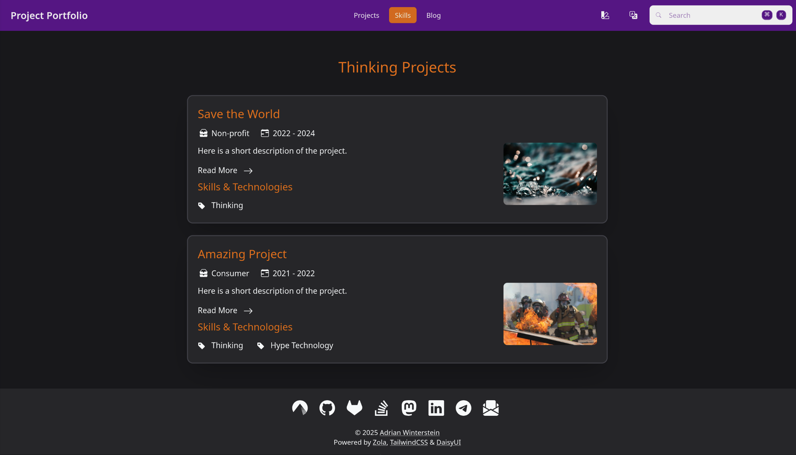

+++
title = "Project Portfolio"
description = "Theme for a project portfolio (based on Tailwind CSS)."
template = "theme.html"
date = 2025-01-09T13:17:38+01:00

[taxonomies]
theme-tags = []

[extra]
created = 2025-01-09T13:17:38+01:00
updated = 2025-01-09T13:17:38+01:00
repository = "https://github.com/awinterstein/zola-theme-project-portfolio.git"
homepage = "https://github.com/awinterstein/zola-theme-project-portfolio"
minimum_version = "0.9.0"
license = "MIT"
demo = "https://awinterstein.github.io/zola-theme-project-portfolio-example/"

[extra.author]
name = "Adrian Winterstein"
homepage = "https://www.winterstein.biz"
+++        

# Project Portfolio

A [Zola](https://www.getzola.org/) theme built with [Tailwind CSS](https://tailwindcss.com/) for presenting the project portfolio of a freelancer, for example. The theme is based on the [Blow](https://www.getzola.org/themes/blow/) theme that was created by Thomas Chartron.

Check out the [live demo of the example project](https://awinterstein.github.io/zola-theme-project-portfolio-example/)  or a [real-world implementation](https://www.winterstein.biz/) of this template.



## Features

- Project types and skills taxonomies
- Automatically selected dark / light modes (with syntax highlighting depending the mode)
- Search functionality supporting `Meta` + `K` shortcut
- Social links (github, gitlab, twitter, linkedin, email)
- Pagination
- Multilingual
- Error 404 page
- Mobile responsive
- Favicon
- Customizable navbar links
- Customizable footer

## Quick Start

For starting to create a new Zola website using this theme, the easiest approach is to just checkout / fork the [example repository](https://github.com/awinterstein/zola-theme-project-portfolio-example) and adapt it to your needs. That repository already contains a minimal structure and configuration for the Zola-based website and can directly be built and deployed to Github pages.

## Details on Using the Theme

The installation of the theme works the same as for other Zola themes. As it is described in the [official documentation](https://www.getzola.org/documentation/themes/installing-and-using-themes/). Hence, it fist needs to be added as a git submodule:

```bash
cd my-zola-website
git submodule add -b main \
    git@github.com:awinterstein/zola-theme-project-portfolio.git \
    themes/project-portfolio
```

In the `config.toml` file it needs to be selected then:

```toml
theme = "project-portfolio" # The site theme to use.
```

Create the files `projects.md` and `skills.md` in your `content` directory that are used to show the "Projects" and "Skills" [taxonomies](https://www.getzola.org/documentation/content/taxonomies/). They both need a title and can optionally get a descriptive text that will be shown above the terms of the taxonomy. See the following `projects.md` file as an example:

```markdown
+++
title = "Projects"
+++

The title and the text of this page can be adapted by changing the
`projects.md` file in the `content` directory.

Check out the amazing projects, by browsing through the industrial
sectors. The project do not need to be categorized by industries, but
could be distinguished by other topics instead. For example by frontend
and backend projects or by main responsibilities, like developer or
lead. Whatever makes most sense for your project portfolio.
```

It would be shown with the configured title and content like this above the terms:


The `skills.md` file can be created the same way. The corresponding page will just show the terms of the skills taxonomy instead of the terms of the projects taxonomy then.

Finally, create the first project page in the `content` directory:

```markdown
+++
```

```toml
title = "Project Title"
description = "Here is a short description of the project."
date = 2022-05-31 # The date when the project finished

[extra]
date_start = 2021-01-01 # Optional date when the project was started
image = "water.jpg" # Optional filename to an image in the `static/images` directory
top_project = true # Optional parameter to show the project on the projects overview page as well

[taxonomies]
projects=["Consumer"] # The category of the project (could be industry, type etc.)
skills=["Thinking", "Hype Technology"] # The skills & technologies used for the project
```

```markdown
+++

The content of the project description page follows here.
```

The generated project site would then look like this:


## Configuration

The minimal `config.toml` file for using the theme looks like this:

```toml
base_url = "https://www.example.com"

theme = "project-portfolio"

taxonomies = [
    {name = "projects", paginate_by = 5, feed = true},
    {name = "skills", paginate_by = 5, feed = true},
]

[translations]
language_symbol = "🇬🇧"
home = "Home"
projects = "Projects"
skills = "Skills"
read_more = "Read More"
skills_technologies = "Skills & Technologies"
main_skills = "Main Skills"
other_skills = "Additional Skills"
```

This would, however, lead to an empty index page. The `config.toml` can be extended by the following configuration parameters for the index page:

```toml
[extra.index]
title = "Main Title"
slogan = "Slogan text that is shown under the title"
image = "portrait.png"
image_alt = "Placeholder text describing the index's image."

[extra.social]
codeberg = "https://codeberg.org/johndoe"
github = "https://github.com/johndoe"
gitlab = "https://gitlab.com/johndoe"
twitter = "https://twitter.com/johndoe"
mastodon = "https://social.somewhere.com/users/johndoe"
linkedin = "https://www.linkedin.com/in/john-doe-b1234567/"
stackoverflow = "https://stackoverflow.com/users/01234567/johndoe"
telegram = "https://t.me/johndoe"
email = "john.doe@gmail.com"
```

## Syntax Highlighting

The theme makes use of Zola code highlighting feature.
It supports setting a different color scheme depending on the user selected theme (Dark / Light)
In order to use it you should select the color scheme you want to use for light and dark themes in the list provided [here](https://www.getzola.org/documentation/getting-started/configuration/#syntax-highlighting) and edit your `config.toml` file like this example:

```toml
highlight_code = true
highlight_theme = "css"
highlight_themes_css = [
  { theme = "ayu-dark", filename = "syntax-dark.css" },
  { theme = "ayu-light", filename = "syntax-light.css" },
]
```

## Custom Footer Content

To overwrite the default footer (copyright notice), extend the `layout.html` template of the theme as described in the [Zola documentation](https://www.getzola.org/documentation/themes/extending-a-theme/#overriding-a-block) by creating a `layout.html` with the following content in your `templates` directory:

```jinja



Here is my own footer with a <a href="http://example.com">link</a>.

```

## Multiple Languages

To enable multilingual support, add the following to the `config.toml` file (adapted to the additional language that you want to support):

```toml
[languages.de]
title = "Projekt-Portfolio"
taxonomies = [
    {name = "projects", paginate_by = 5, feed = true},
    {name = "skills", paginate_by = 5, feed = true},
]

[languages.de.translations]
language_symbol = "🇩🇪"
home = "Home"
projects = "Projekte"
skills = "Qualifikationen"
read_more = "Weiterlesen"
skills_technologies = "Qualifikationen & Technologien"
main_skills = "Top-Fähigkeiten"
other_skills = "Weitere Fähigkeiten"

[extra]
enable_multilingual = true
```

For the language switching of the theme to work best, it is recommended not to change the names of the taxonomies and to also keep the filenames for all pages of the site the same in all languages. Right now, the theme only supports websites with up to two languages. The default language and one additional language.

Proceed to add translated markdown files.
        