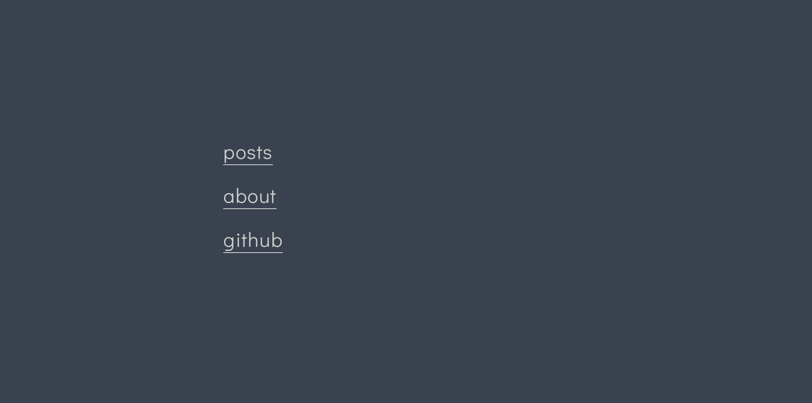

+++
title = "sam"
description = "A Simple and Minimalist theme with a focus on typography and content."
template = "theme.html"
date = 2021-02-18T22:27:50+01:00

[extra]
created = 2021-02-18T22:27:50+01:00
updated = 2021-02-18T22:27:50+01:00
repository = "https://github.com/janbaudisch/zola-sam.git"
homepage = "https://github.com/janbaudisch/zola-sam"
minimum_version = "0.4.0"
license = "AGPL-3.0"
demo = "https://zola-sam.janbaudisch.dev"

[extra.author]
name = "Jan Baudisch"
homepage = "https://janbaudisch.dev"
+++        

[![Build Status][build-img]][build-url]
[![Demo][demo-img]][demo-url]

# Sam

> A Simple and Minimalist theme with a focus on typography and content.
>
> [Zola][zola] port of [hugo-theme-sam][hugo-sam].



## Original

This is a port of the original [hugo-theme-sam][hugo-sam] theme for Hugo ([License][upstream-license]).

See [`upstream`][upstream] for source code take from there.

## Installation

The easiest way to install this theme is to either clone it ...

```
git clone https://github.com/janbaudisch/zola-sam.git themes/sam
```

... or to use it as a submodule.

```
git submodule add https://github.com/janbaudisch/zola-sam.git themes/sam
```

Either way, you will have to enable the theme in your `config.toml`.

```toml
theme = "sam"
```

## Taxonomies

Sam supports the `tags` and `authors` taxonomies.

To use them, declare them in your `config.toml`:

```toml
taxonomies = [
    { name = "tags", rss = true },
    { name = "authors", rss = true }
]
```

Set them in your page's frontmatter:

```toml
[taxonomies]
tags = ["some", "tag"]
authors = ["Alice", "Sam"]
```

See [Zola's documentation][taxonomies-docs] for more details.

## Options

See [`config.toml`][config] for an example configuration.

### Menu

The menu on the index page is created as follows: If the `sam_menu` variable is set, it gets used.

```toml
[extra]
sam_menu = [
    { text = "posts", link = "/posts" },
    { text = "about", link = "/about" },
    { text = "github", link = "https://github.com" }
]
```

If it is not set, all sections under `content` will get linked.

#### Bottom menu

This variable decides wether the menu - as mentioned above - will also be displayed at the bottom of pages.

Default: `false`

```toml
[extra]
sam_bottom_menu = true
```

### `home`

Sets the name for all links referring to the home page in the menus and the 404 page.

Default: `home`

```toml
[extra]
home = "home"
```

### Date format

Specifies how to display dates. The format is described [here][date-format-docs].

Default: `%a %b %e, %Y`

```toml
[extra]
date_format = "%a %b %e, %Y"
```

### Word count and reading time

You can enable or disable word count and reading time for posts across the whole site:

Default: `true` (both)

```toml
[extra]
show_word_count = true
show_reading_time = true
```

If enabled, you can opt-out per page via front-matter:

Default: `false` (both)

```
+++
[extra]
hide_word_count = true
hide_reading_time = true
+++
```

### Disable page header

If you want to disable the complete header of a page (for example a page which is explicitly not a post), you can do so via front-matter:

Default: `false`

```
+++
[extra]
no_header = true
+++
```

### Footer

To place some text at the end of pages, set the following:

```toml
[extra.sam_footer]
text = "Some footer text."
```

[build-img]: https://builds.sr.ht/~janbaudisch/zola-sam.svg
[build-url]: https://builds.sr.ht/~janbaudisch/zola-sam
[demo-img]: https://img.shields.io/badge/demo-live-green.svg
[demo-url]: https://zola-sam.janbaudisch.dev
[zola]: https://getzola.org
[hugo-sam]: https://github.com/victoriadotdev/hugo-theme-sam
[upstream]: https://github.com/janbaudisch/zola-sam/blob/master/upstream
[upstream-license]: https://github.com/janbaudisch/zola-sam/blob/master/upstream/LICENSE
[taxonomies-docs]: https://www.getzola.org/documentation/content/taxonomies
[config]: https://github.com/janbaudisch/zola-sam/blob/master/config.toml
[date-format-docs]: https://docs.rs/chrono/latest/chrono/format/strftime/index.html

        