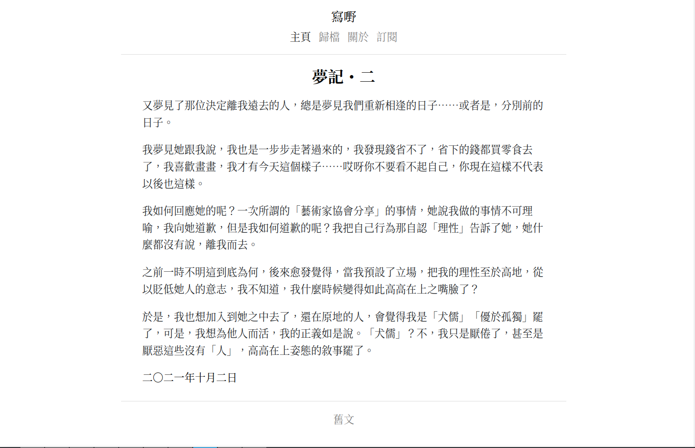

+++
title = "Seje2"
description = "A beautiful zola theme"
template = "theme.html"
date = 2024-01-25T10:41:35+02:00

[extra]
created = 2024-01-25T10:41:35+02:00
updated = 2024-01-25T10:41:35+02:00
repository = "https://github.com/eatradish/seje2"
homepage = "https://github.com/eatradish/Seje2"
minimum_version = "0.15.0"
license = "MIT"
demo = "https://eatradish.github.io/Seje2"

[extra.author]
name = "Mag Mell"
homepage = "https://blog.utopiosphere.net"
+++        

# Seje2



[Demo](https://eatradish.github.io/Seje2)
[中文 README](https://github.com/eatradish/Seje2/blob/main/README_zh_cn.md)

## Installation
First download this theme to your `themes` directory:

```bash
cd themes
git clone https://github.com/eatradish/Seje2
```
and then enable it in your `config.toml`:

```toml
theme = "Seje2"
```

This theme requires your index section (`content/_index.md`) to be paginated to work:

```toml
paginate_by = 5
```

The posts should therefore be in directly under the `content` folder.

and requires your index section (`about/_index.md`) to be paginated to work:

```toml
title = "..."

[extra]
year = 2019
month = 11
day = 3
```

## Options

### Top-menu
Set a field in `extra` with a key of `seje2_menu_links`:

```toml
seje2_menu_links = [
    {url = "$BASE_URL", name = "Home"},
    {url = "$BASE_URL/categories", name = "Categories"},
    {url = "$BASE_URL/tags", name = "Tags"},
    {url = "https://google.com", name = "Google"},
]
```

If you put `$BASE_URL` in a url, it will automatically be replaced by the actual
site URL.

### License

Set a field in `extra` with a key of `license`:

```toml
license = "@ 宇宙眼睛人"
```

        