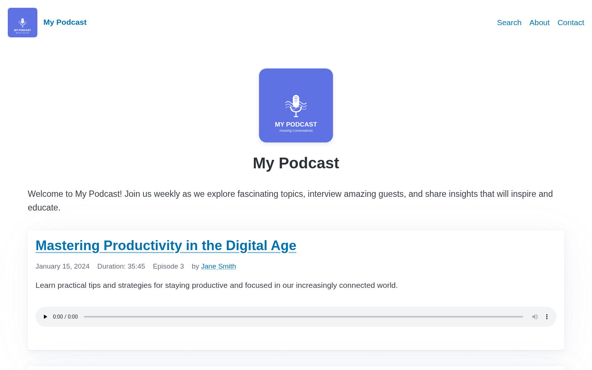

+++
title = "SimplePod"
description = "A simple podcast theme with an iTunes-compatible RSS feed, a built-in audio player, and client-side search. No build step required."
template = "theme.html"
date = 2026-08-11T12:04:26-04:00

[taxonomies]
theme-tags = ['podcast', 'rss', 'audio', 'search', 'responsive', 'minimal']

[extra]
created = 2026-08-11T12:04:26-04:00
updated = 2026-08-11T12:04:26-04:00
repository = "https://github.com/cbrake/simplepod"
homepage = "https://github.com/cbrake/simplepod"
minimum_version = "0.20.0"
license = "MIT"
demo = "https://cbrake.github.io/simplepod/"

[extra.author]
name = "Cliff Brake"
homepage = "https://github.com/cbrake"
+++        

# SimplePod

SimplePod is a Zola theme for podcasts. It has the following features:

- is simple -- focused on generating only a single podcast, not an all-in-one
  site that includes a blog, etc.
- generates an iTunes-compatible RSS feed at `/rss.xml`
- includes a web audio player
- offers client-side full-text search over every episode
- supports tag and author pages
- uses the pico css framework for styling -- no build step or npm packages
  required.



[Live demo](https://cbrake.github.io/simplepod/)

The [TMPDIR Podcast](https://tmpdir.org/) (53 episodes) is published using Zola
and this theme.

## Requirements

Zola 0.20.0 or later. Episode navigation uses `page.lower` and `page.higher`,
which replaced `page.earlier` and `page.later` in Zola 0.20.

## Installation

From the root of your Zola site:

```bash
git submodule add https://github.com/cbrake/simplepod themes/simplepod
```

Then enable the theme in `config.toml`:

```toml
theme = "simplepod"
```

The root of this repository is itself a working Zola site, so you can also clone
it and run `zola serve` to preview the theme with the demo content in
`content/`. That demo doubles as a starting point: copy `config.toml` and
`content/` into your own site, add `theme = "simplepod"`, and replace the
episodes with your own.

## Site Structure

SimplePod expects a specific content layout:

```
content/
  _index.md            # home page, lists episodes
  001-my-episode.md    # episodes live at the top level of content/
  002-another.md
  pages/
    _index.md          # section index for static pages
    about.md           # static pages live in content/pages/
    search.md          # the search page
static/
  audio/               # episode audio files
```

Episodes are pages at the top level of `content/`, so they render with
`page.html`. Static pages live in `content/pages/` and render with
`pages/page.html`, which omits the audio player and episode navigation. For that
to happen, `content/pages/_index.md` must select the template:

```toml
+++
title = "Pages"
sort_by = "weight"
page_template = "pages/page.html"
+++
```

Without that `page_template` line, Zola falls back to `page.html` and your
static pages render with episode styling.

## Configuration

The theme reads these top-level keys from `config.toml`:

```toml
build_search_index = true       # required for the search page
generate_feeds = true
feed_filenames = ["rss.xml"]

[[taxonomies]]
name = "tags"

[[taxonomies]]
name = "authors"                # only if you use author pages
```

The rest of the configuration goes in the `[extra]` section.

### Basic Settings

- `language` - Language code for the podcast (e.g., "en-us")
- `show_copyright` - Show copyright notice in footer (boolean, default: false)
- `show_hero` - Show hero section on homepage with logo/title/description
  (boolean, default: true)
- `show_season` - Show the season number in episode metadata (boolean, default:
  true)
- `podcast_description` - Long description of your podcast for the homepage
- `podcast_logo` - Path to podcast logo image (e.g., "/podcast-logo.svg")
- `feed_description` - Channel `<description>` for the RSS feed. Defaults to the
  site's `description`. Set this when the show blurb podcast apps display should
  differ from the site's meta description.
- `media_prefix` - URL prefix for audio files. By default, files are assumed to
  be in the `static/audio` directory if this is not set. The URL in the rss feed
  is a complete URL as required by podcast engines.
- `copyright` - Copyright line for the RSS feed. Defaults to the current year
  and the site title.

### iTunes/Apple Podcasts Settings

- `itunes_author` - Podcast author name
- `itunes_subtitle` - One-line subtitle for the show
- `itunes_summary` - Brief podcast summary for iTunes
- `itunes_owner_name` - Podcast owner's name
- `itunes_owner_email` - Podcast owner's email
- `itunes_image` - Full URL to podcast cover art (1400x1400 to 3000x3000 pixels
  recommended)
- `itunes_category` - Main iTunes category (e.g., "Technology")
- `itunes_subcategory` - iTunes subcategory (e.g., "Tech News")
- `itunes_explicit` - Content rating ("true" or "false")
- `itunes_type` - Podcast type ("episodic" or "serial")
- `itunes_url` - Link to your podcast on Apple Podcasts

### Additional Links

- `spotify_url` - Link to your podcast on Spotify
- `nav_links` - Array of navigation links, each with `name` and `url` fields
- `call_to_action` - Text that can optionally be displayed at the top of each
  page, typically one line.

### Analytics

- `fathom_site_id` - Fathom Analytics site ID (optional). If set, includes
  Fathom tracking script

## Episode Front Matter

Episodes are stored as markdown files directly in the `content/` directory. Each
episode should include the following in its front matter:

```toml
+++
title = "Episode Title"
date = 2024-01-01
description = "Shown on the episode list and in the RSS feed."

[taxonomies]
tags = ["interview"]
authors = ["Jane Smith"]          # Optional, requires the authors taxonomy

[extra]
audio_file = "audio/episode-001.mp3"  # File should be in static/audio/
duration = "35:42"                    # Format: MM:SS or HH:MM:SS
episode_number = 1
season = 1                            # Optional
audio_length = "12345678"             # Optional, file size in bytes
audio_type = "audio/mpeg"             # Optional, defaults to audio/mpeg
episode_type = "full"                 # Optional: full, trailer, or bonus
itunes_subtitle = "A one-line teaser" # Optional
itunes_summary = "A longer summary."  # Optional, falls back to description
itunes_explicit = "false"             # Optional, falls back to the site value
itunes_image = "https://..."          # Optional, falls back to the site value
transcript = "transcripts/001.txt"    # Optional, adds a download link
guid = "https://example.com/001.mp3"  # Optional, see below
show_notes = """
## Links mentioned

- [Our website](https://example.com)
"""
+++
```

`audio_length` is the size of the audio file in bytes. Podcast clients use it
for download progress, so it is worth setting.

`guid` is the identifier podcast clients use to tell episodes apart, and it
defaults to the episode's permalink. Set it only when moving a published podcast
onto this theme: give each episode the guid its old feed used, or subscribers'
clients will treat the whole back catalogue as new episodes and download it
again. Once an episode is published, its guid must never change.

To publish the feed at a path other than `/rss.xml`, which a move from another
generator may require, add the path to `feed_filenames` and create a wrapper
template of the same name:

```jinja


```

## Search

SimplePod ships a client-side search page built on the search index Zola
generates. To enable it:

1. Set `build_search_index = true` in `config.toml`.
2. Create `content/pages/search.md`:

   ```toml
   +++
   title = "Search"
   template = "search.html"
   +++
   ```

3. Add a link to it in `nav_links`.

Search runs entirely in the browser against `search_index.<lang>.js` and the
copy of `elasticlunr.min.js` that Zola writes to the output directory. No
external services or CDNs are involved.

## Tag and Author Pages

Declaring the `tags` and `authors` taxonomies in `config.toml` gives you listing
pages at `/tags/` and `/authors/`, plus a page per tag and per author. The
episode list and episode pages link to them automatically when an episode
declares those taxonomies.

## Templates

| Template              | Used for                                 |
| --------------------- | ---------------------------------------- |
| `base.html`           | Shared layout: head, nav, footer         |
| `index.html`          | Home page and episode list               |
| `page.html`           | A single episode                         |
| `pages/page.html`     | A static page in `content/pages/`        |
| `section.html`        | A section index, such as `/pages/`       |
| `search.html`         | The search page                          |
| `tags/list.html`      | All tags                                 |
| `tags/single.html`    | Episodes with one tag                    |
| `authors/list.html`   | All authors                              |
| `authors/single.html` | Episodes by one author                   |
| `rss.xml`             | The iTunes-compatible feed at `/rss.xml` |

## Development

The audio files under `static/audio/` are short generated tones, present only so
the demo site has a working player. Replace them with your own episodes.

Run `zola serve` from the root of this repository to preview the theme against
the demo content. `envsetup.sh` defines `sp_format`, which runs Prettier over
the markdown and CSS files.

## Releases

Versions follow [Semantic Versioning](https://semver.org/), and
[CHANGELOG.md](CHANGELOG.md) records what changed in each one. The version
describes the upgrade: a major release means editing `config.toml`, the episode
front matter, or a template you have overridden, while a minor or patch release
does not.

Installing the theme as a submodule pins it to whatever commit you added, so
upgrading is deliberate:

```bash
cd themes/simplepod
git fetch --tags
git checkout v0.1.0
cd ../..
git add themes/simplepod
```

## License

MIT. See [LICENSE](LICENSE).

        