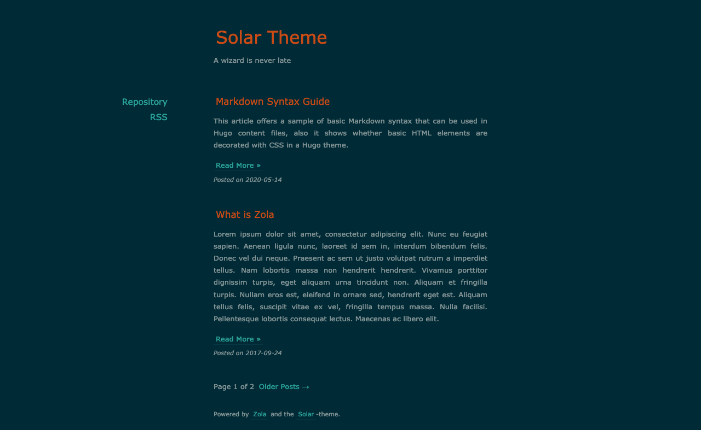

+++
title = "solar-theme-zola"
description = "A port of solar-theme-hugo for zola"
template = "theme.html"
date = 2021-02-18T22:27:50+01:00

[extra]
created = 2021-02-18T22:27:50+01:00
updated = 2021-02-18T22:27:50+01:00
repository = "https://github.com/hulufei/solar-theme-zola.git"
homepage = "https://github.com/hulufei/solar-theme-zola"
minimum_version = "0.4.0"
license = "MIT"
demo = ""

[extra.author]
name = "hulufei"
homepage = "https://github.com/hulufei"
+++        

# Solar Theme for Zola

Port of [Solar theme for Hugo](https://github.com/bake/solar-theme-hugo) to Zola.



## Installation

First download this theme to your `themes` directory:

```bash
$ cd themes
$ git clone https://github.com/hulufei/solar-theme-zola.git
```
and then enable it in your `config.toml`:

```toml
theme = "solar-theme-zola"
```

Add `title` and `description`:

```toml
title = "Your Blog Title"
description = "Your blog description"
```

## Options

### Color schemes

Set color scheme to (Solarized) `dark` or (Solarized) `light` with `highlight_theme` option:

```toml
highlight_theme = "solarized-dark"
```

### Sidebar menu

Set a field in `extra` with a key of `site_menus`:

```toml
site_menus = [
  { url = "https://github/hulufei.com/solar-theme-zola", name = "Repository" },
  { url = "rss.xml", name = "RSS" },
]
```
Each link needs to have a `url` and a `name`.

        