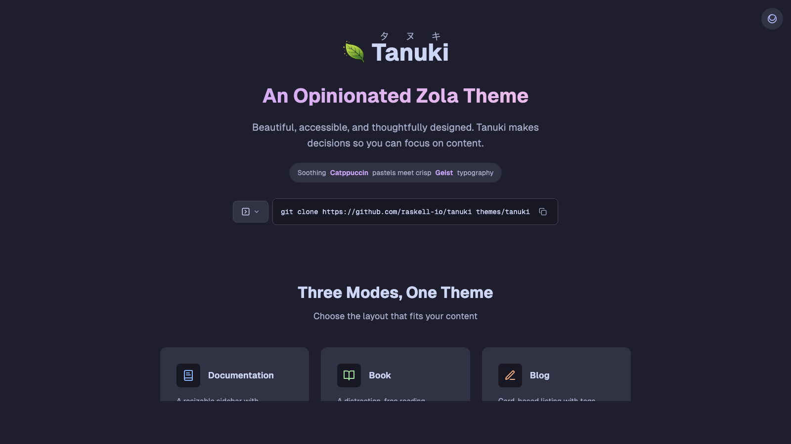

+++
title = "tanuki"
description = "A whimsical, Nintendo-inspired Zola theme with Catppuccin colors, Geist typography, and Lucide icons. Supports documentation (with versioning), e-books, and blog/landing pages. Named after the playful Japanese raccoon dog (タヌキ)."
template = "theme.html"
date = 2025-12-29T17:15:02+01:00

[taxonomies]
theme-tags = []

[extra]
created = 2025-12-29T17:15:02+01:00
updated = 2025-12-29T17:15:02+01:00
repository = "https://github.com/raskell-io/tanuki"
homepage = "https://github.com/raskell-io/tanuki"
minimum_version = "0.19.0"
license = "MIT"
demo = "https://tanuki.raskell.io"

[extra.author]
name = "Raffael Schneider"
homepage = "https://raskell.io"
+++        

<div align="center">

<h1 align="center">
  
  <br>
  Tanuki
</h1>

<p align="center">
  <em>An opinionated Zola theme for documentation, books, and blogs.</em><br>
  <em>Beautiful, accessible, and thoughtfully designed.</em>
</p>

<p align="center">
  <a href="https://www.getzola.org/">
    
  </a>
  <a href="https://catppuccin.com/">
    
  </a>
  <a href="LICENSE">
    
  </a>
</p>

<p align="center">
  <a href="https://tanuki.raskell.io">Live Demo</a> •
  <a href="https://tanuki.raskell.io/docs/">Documentation</a> •
  <a href="https://tanuki.raskell.io/book/">Book Example</a> •
  <a href="https://tanuki.raskell.io/blog/">Blog Example</a>
</p>

<hr />

</div>



## Features

- **Three Modes** — Documentation (with versioning), Book, and Blog layouts
- **Catppuccin Colors** — Soothing Mocha (dark) and Latte (light) palettes
- **Geist Typography** — Clean, readable variable fonts
- **Lucide Icons** — Crisp, consistent iconography
- **Resizable Sidebar** — Drag to resize, persists across sessions
- **Full-text Search** — Elasticlunr-powered instant search
- **Dark/Light Toggle** — Three-way toggle with system preference detection
- **Print Support** — Print all pages as a single document (docs/book modes)
- **Keyboard Navigation** — Arrow keys for prev/next, `/` for search
- **SEO & Accessibility** — JSON-LD structured data, ARIA landmarks, semantic HTML

## Installation

```bash
cd your-zola-site
git clone https://github.com/raskell-io/tanuki themes/tanuki
```

Or as a git submodule:

```bash
git submodule add https://github.com/raskell-io/tanuki themes/tanuki
```

## Quick Start

### Documentation Mode

```toml
base_url = "https://docs.example.com"
title = "My Project Docs"
theme = "tanuki"
build_search_index = true

[markdown]
highlight_code = true
highlight_theme = "css"

[extra]
mode = "docs"
github = "https://github.com/you/project"

# Optional: version picker
[extra.versions]
current = "2.0.0"
list = [
    { version = "2.0.0", url = "/", label = "latest" },
    { version = "1.0.0", url = "/v1/" },
]
```

### Book Mode

```toml
base_url = "https://book.example.com"
title = "The Complete Guide"
theme = "tanuki"
build_search_index = true

[markdown]
highlight_code = true
highlight_theme = "css"

[extra]
mode = "book"
github = "https://github.com/you/book"
```

### Blog Mode

```toml
base_url = "https://blog.example.com"
title = "My Blog"
theme = "tanuki"
generate_feeds = true

taxonomies = [
    { name = "tags", feed = true },
]

[markdown]
highlight_code = true
highlight_theme = "css"

[extra]
mode = "blog"

[extra.hero]
title = "Welcome to my blog"
subtitle = "Thoughts on code and craft"

[[extra.nav]]
name = "Blog"
url = "/blog/"

[[extra.nav]]
name = "About"
url = "/about/"
```

## Keyboard Shortcuts

| Key | Action |
|-----|--------|
| `←` / `→` | Previous / Next page |
| `/` | Open search |
| `Esc` | Close overlays |

## Browser Support

Modern browsers (Chrome 88+, Firefox 78+, Safari 14+, Edge 88+)

## Credits

- [Catppuccin](https://catppuccin.com) — Color palette
- [Geist](https://vercel.com/font) — Typography
- [Lucide](https://lucide.dev) — Icons
- [Zola](https://www.getzola.org) — Static site generator

## License

[MIT](LICENSE)

---

<p align="center">Made with care by <a href="https://raskell.io">raskell.io</a></p>

        