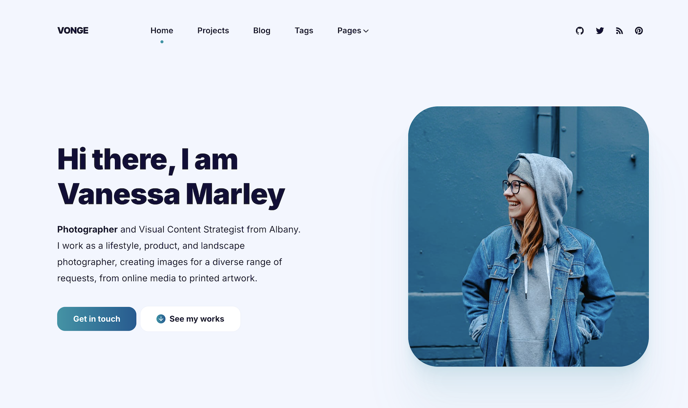

+++
title = "Vonge"
description = "Vonge is a Personal portfolio/blog site template"
template = "theme.html"
date = 2025-06-15T10:50:24+03:00

[taxonomies]
theme-tags = []

[extra]
created = 2025-06-15T10:50:24+03:00
updated = 2025-06-15T10:50:24+03:00
repository = "https://github.com/paberr/vonge-zola-theme"
homepage = "https://github.com/paberr/vonge"
minimum_version = "0.4.0"
license = "MIT"
demo = "https://paberr.github.io/vonge-zola-theme/"

[extra.author]
name = "Pascal Berrang"
homepage = "https://pascal-berrang.de"
+++        

# Vonge Zola Theme


This is a Zola port of the [Vonge Hugo Bookshop template](https://github.com/CloudCannon/vonge-hugo-bookshop-template), originally created by [CloudCannon](https://cloudcannon.com/) and licensed under the MIT License.

Vonge is a clean, modern theme for personal portfolios, blogs, or landing pages. This Zola version is designed to be **fully configurable via `config.toml` and through structured front matter blocks** and **does not rely on Bookshop**.

> ✨ This theme is suitable for developers who want a minimal and flexible Zola theme with a professional design and content blocks driven by configuration.

Demo @ https://paberr.github.io/vonge-zola-theme/

## 🚀 Features

* Flexible homepage and inner pages using content blocks
* Customisable content via `extra.content_blocks` in front matter
* Clean typography and responsive layout
* Blog section with pagination
* Portfolio and testimonial support
* SEO-friendly structure
* MIT licensed

## 📦 Installation

1. Download the Theme

```
git submodule add https://github.com/paberr/vonge-zola-theme themes/vonge
```

2. At minimum, add the following to your zola `config.toml`

```toml
theme = "vonge"
taxonomies = [
    { name = "tags", feed = true},
]
```

3. Copy over the example content to get started

```
cp -r themes/vonge/content/* content
```

## 👷 Usage

This theme uses **structured front matter** to build flexible page layouts. Each page can define its blocks using the `extra.content_blocks` array.

### Example: `content/blog/_index.md`

```toml
+++
title = "Blog"
sort_by = "date"
paginate_by = 6

[extra]
content_blocks = [
  { block = "page-heading", title = "Blog", description = "Vonge blog features productivity, tips, inspiration and strategies for massive profits. Find out how to set up a successful blog or how to make yours even better!" },
  { block = "posts-list", show_posts = true },
  { block = "newsletter", newsletter_title = "Join my mailing list", newsletter_description = "Get inspiration, updates and, cool stuff!", newsletter_identifier = "", newsletter_button = "Subscribe" }
]
+++
```

You can create your own custom blocks or extend existing ones by editing the theme's templates and SCSS.

## 🙏 Acknowledgements

This theme is based on the original [Vonge Hugo Bookshop template](https://github.com/CloudCannon/vonge-hugo-bookshop-template) by [CloudCannon](https://cloudcannon.com/), adapted for use with Zola. All original design credits go to the authors.

## 📄 Contributing

All contributions to this port are highly welcome!

        