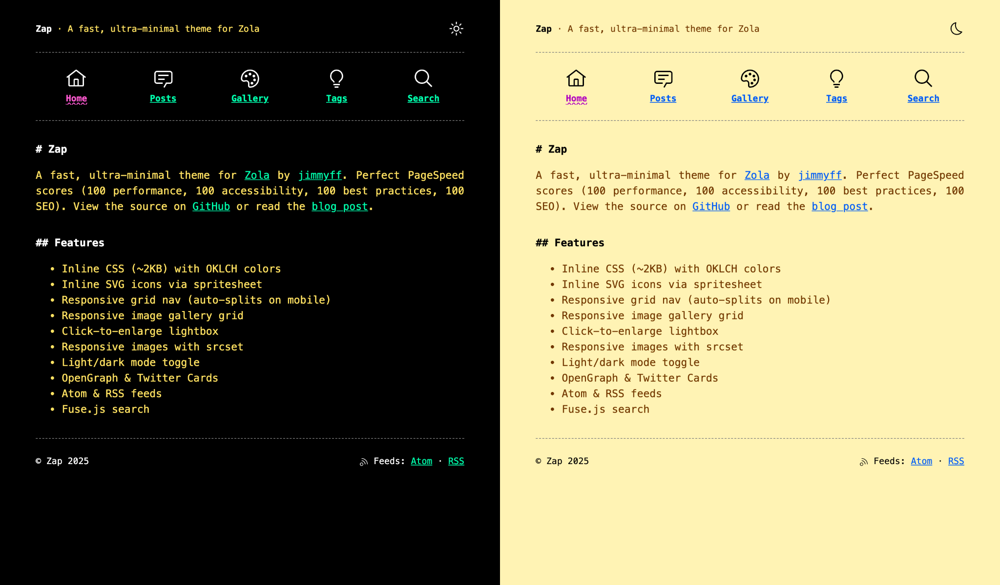

+++
title = "Zap"
description = "A fast, ultra-minimal Zola theme"
template = "theme.html"
date = 2025-12-08T18:11:59Z

[taxonomies]
theme-tags = []

[extra]
created = 2025-12-08T18:11:59Z
updated = 2025-12-08T18:11:59Z
repository = "https://github.com/jimmyff/zola-zap.git"
homepage = "https://github.com/jimmyff/zola-zap"
minimum_version = "0.17.0"
license = "MIT"
demo = "https://www.jimmyff.co.uk/zola-zap/"

[extra.author]
name = "jimmyff"
homepage = "https://www.jimmyff.co.uk"
+++        

# Zap

A fast, ultra-minimal Zola theme by [jimmyff](https://www.jimmyff.co.uk). Perfect PageSpeed scores (100 performance, 100 accessibility, 100 best practices, 100 SEO). See the [demo](https://www.jimmyff.co.uk/zola-zap/) or read the [blog post](https://www.jimmyff.co.uk/blog/zap-theme/).

[](https://www.jimmyff.co.uk/zola-zap/)

## Features

- Inline CSS (~2KB) with OKLCH colors
- Inline SVG icons via spritesheet
- Responsive grid nav (auto-splits on mobile)
- Responsive image gallery grid
- Click-to-enlarge lightbox
- Responsive images with srcset
- Light/dark mode toggle
- OpenGraph & Twitter Cards
- Atom & RSS feeds
- Fuse.js search

## Installation

```bash
cd themes
git clone https://github.com/jimmyff/zola-zap zap
```

In your `config.toml`:

```toml
theme = "zap"
```

## Configuration

See `config.toml` for available options.

## Icons

Configure which icons to load in `config.toml`:

```toml
[extra]
inline_icons = true
icon_path = "static/icons/"
icons = ["home", "chat", "search", "light", "asleep", "rss"]
```

Place SVG icons in your `static/icons/` folder. The theme includes icons from [Carbon Design System](https://carbondesignsystem.com/elements/icons/library/).

## Using the responsive image shortcode

```md
{{/* image(src="yourimage.jpg", alt="This is my image") */}}
```


        