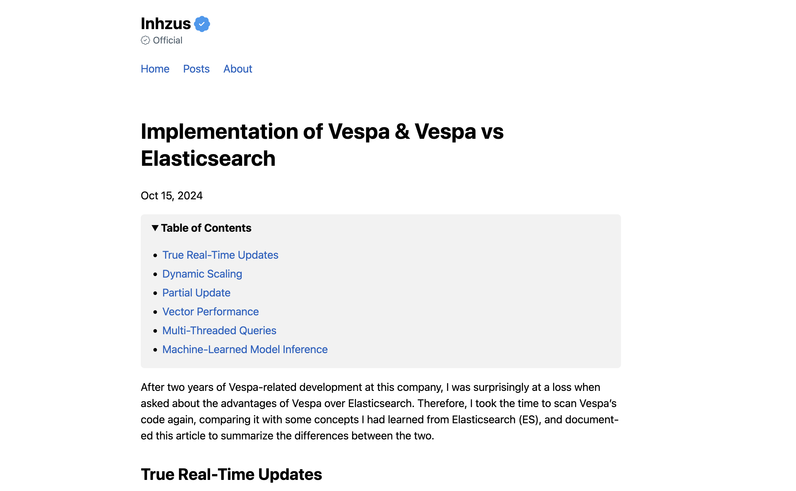

+++
title = "futu"
description = "Futu Theme"
template = "theme.html"
date = 2025-03-11T13:20:21+08:00

[taxonomies]
theme-tags = []

[extra]
created = 2025-03-11T13:20:21+08:00
updated = 2025-03-11T13:20:21+08:00
repository = "https://github.com/inhzus/zola-futu.git"
homepage = "https://github.com/inhzus/zola-futu/"
minimum_version = "0.20.0"
license = "MIT"
demo = ""

[extra.author]
name = "inhzus"
homepage = "https://inhzus.io/"
+++        

# Zola Futu

Zola-futu is a clean and fast theme for [Zola](https://www.getzola.org) SSG. It's ported from [Futu](https://github.com/yuanji-dev/futu).

See a live preview here: [https://inhzus.io](https://inhzus.io).



## Quick Start

```
# 1. Clone the repo
git clone https://github.com/inhzus/zola-futu

# 2. Change directory into clone
cd zola-futu

# 3. Serve the site locally
zola serve

# 4. Open http://127.0.0.1:1111/ in the browser
```

For more detailed instructions, visit the [Documentation](https://www.getzola.org/documentation/) page about installing and using themes, and access this [config.yaml](https://github.com/inhzus/inhzus.com/blob/main/config.toml) as an example full version configuration.
## Features

- Responsive Design
- Customized Navigation
- Table of contents
- GitHub Style [footnotes](https://docs.github.com/en/get-started/writing-on-github/getting-started-with-writing-and-formatting-on-github/basic-writing-and-formatting-syntax#footnotes)
- [MathJax](https://www.mathjax.org)
- [Giscus](https://giscus.app)
- [Twitter cards](https://developer.x.com/en/docs/x-for-websites/cards/overview/abouts-cards) & [OpenGraph Protocol](https://ogp.me)
- Support for [Google Analystics](https://developers.google.com/analytics) & [Microsoft Clarity](https://clarity.microsoft.com)
- [Follow.app](https://follow.is) feed claim
- [Mastodon](https://joinmastodon.org/) integration

        