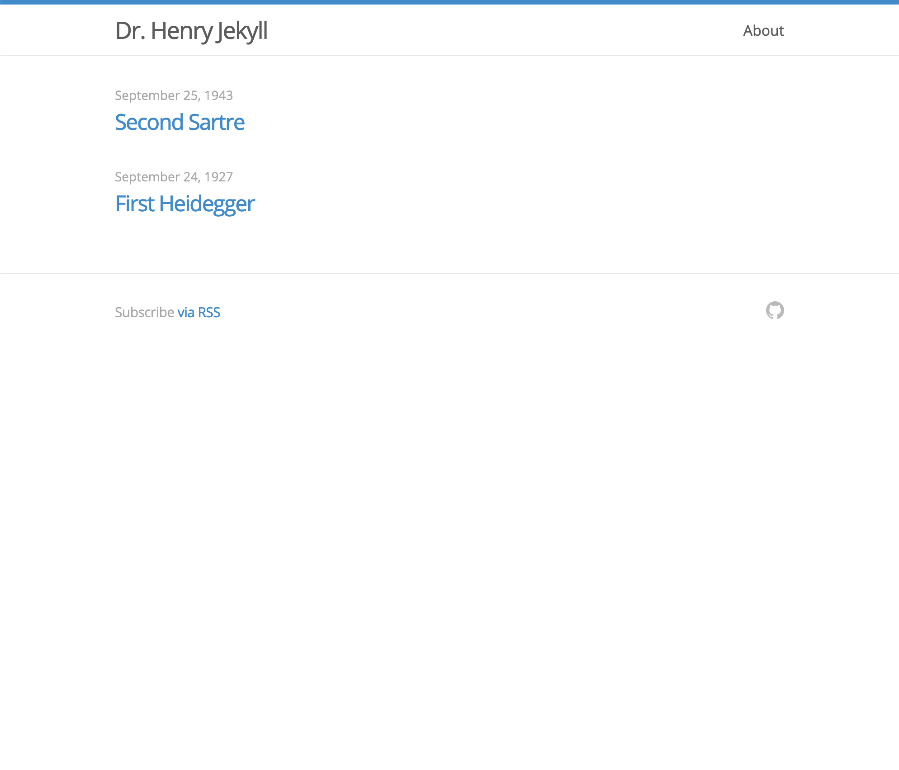

+++
title = "henry"
description = "A timeless blog theme"
template = "theme.html"
date = 2021-02-18T22:27:50+01:00

[extra]
created = 2021-02-18T22:27:50+01:00
updated = 2021-02-18T22:27:50+01:00
repository = "https://github.com/sirodoht/zola-henry"
homepage = "https://github.com/sirodoht/zola-henry"
minimum_version = "0.4.0"
license = "MIT"
demo = ""

[extra.author]
name = "sirodoht"
homepage = ""
+++        

# henry

Henry is a single-column [Zola](https://github.com/getzola/zola) theme based on the original Jekyll styles.



## Installation

First download this theme to your `themes` directory:

```sh
$ cd themes
$ git clone https://github.com/sirodoht/zola-henry.git henry
```

and then enable it in your `config.toml`:

```toml
theme = "henry"
```

## Options

### Nav links

Set a field in `extra` with a key of `henry_links`:

```toml
[extra]
henry_links = [
    {url = "/about", name = "About"},
    {url = "https://github.com/patrick", name = "Projects"},
]
```

Each link needs to have a `url` and a `name`.

### Footer GitHub icon link

By default Henry ships with GitHub icon link in the right side of the footer. You can change its link href in your `config.toml`.

```toml
[extra]
henry_github = "https://github.com/sirodoht/zola-henry"
```

### Footer Twitter icon link

Twitter is too mainstream and a bit lame, but 100% of our users have requested, so we offer it.

```toml
[extra]
henry_twitter = "https://twitter.com/dhh"
```

## License

MIT

        