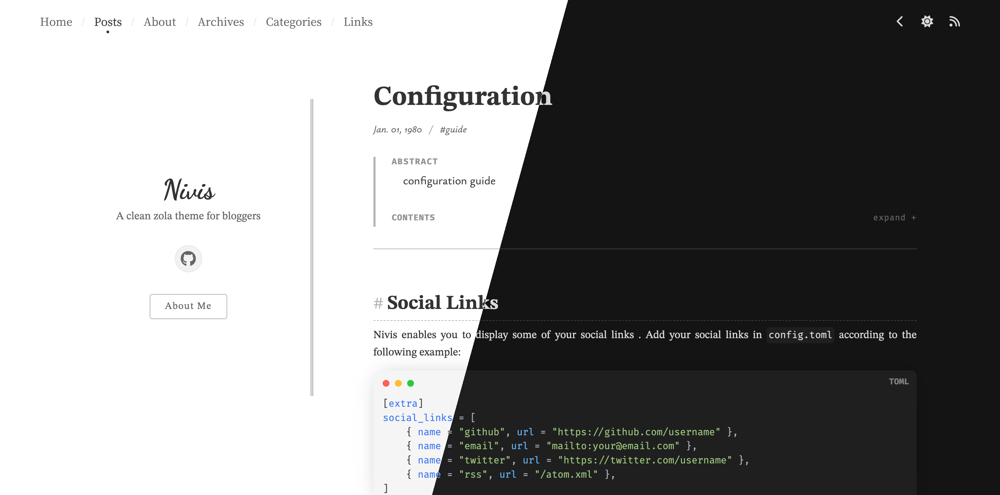

+++
title = "nivis"
description = "A clean zola theme for bloggers"
template = "theme.html"
date = 2026-08-31T19:06:18+08:00

[taxonomies]
theme-tags = ['Clean', 'Blog', 'Responsive']

[extra]
created = 2026-08-31T19:06:18+08:00
updated = 2026-08-31T19:06:18+08:00
repository = "https://github.com/Resorie/zola-theme-nivis.git"
homepage = "https://github.com/Resorie/zola-theme-nivis"
minimum_version = "0.23.4"
license = "MIT"
demo = "https://resorie.xyz/blog/"

[extra.author]
name = "Resory"
homepage = "https://resorie.xyz/blog/"
+++        

Nivis: A clean zola theme for bloggers.



Live demo: [Example Site](https://resorie.xyz/zola-theme-nivis/) | [My Blog](https://resorie.xyz/blog/).

This theme is inspired by (and derived from) themes [Float](https://float-theme.netlify.app/) and [anatole](https://longfangsong.github.io/). Check out these two wonderful themes as well! :smile:

## Features :star:

- Clean & Minimalist Design
- Elegant Typography
- Responsive Layout
- Dark/Light Mode Support

## Getting Started :rocket:

Use `git submodule` to add the theme to your site:
```bash
git submodule add -b master --depth=1 https://github.com/Resorie/zola-theme-nivis.git themes/nivis/
git submodule update --init --recursive
```

Then, change your theme config in `config.toml`:
```toml
theme = "nivis"

[extra]
# "focus" is the default; use "horizontal" for the left-aligned layout.
home_layout = "focus"
```

Start your site by copying the example content into your site folder:
```bash
cp -r themes/nivis/content content
cp -r themes/nivis/data data
```

Move on to the [example site](https://resorie.xyz/zola-theme-nivis/) for more info. Enjoy it! :kissing_heart:

## Todo :clipboard:

- [ ] Add transition when switching light/dark mode
- [ ] Better special page customization
- [ ] Minimize web resources

        