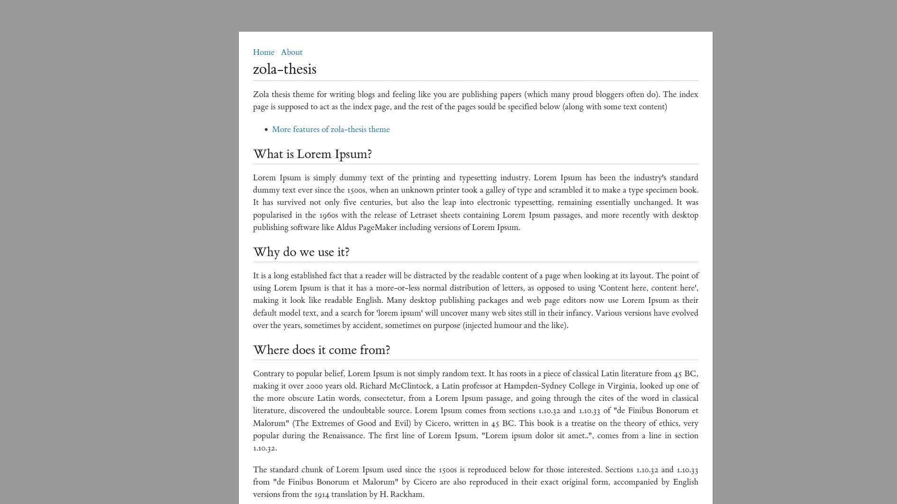
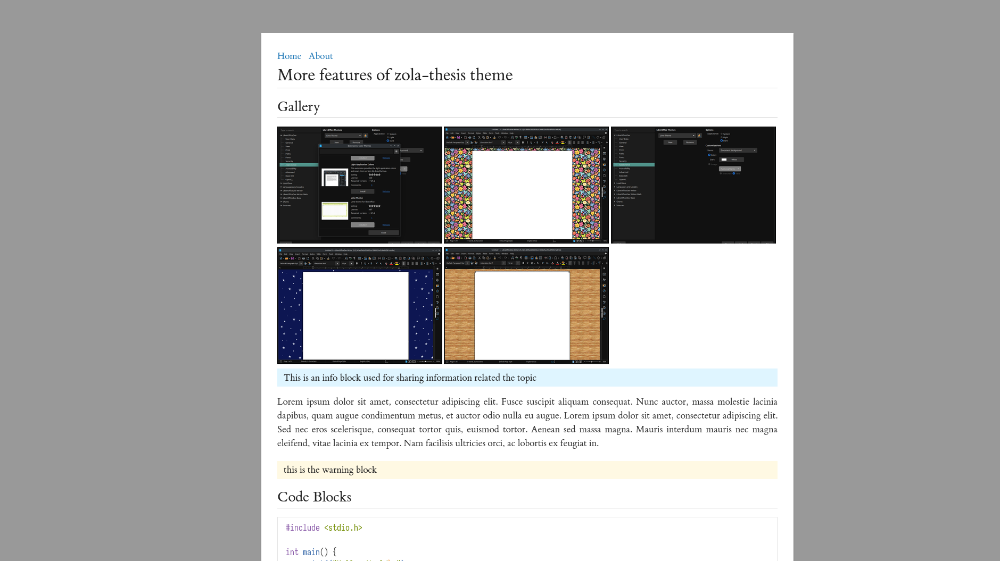

+++
title = "Zola Thesis"
description = "A theme for  minimalists who like to  think of themselves as  researchers and their blogs as research papers."
template = "theme.html"
date = 2024-12-20T14:23:00+05:30

[taxonomies]
theme-tags = []

[extra]
created = 2024-12-20T14:23:00+05:30 
updated = 2024-12-20T14:23:00+05:30 
repository = "https://github.com/printfdebugging/zola-thesis.git"
homepage = "https://github.com/printfdebugging/zola-thesis/"
minimum_version = "0.18.0"
license = "GPL-2.0"
demo = "https://printfdebugging.github.io/zola-thesis/"

[extra.author]
name = "Sahil Gautam"
homepage = "https://printfdebugging.in/"
+++        


<div align="center">
<h1>Zola Thesis</h1>
</div>
<div align="center">

A theme for  minimalists who like to  think of themselves as  researchers and like
their blogs as research papers.
</div>



## Quick Start

Before using the theme, you need to install [Zola](https://www.getzola.org/documentation/getting-started/installation/) ≥ v0.18.0.

```sh
# 1. Clone the repo
git clone git@github.com:printfdebugging/zola-thesis.git

# 2. Change directory into clone
cd zola-thesis

# 3. Serve the site locally
zola serve

# 4. Open http://127.0.0.1:1111/ in the browser
```

## Features
- Different note types are supported
  - ok
  - info
  - warning
  - error
- RSS feed
- Gallery - just make a sub folder named `gallery` in the post folder (next to index.md), and all the images in that folder
  will be displayed as a gallery whenever you use the shortcode `{{ gallery() }}`. for example..



## Contributions

Contributions are welcome! Just create a  nice PR which changes only relevant code
and the  commit message explains  the change,  no other constraints  like specific
commit heading format etc.

## Acknowledgements
- zola [minimal] theme used as a base
- note.html shortcode from [toucan] theme.

[minimal]: https://zola-minimal.vercel.app/
[toucan]: https://www.getzola.org/themes/toucan/
