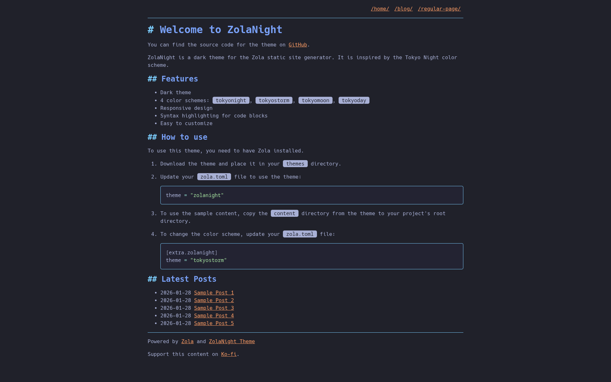

+++
title = "zolanight"
description = "ZolaNight is a dark theme inspired by the Tokyo Night color palette"
template = "theme.html"
date = 2026-02-02T14:08:41+08:00

[taxonomies]
theme-tags = ['dark', 'blog', 'responsive', 'syntax-highlighting', 'tokyo-night']

[extra]
created = 2026-02-02T14:08:41+08:00
updated = 2026-02-02T14:08:41+08:00
repository = "https://github.com/mxaddict/zolanight"
homepage = "https://github.com/mxaddict/zolanight"
minimum_version = "0.18.0"
license = "MIT"
demo = "https://zolanight.codedmaster.com"

[extra.author]
name = "mxaddict"
homepage = "https://www.codedmaster.com"
+++        

# ZolaNight

[ZolaNight](https://github.com/mxaddict/zolanight) is a dark theme for the
[Zola](https://getzola.org) static site generator, inspired by the
[Tokyo Night](https://github.com/folke/tokyonight.nvim) color palette. It's
designed to be lightweight and focus on clear content presentation.



## Live Demo

Explore a live demo of the ZolaNight theme here:
[https://zolanight.codedmaster.com](https://zolanight.codedmaster.com)

## Features

- **Dark Themes:** Offers multiple dark color schemes: `tokyonight` (default),
  `tokyostorm`, `tokyomoon`, and `tokyoday`.
- **Responsive Design:** Adapts to various screen sizes for optimal viewing on
  any device.
- **Syntax Highlighting:** Beautiful syntax highlighting for code blocks using
  the `catppuccin-mocha` theme.
- **Clean Typography:** Utilizes the `Source Code Pro` font for a modern,
  readable appearance.
- **Basic Navigation:** Provides essential navigation for root sections and
  pages.
- **Blog-Ready:** Displays recent blog posts on the home page (configurable) and
  includes tag support for categorization.
- **Modern Reset:** Built on a modern CSS reset for consistent styling across
  browsers.
- **Easy Customization:** Designed for straightforward modification and
  personalization.

## Installation and Usage

1. **Download the Theme:** Place the `zolanight` theme directory into your Zola
   site's `themes` folder.

2. **Enable the Theme:** Update your `config.toml` (or `zola.toml`) file to use
   the theme:

   ```toml
   theme = "zolanight"
   ```

3. **Optional: Sample Content:** To see the theme in action with pre-filled
   content, copy the `content` directory from the theme repository into your
   project's root directory.

4. **Change Color Scheme:** Customize the color scheme by adding the following
   to your `config.toml` (or `zola.toml`) under the `[extra.zolanight]` section:

   ```toml
   [extra.zolanight]
   theme = "tokyostorm" # Choose from "tokyonight", "tokyostorm", "tokyomoon", "tokyoday"
   ```

## Configuration

The `zola.toml` file contains the following theme-specific configurations:

```toml
base_url = "https://zolanight.codedmaster.com"       # Your site's base URL
title = "ZolaNight Theme Demo"                       # Your site's title
description = "A demo site for the ZolaNight theme." # Your site's description
compile_sass = true                                  # Enable Sass compilation
generate_feeds = true                                # Generate RSS/Atom feeds
feed_limit = 10                                      # Number of items in feeds
feed_filenames = ["atom.xml"]                        # Feed filenames
taxonomies = [{ name = "tags" }]                     # Enable tags taxonomy

[markdown.highlighting]
theme = "catppuccin-mocha" # Code highlighting theme

[extra.zolanight]
theme = "tokyonight"               # Default theme, override as shown above
home_list_latest_blog_posts = true # Toggles latest posts on homepage
google_analytics_id = ""           # Set a GA ID to use with analytics snippet
ko_fi_url = ""                     # Link to your Ko-fi page for donations.
```

## License

This theme is licensed under the [MIT License](LICENSE).

        