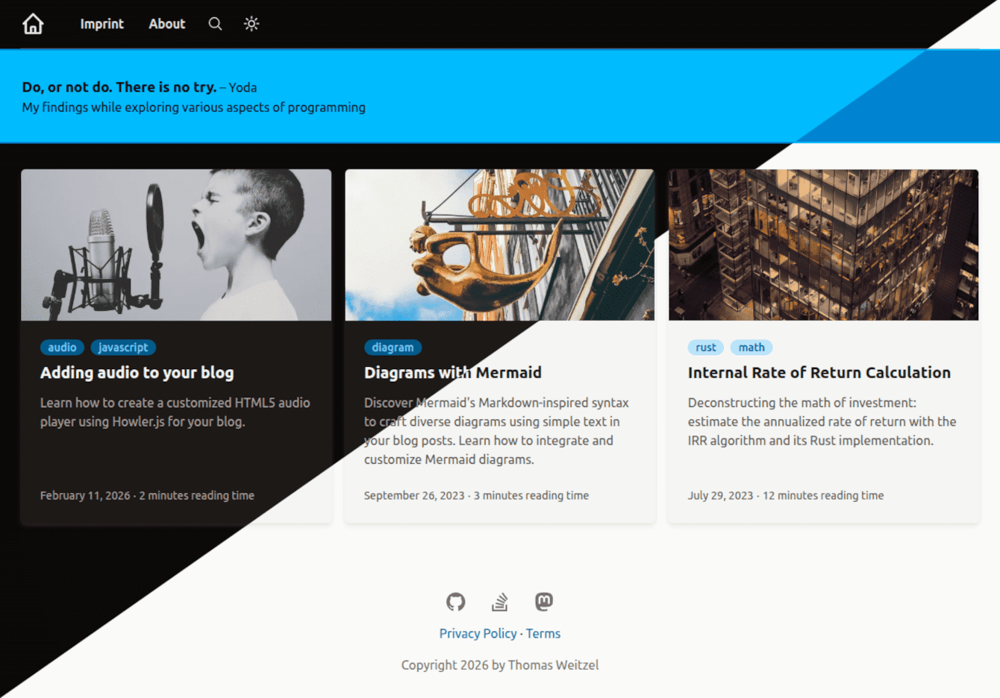

+++
title = "Zolarwind"
description = "A localizable blog theme using Tailwind CSS for styling and KaTex for math"
template = "theme.html"
date = 2026-01-18T17:03:11+01:00

[taxonomies]
theme-tags = []

[extra]
created = 2026-01-18T17:03:11+01:00
updated = 2026-01-18T17:03:11+01:00
repository = "https://github.com/thomasweitzel/zolarwind.git"
homepage = "https://github.com/thomasweitzel/zolarwind"
minimum_version = "0.22.0"
license = "MIT"
demo = "https://pureandroid.com"

[extra.author]
name = "Thomas Weitzel"
homepage = "https://weitzel.dev"
+++        



# The Zolarwind Theme for Zola

Welcome to Zolarwind, the simple Zola blog theme with Tailwind CSS and KaTeX support.
This theme is for Zola users aiming to have a nice blog design powered by Tailwind CSS.
It seamlessly integrates with [Mermaid](https://mermaid.js.org), enabling the creation of various diagrams
directly within your blog posts using a Markdown-inspired syntax.
Additionally, the theme smoothly integrates math formulas using [KaTeX](https://katex.org).
Most importantly, while the theme is designed to be easily localizable,
you can choose your preferred language setting for a consistent blog experience.

---

## Features:

- **Tailwind CSS**: Utilize the utility-first CSS framework for rapid UI development.

- **Mermaid Integration**: Create diverse diagrams using simple text.

- **KaTeX Integration**: Integrate and display math formulas seamlessly in your blog posts.

- **Localization Support**: All theme-specific strings are available in multiple languages; choose the one that's right for you.
  If your language isn't supported yet, just create the resource file with your translations.

- **Dark/Light Mode**: The theme includes a dark/light mode toggle and persists the user preference.

- **Client-side Search**: Built-in search page powered by Zola's index and MiniSearch.

---

## IMPORTANT NOTE

As of Zola v0.22.0 from 2026-01-09, color syntax highlighting has changed and requires a different configuration.
I have updated the theme to reflect this change.
This also means that the theme is no longer compatible with Zola v0.21.0 and earlier.

---

## Table of Contents:
- Demo Website
- Prerequisites
- Installation
- Configuration
- Front Matter
- Localization
- Integrating the theme folder
- Development
- Remarks
- Contributing
- License

---

## Demo Website

You can see the theme in action on my [personal website](https://pureandroid.com).
The site uses the German language.

---

## Prerequisites

To use the theme, you need some software pre-installed:

- [Git](https://git-scm.com/downloads), Required for version control.

- [Node](https://nodejs.org/en/download), an open-source, cross-platform JavaScript runtime environment.
  Node is optional and only needed if you want to change the CSS in `css/main.css`.

- [Zola](https://github.com/getzola/zola/releases), a fast static site generator.

- an editor or integrated development environment of your choice —
  I use [JetBrains IDEA](https://www.jetbrains.com/idea/download),
  an IDE that makes development a more productive and enjoyable experience. 

---

## Installation

1. Clone this theme repository with e.g. `git@github.com:thomasweitzel/zolarwind.git`.
   Or download it from `https://github.com/thomasweitzel/zolarwind`.

2. Make adjustments to the `config.toml` file as needed.
   To run the theme as a standalone site, you need to adjust the `base_url` to your domain.
   If you want to try it out on your local machine, you can leave it as is.
   Just run `zola serve` from the theme's root directory. 

---

## Configuration

Your `config.toml` file is crucial in customizing the Zola site.
Here's a breakdown of the configuration settings tailored for this theme:

### Basic Configuration:

- **base_url**: Specify the URL the site will be built for.
  In this case, the site will be built for `https://example.org`.
  Adjust this to your own domain.

- **compile_sass**: Determines whether to automatically compile all Sass files present in the `sass` directory.
  Here, it's set to `false`, meaning Sass files won't be automatically compiled for this theme.

- **default_language**: Sets the default language for the site.
  The provided config uses English (`en`) as the default language.
  As of now, German (`de`) is available in the `i18n` directory.

- **theme**: The theme used for the site.
  The provided line is commented out, indicating that the theme's files are taken from the `template` directory.
  If you move the theme to the `themes/zolarwind` directory, use `zolarwind` for this entry.

- **build_search_index**: If set to `true`, a search index will be built from the pages and section content for the `default_language`.
  In this configuration and for this theme, it's enabled (`true`).

- **generate_feed**: Determines if an Atom feed (file `atom.xml`) is automatically generated.
  It's set to `true`, meaning a feed will be generated.

- **taxonomies**: An array of taxonomies (classification systems) used for the site.
  Here, a taxonomy for `tags` is defined, with a pagination limit of 6 and an enabled feed.

- **ignored_static**: An array of GLOB patterns (files and directories) that Zola should ignore.
  Here, a pattern is defined to ignore the `static/giallo*.css` file, which is included by Tailwind CSS and should not directly be used by the web site.

### Markdown Highlighting Configuration:

- **theme**: The name of the theme to be used for code highlighting. The chosen theme in this configuration is `ayu-dark`.

- **error_on_missing_language**: If the language to be highlighted is not found, how should Zola handle this? Set to `true` so missing languages cause a build error.

- **style**: How to highlight code. Options are either `class` or `inline`. Here, we use the setting `class`.

- **extra_grammars**: array of additional syntax highlighting configuration files in JSON format for languages not directly supported by Zola/Giallo.

### Extra Configuration:

The `[extra]` section is where you can place any custom variables you want to be accessible in your templates.

- **title**: Required.
  The title of the site.
  Here, it's set to "Zolarwind."

- **path_language_resources**: Required.
  The path to the directory containing language resource files.
  In this config, it's set to `i18n/`.
  If you move the theme to the `themes/zolarwind` directory, use `themes/zolarwind/i18n/` for this entry.

- **generator**: Optional.
  Specify the generator used for creating the static website.
  This site is generated using `Zola v0.22.0`.

- **favicon_svg**: Optional.
  Provides a path to the site's favicon in SVG format.
  The provided path points to `/img/yin-yang.svg`.

- **copyright**: Optional.
  A template for the copyright notice.
  It includes a placeholder `{year}` which is dynamically replaced with the current year of your `zola build` run.

- **site_description**: Optional.
  A brief description is displayed on the site's banner.

- **quote**: Optional.
  A structure defining a quote and its author.
  This quote is from Yoda.

- **menu_pages**: Optional.
  An array of main navigation menu items.
  Each item has a `title` and a `url`.

- **footer_pages**: Optional.
  An array of pages that will appear in the site's footer.
  Each item has a `title` and a `url`.

- **social_links**: Optional.
  An array of social media links.
  Each link has a name, a boolean indicating if it's enabled, a URL, and an SVG icon.

- **displaymode.sun** and **displaymode.moon**: Optional.
  Inline SVG icons used by the dark/light mode toggle.
  Define both to enable the toggle; if either is missing, the toggle is not rendered.

---

## Subpath base_url support

This theme is safe to run under a subpath (for example `https://example.org/blog/`), as long as all internal links and
assets are resolved with Zola's `get_url` helper. That is why the templates use `get_url` for CSS, JS, images, and menu
links. Keep internal links in `config.toml` root-relative (for example `"/pages/about/"`), so Zola can prefix the
`base_url` subpath reliably.

If you add or adjust templates, avoid hardcoded `href="/..."` or `src="/..."`. Always prefer:

```tera
{{/* get_url(path="/img/example.jpg") */}}
```

### Local testing with a subpath

`zola serve` always mounts at `/`, so it does not exercise subpath behavior. To test subpaths locally, build into a
subdirectory and serve the output from there:

```bash
zola build --base-url http://127.0.0.1:1111/demo/zolarwind -o public/demo/zolarwind
python -m http.server --directory public 1111
```

Then open `http://127.0.0.1:1111/demo/zolarwind/` in your browser.

---

## Front matter

For blog posts (Markdown files in folder `content/blog`), this theme uses a directory structure where each post has its own folder.
This way, I have all resources for a post in one place.
It can include images, videos, and other files.

Each post is associated with an image displayed on the blog's main page and on the post's detail page.
If you do not provide an image under `extra.image`, a default image is used instead.

- **date**: the date of the blog posts, e.g. `2020-06-11`.

- **title**: the title of the blog posts, e.g. `The Game of Fifteen`.
 
- **description**: the description of the blog posts. It is used as a summary on the blog's main page.
 
- **authors**: an optional array of all the post's authors, e.g. `["Thomas Weitzel"]`.
  You can leave it empty, but then the first author will show up as `Unknown` in the feed (`atom.xml`).

- **taxonomies**: only the optional `tags` taxonomy is used by this theme.
  I tend to list programming languages used in the post, e.g. `["rust", "javascript"]`.
  You can omit it, but then the post will not show up under `tags`. 

- **extra.math**: either `false` (default) or `true`.
  If set to `true`, the post will be rendered with KaTex support for displaying math formulas.
  If the entry is omitted or set to `false`, the post will not have KaTex support.
  To avoid Markdown conflicts (for example `*` italics or backslash escaping), use the safe KaTeX shortcode.
  Omit `$` and `$$` delimiters inside the shortcode body:

  ```text
   a^2 + b^2 
   1*2+3*4 
  ```

- **extra.diagram**: either `false` (default) or `true`.
  Controls loading of the necessary JavaScript to render the Mermaid diagram.
  If set to `true`, the post will be rendered with Mermaid support for displaying diagrams
  by using the `diagram()` shortcode.

- **extra.image**: an optional image for the post.
  If omitted, a default image is used instead.
  The image is displayed on the blog's main page and on the post's detail page.

---

## Light/Dark Images

If you want images that switch with the theme, wrap two images in a container using class `light-dark-image`.
The first image is shown in light mode, the second in dark mode:

```html
<div class="light-dark-image">
  
  
</div>
```

---

## Localization

Consider this text on a page where a blog post is published as an example: `Published on July 04, 2023; 1,234 words`.
If your blog is in the German language, you want to have `Veröffentlicht am 04. Juli 2023; 1.234 Wörter` instead.
Not only the text should be translated, but also the date and number formats are different.
And you want a text like `1 word` or `1 Wort`, because the singular form should be used where applicable.
This theme takes care of that.

To localize your blog with this theme:

1. Pick your desired language by setting the `default_language` in `config.toml`.
   As of now, English (`en`) and German (`de`) have language resources available in the `i18n` directory.
   If your language is not supported yet, just create a new resource file with your translations.
   Use the file `en.toml` as a template for your own translations.
   Use the correct language code for the file name, e.g. `eo.toml` for Esperanto.
   This theme supports only languages that read from left-to-right (ltr).

2. The theme will automatically display all theme-specific string resources in the chosen language.

3. The content that you provide should match this language.
   But that is your responsibility.
   The theme will not translate your content.

This theme uses `default_language` as a build-time switch for a single locale per build.
It does not target Zola's multi-language output in a single build.

If you need to define your own date format, look [here](https://docs.rs/chrono/latest/chrono/format/strftime/index.html) for supported specifiers.

---

## Integrating the theme folder

This project is structured as a stand-alone Zola site.
This section is for those who might want to integrate the theme into an existing Zola website.
You can do so by moving the relevant theme files to the `themes/zolarwind` directory.
All other files stay in the root directory.
If you have your own files there, you need to merge them with the ones from this theme.
You also need to adjust the `config.toml` and `package.json` files in the root accordingly.

I will only show you the relevant directories that need to be moved.
This is the directory structure of the stand-alone site, where the theme is in the root directory:

```
/
├── css
├── i18n
├── static
│   ├── css
│   ├── img
│   └── js
├── syntaxes
├── templates
└── theme.toml
```

Create a new directory `themes/zolarwind` and move the following files and directories there:

```
/
├── static
│   └── css
└── themes
    └── zolarwind
        ├── css
        ├── i18n
        ├── static
        │   ├── img
        │   └── js
        ├── syntaxes
        ├── templates
        └── theme.toml
```

The `static/css` directory is a special case.
It contains the generated Tailwind CSS file with the name `generated.css`.
It will stay in its original location.
This file is generated from the file `css/main.css`, which is the input for the CSS generation.
The generation process can be triggered with a script in the `package.json` file.
**You only need to adjust and run the script** in `package.json` if you make changes to the theme's template files or use new Tailwind CSS classes directly in your content files.
Since the source file `css/main.css` has moved to the directory `themes/zolarwind/css/main.css`, we need to adjust the script in `package.json` accordingly.

This is what the relevant part of it looks like for the stand-alone site:

```json
"scripts": {
  "css:build": "npx tailwindcss -i ./css/main.css -o ./static/css/generated.css --minify",
  "css:watch": "npx tailwindcss -i ./css/main.css -o ./static/css/generated.css --watch",
  "server": "zola serve"
}
```

Now change it so that the input file `css/main.css` will be the file `themes/zolarwind/css/main.css`:

```json
"scripts": {
  "css:build": "npx tailwindcss -i ./themes/zolarwind/css/main.css -o ./static/css/generated.css --minify",
  "css:watch": "npx tailwindcss -i ./themes/zolarwind/css/main.css -o ./static/css/generated.css --watch",
  "server": "zola serve"
}
```

Since you now use Zolarwind as a theme, you need to declare it in the `config.toml` file.
The theme's files have moved to the directory `themes/zolarwind`, so you need to adjust the only reference to the theme's files in the `config.toml` file accordingly by changing the `path_language_resources` entry:

```toml
# The site theme to use
theme = "zolarwind"

# ...

# Path to the language resource files
path_language_resources = "themes/zolarwind/i18n/"
```

---

## Development

If you want to adjust the CSS of the theme to your needs, you will need to edit the files in the `templates` and `css`
directories. While you do this, you should make sure that the CSS file `static/css/generated.css` is up to date. This
file is generated from the file `css/main.css`, and all the files that Tailwind automatically identifies via automatic
content detection.

The theme uses a custom color palette (`neutral`, `primary`, `ok`, `warn`, `fail`) instead of the default Tailwind colors.
When you add new classes in templates or content, rebuild the CSS so the generated palette classes are included.

If you ever need to explicitly add a source file excluded by default, you can always add it with the `@source`
directive, right in your `css/main.css` file:

```css
@source "../node_modules/@my-company/ui-lib";
```

So whenever one of these files changes, you need to run the script `css:build` from the `package.json` file.
To achieve this, you need to have `Node.js` and all dependencies from `package.json` installed (with `npm install`).
Then you can run the script with `npm run css:watch`.
It monitors all files mentioned above and triggers the CSS generation whenever a relevant file changes.
This ensures, that the file `static/css/generated.css` is always up to date.

I recommend having two terminals open.
In one terminal, run `npm run server` - or just `zola serve` - to start the Zola server.
In the other terminal, run `npm run css:watch` to start the CSS generation whenever a relevant file changes.

That way, your local web browser will automatically reload the page with the updated CSS whenever you change a file.

---

## Search

This theme ships with a local, client-side search page powered by Zola's search index (Elasticlunr output) and MiniSearch.

1. Enable the search index in `config.toml`:
   ```toml
   build_search_index = true
   ```
2. Create a page that uses the search template (for example `content/pages/search.md`). If your `content/pages/_index.md`
   uses `sort_by = "date"`, the page needs a `date` (or `weight`) to avoid being ignored. You can optionally set
   `extra.results_per_page` to control pagination and `extra.pagination_window` to control the number of pages shown on each side of the current page.
   ```toml
   +++
   date = 2026-01-14
   title = "Search"
   template = "search.html"
   [extra]
   results_per_page = 5
   pagination_window = 2
   +++
   ```
3. A search icon appears in the header and links to `/pages/search/`.

When using this theme in another Zola site, add `content/pages/search.md` in that site repository. Theme `content/` is not loaded by Zola.

The search index is built for the current `default_language` only.

---

## Privacy

This theme sets no cookies and does not load resources from third-party sites. The dark/light mode preference is stored in `localStorage` only after a user explicitly toggles the theme.

---

## Remarks

### Typography for Markdown

I'm not using `@tailwindcss/typography` for styling of Markdown files.
I don't like how it looks.
Instead, I use `@apply` in the `css/main.css` file.
The `@apply` directive in Tailwind CSS enables you to compose utility classes into custom CSS classes.
This makes it possible to apply multiple utility styles within a single class, making it efficient to style Markdown content.

This approach has pros and cons.
But it gives me fine-grained control over how the result looks like.
While it is time-consuming, I prefer this solution over the `@tailwindcss/typography` plugin.
 
Yes, I'm reinventing the wheel here, because for common typographic patterns, I'm just recreating what's already provided by the typography plugin.

### Serve KaTex files locally

All KaTex files are included in the `static` directory for this theme.
Using KaTeX (or any other library) by serving it from a Content Delivery Network (CDN) has implications concerning the General Data Protection Regulation (GDPR) and the use of cookies:

- **Third-Party Requests & Data Privacy**: When you load resources from a CDN, it triggers third-party requests to the CDN's servers.
  These servers might log your IP address, user agent, and other request-related metadata.
  Under GDPR, IP addresses can be considered personal data.
  By serving KaTeX from your domain, you reduce third-party data transfers, limiting the amount of personal data you expose to external entities.

- **Cookies**: Many CDNs set cookies for various reasons, including analytics or performance optimizations.
  These cookies can track users across different websites that use the same CDN, potentially infringing on their privacy rights.
  By hosting KaTeX on your domain, you have full control over cookies and can ensure compliance with GDPR.

- **Consent**: If you're using a CDN that sets cookies or collects data, you might need to get explicit user consent before loading resources from that CDN.
  This can complicate user experience and lead to a reduced site performance for users who opt-out.
  By self-hosting, you circumvent this issue.

- **Transparency & Control**: By self-hosting, you know exactly which version of KaTeX you're using and can ensure there are no modifications or unexpected behaviors.
  With CDNs, there's a minor risk of the library being compromised, which could affect all sites using that resource.

- **Data Transfer Outside the EU**: If the CDN servers are located outside the European Union, you might be transferring data out of the EU,
  which adds another layer of GDPR compliance requirements.
  By self-hosting, you ensure that user data doesn't leave the region unless you specifically choose a hosting solution outside the EU.

---

## Contributing

Contributions are always welcome!
If you see areas of improvement or want to add features, please submit a PR.

I'm especially interested in more translations.
See folder `i18n` for what's available and what is not.
Use the file `en.toml` as a template for your own translations.

---

## License

This theme is under the MIT License.
For details, please refer to the LICENSE file.

### Third-Party Notices

- Heroicons (MIT License): https://heroicons.com
- KaTeX (MIT License): https://katex.org
- Mermaid (MIT License): https://mermaid.js.org
- MiniSearch (MIT License): https://lucaong.github.io/minisearch/
- mhchem (Apache 2.0 License): https://mhchem.github.io/MathJax-mhchem/
- Unsplash images (Unsplash License): https://unsplash.com/license

        