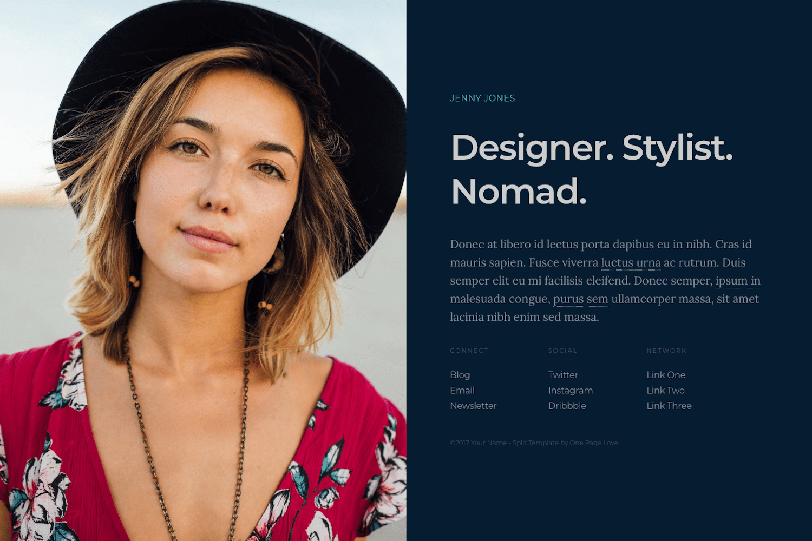

+++
title = "Zplit"
description = "A single page theme for a professional online presence."
template = "theme.html"
date = 2024-01-09T08:33:22+01:00

[extra]
created = 2024-01-09T08:33:22+01:00
updated = 2024-01-09T08:33:22+01:00
repository = "https://github.com/gicrisf/zplit"
homepage = "https://github.com/gicrisf/zplit"
minimum_version = "0.15.0"
license = "Creative Commons Attribution 3.0 License"
demo = "https://zplit.netlify.app"

[extra.author]
name = "Giovanni Crisalfi"
homepage = "https://github.com/gicrisf"
+++        

# Zplit

Zplit is a single page, centrally-divided layout for a professional online presence with a big image or video left with alongside content. It is a port of [Split](//onepagelove.com/split) by [One Page Love](//onepagelove.com) for [Zola](https://www.getzola.org/).



**DEMO**: [https://zplit.netlify.app/](https://zplit.netlify.app/)

## Installation

Download this theme to your `themes` directory:

```bash
$ cd themes
$ git clone https://github.com/gicrisf/zplit.git
```

Then, enable the theme editing your `config.toml`:

```toml
theme = "zhuia"
```

## Getting started

You can find the most important file of the theme in the root directory. It's called `config.toml`.
Edit it, specifying your personal preferences. Go through this (small) file to set some self-explaining variable, such as `author` under `[extra]` or `intro_tagline` under `[extra.content]`. 

If something appears not that evident, maybe you missed the ["configuration" paragraph of the Zola official documentation](https://www.getzola.org/documentation/getting-started/configuration/). Even if this is your first time with a static site generator, don't be scared and go through the docs, because it's very basic stuff.

Here, we'll see in more detail two more section, that are peculiar for this theme:
- Background image
- Lists (of links)

### Background image

Edit the `[extra.visual]` section to set your background image of choice.

```toml
[extra.visual]

background = "<your-image-file-path-goes-here>"
```

You can find this example already written as the default:

```toml
[extra.visual]

background = "images/background.jpg"
position = "center center"
```

As you can see, you can edit the relative position of the image, which is centered by default.

### Lists

You can set up to 3 lists of links in the `[extra.lists]` section of the `config.toml` file: 
- connect
- social
- network

Manipulating them is very easy: just add/remove elements in the TOML list, as showed in this example (also already present in the default file):

``` toml
social = [
    {url = "https://t.me/zwitterio", text = "Telegram"},
    {url = "https://twitter.com/gicrisf", text = "Twitter"},
    {url = "https://github.com/gicrisf", text = "Github"},
]
```

Do you want another item? Just throw it up to the pile. You have no limits.
Remember to set the `url` field with the link itself you want to direct your user at and a `text` to show in the page for the corrisponding URL.

## Posts

You could add new posts, by adding markdown files to the `content` directory.
To sort the post index by date, enable sort in your index section `content/_index.md`:

```toml
sort_by = "date"
```

This theme wasn't written with blogging in mind, but more as a landing page for professionals. If you want to blog some stuff, though, you can, absolutely. If you add a new section in the content directory, you just have to add it to the main menu through the config file and it will be immediately accessible to the user.

The theme doesn't support taxonomies or other advanced stuff: just simple pages. If you want to extend the blogging features, feel free to tweak the code or open an issue with a specific request.

## Custom CSS

Add a `custom.css` file in `static` directory and add all the changes you want to the original stylesheets. 

## Custom colors

If you want to tweak the colors or grid dimensions, though, it could be easier to directly edit the `_01-content.scss` file frontmatter, where the variables are easily exposed at the top of the file:

``` scss
//-------------------------------------------------------------------------------
// Variables
//-------------------------------------------------------------------------------

// Colors
$color-background : #061C30;
$color-text       : #848d96;
$color-link       : #848d96;
$color-link-hover : #CA486d;
$color-maverick   : #47bec7;
$color-tagline    : #CCCCCC;

// Breakpoints
$bp-smallish      : 1200px;
$bp-tablet        : 800px;
$bp-mobile        : 500px;
```

If you choose this way, you don't have to care about anything else in that file. Just look at the variables.

## Features

- [x] Lightweight and minimal
- [x] Responsive (mobile support)
- [x] Social links
- [x] Deploy via Netlify (config already included)
- [x] Easily extendable menus
- [x] De-googled (local assets are faster and more secure)
- [x] Netlify support
- [x] Custom CSS
- [x] Custom colors
- [x] 404 page
- [x] Basic blogging features
- [ ] Open Graph and Twitter Cards support
- [ ] Multilanguage support

## Support me!

Do you love this theme? Was it useful to you? Make a donation and support new features!

[](https://ko-fi.com/V7V425BFU)

## License

The original template is released under the [Creative Commons Attribution 3.0 License](//github.com/escalate/hugo-split-theme/blob/master/LICENSE.md). Please keep the original attribution link when using for your own project. If you'd like to use the template without the attribution, you can check out the license option via the template [author's website](//onepagelove.com/split).

        